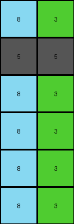

# bd4472b8 • 018 • refine_coder

---

Previous Code:
```python
"""
1.  **Copy Input:** Create a copy of the input grid as the output grid.
2.  **Preserve Top Rows:** The first two rows of the input grid remain unchanged in the output grid.
3.  **Iterate through Remaining Rows:** Starting from the third row (index 2), iterate through each subsequent row of the output grid.
4.  **Cyclic Replacement:** For each pixel in the current row:
    *   If the pixel value is 0 (white):
        *   Replace it with the corresponding value from the first row, using a cyclic index. The column index for the first row is calculated as `current_column_index % width_of_first_row`.
5.  **Repeat Replacement**: Repeat replacing 0 (white) with the cyclic index for the entire input grid.
6.  **Output:** Return the modified output grid.
"""

import numpy as np

def transform(input_grid):
    output_grid = np.copy(input_grid)
    rows, cols = output_grid.shape

    # Preserve top two rows (already done by copying)

    # Iterate through remaining rows
    for i in range(2, rows):
        for j in range(cols):
            # Cyclic Replacement
            if output_grid[i, j] == 0:
                first_row_index = j % cols  # Cyclic index for the first row
                output_grid[i, j] = input_grid[0, first_row_index]

    return output_grid
```

Train Set Results:

## Example 1:

Input:
```
2 1 4
5 5 5
0 0 0
0 0 0
0 0 0
0 0 0
0 0 0
0 0 0
```
Expected Output:
```
2 1 4
5 5 5
2 2 2
1 1 1
4 4 4
2 2 2
1 1 1
4 4 4
```
Transformed Output:
```
2 1 4
5 5 5
2 1 4
2 1 4
2 1 4
2 1 4
2 1 4
2 1 4
```

match: False
pixels_off: 12
size_correct: True
color_palette_correct: True
correct_pixel_counts: True

## Example 2:

Input:
```
3 2 1 4
5 5 5 5
0 0 0 0
0 0 0 0
0 0 0 0
0 0 0 0
0 0 0 0
0 0 0 0
0 0 0 0
0 0 0 0
```
Expected Output:
```
3 2 1 4
5 5 5 5
3 3 3 3
2 2 2 2
1 1 1 1
4 4 4 4
3 3 3 3
2 2 2 2
1 1 1 1
4 4 4 4
```
Transformed Output:
```
3 2 1 4
5 5 5 5
3 2 1 4
3 2 1 4
3 2 1 4
3 2 1 4
3 2 1 4
3 2 1 4
3 2 1 4
3 2 1 4
```

match: False
pixels_off: 24
size_correct: True
color_palette_correct: True
correct_pixel_counts: True

## Example 3:

Input:
```
8 3
5 5
0 0
0 0
0 0
0 0
```
Expected Output:
```
8 3
5 5
8 8
3 3
8 8
3 3
```
Transformed Output:
```
8 3
5 5
8 3
8 3
8 3
8 3
```

match: False
pixels_off: 4
size_correct: True
color_palette_correct: True
correct_pixel_counts: True
Here's an analysis of the provided examples and results, along with a refined natural language program and a YAML block summarizing the observations:

**General Assessment and Strategy**

The initial natural language program and generated code were on the right track but made an incorrect assumption. It assumed that *all* white (0) pixels should be replaced using a cyclic index from the first row.  The examples demonstrate a more complex pattern: the white (0) pixels are replaced by cycling vertically *through the rows of the input*, repeating the entire top rows pattern, not just using the first row, cyclically.

The strategy is to correct the natural language program and code to reflect the repeating pattern derived from *all* of the top rows, rather than just the first. The rows to be repeated are the rows above the first row that contains 0.

**Metrics and Observations**

Here's a summary, using the provided execution results, of what occurs in each example:

*   **Example 1:**
    *   Input Shape: (8, 3)
    *   Output Shape: (8, 3)
    *   Rows to repeat: First two rows (index 0 and 1)
    *   Pattern: The first two rows are repeated in sequence to fill the rest of the output grid.
*   **Example 2:**
    *   Input Shape: (10, 4)
    *   Output Shape: (10, 4)
    *    Rows to repeat: First two rows (index 0 and 1)
    *   Pattern: The first two rows are repeated in sequence.
*   **Example 3:**
    *   Input Shape: (6, 2)
    *   Output Shape: (6, 2)
    *    Rows to repeat: First two rows (index 0 and 1)
    *   Pattern: The first two rows are repeated in sequence.

**YAML Block**

```yaml
task: 016_repeat_rows
observations:
  - example_1:
      input_shape: (8, 3)
      output_shape: (8, 3)
      rows_to_repeat: [0, 1]
      pattern: "Repeat rows 0 and 1 sequentially until the output grid is filled."
      result: "Incorrect. The transformation only repeats the values of the first row (index 0)."
  - example_2:
      input_shape: (10, 4)
      output_shape: (10, 4)
      rows_to_repeat: [0, 1]
      pattern: "Repeat rows 0 and 1 sequentially."
      result: "Incorrect. Same error as example 1."
  - example_3:
      input_shape: (6, 2)
      output_shape: (6, 2)
      rows_to_repeat: [0, 1]
      pattern: "Repeat rows 0 and 1 sequentially."
      result: "Incorrect. Same error as example 1."
objects:
  - type: grid
    properties:
      - rows: "Variable, between 1 and 30"
      - columns: "Variable, between 1 and 30"
      - cells: "Pixels with integer values 0-9, representing colors."
    actions:
      - "Copy input grid to output grid."
      - "Identify rows with all non-zero pixels before any row that contains a 0."
      - "Repeat identified rows sequentially to fill output, starting at first row that was all 0s in input."
```

**Natural Language Program**

1.  **Copy Input:** Create a copy of the input grid as the output grid.
2.  **Identify Repeating Section:** Find the index of the first row that contains the value 0.  The "repeating section" consists of all rows *before* this index.
3.  **Iterate through Remaining Rows:** Iterate through each subsequent row of the *output* grid, *starting* from the first row index that contained a 0 in the input grid.
4. **Sequential Replacement**  Fill the remaining rows by repeatedly copying *all* rows from repeating section. The row index should be calculated using the modulo operator against length of the repeating section.
5.  **Output:** Return the modified output grid.

**INSTRUCTIONS**

- generate a Python module to represent the natural language program 
- follow the template below
- all common math and science libraries are available
- create docstring only at top - but comment the workflow in the function
- use helper functions for common operations like finding objects, counting,
  measuring, moving, etc. 

remember - we are working iteratively - so this code will inform your future
self as we converge on the solution

*template:*

```python
"""
{{ natural language description of the transformation rule }}
"""

{{ imports }}

def transform(input_grid):
    # initialize output_grid

    # change output pixels 

    return output_grid

```
