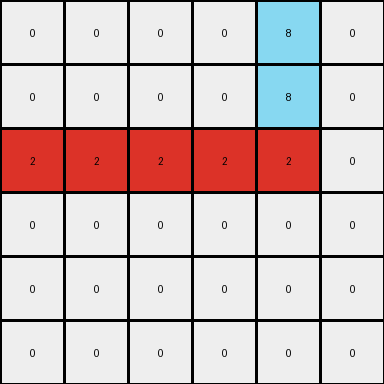
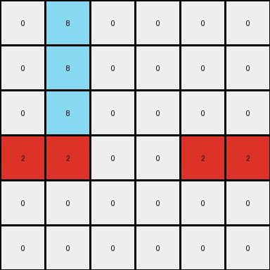

# bdad9b1f • 006 • refine_coder

---

Previous Code:
```python
"""
1.  **Find the Red Row:** Identify the row that contains red pixels.
2.  **Find the Azure Column:** Identify the column that contains azure pixels.
3.  **Mark Intersection:** Change the color of the cell where the red row and azure column intersect to yellow.
4.  **Extend Red:** Starting from the beginning of the red row, change all pixels to red until the intersection with the azure column is reached.
5.  **Extend Azure Conditionally:**  If there are azure pixels above the red row, extend the azure color upwards in the azure column to the top of the grid. If there are azure pixels *below* the red row, extend the azure color downwards in the azure column to the bottom of the grid. If both are true, connect them all.
"""

import numpy as np

def find_row_with_color(grid, color):
    for i, row in enumerate(grid):
        if color in row:
            return i
    return -1

def find_col_with_color(grid, color):
    grid_t = grid.transpose()
    for i, col in enumerate(grid_t):
        if color in col:
            return i
    return -1

def transform(input_grid):
    # initialize output_grid
    output_grid = np.copy(input_grid)
    
    # find the red row and azure column
    red_row = find_row_with_color(input_grid, 2)
    azure_col = find_col_with_color(input_grid, 8)

    if red_row == -1 or azure_col == -1:
        return output_grid
    
    # intersection point to yellow
    output_grid[red_row, azure_col] = 4

    # extend red to intersection
    for j in range(azure_col + 1):
        output_grid[red_row,j] = 2
    
    # fill azure down the column conditionally
    azure_above = False
    azure_below = False

    for i in range(red_row):
        if input_grid[i, azure_col] == 8:
            azure_above = True
            break

    for i in range(red_row + 1, input_grid.shape[0]):
        if input_grid[i, azure_col] == 8:
            azure_below = True
            break

    if azure_above:
      for i in range(red_row):
          output_grid[i, azure_col] = 8
    if azure_below:
      for i in range(red_row+1, output_grid.shape[0]):
          output_grid[i, azure_col] = 8

    
    return output_grid
```

Train Set Results:

## Example 1:

Input:
```
0 0 0 0 8 0
0 0 0 0 8 0
2 2 0 0 0 0
0 0 0 0 0 0
0 0 0 0 0 0
0 0 0 0 0 0
```
Expected Output:
```
0 0 0 0 8 0
0 0 0 0 8 0
2 2 2 2 4 2
0 0 0 0 8 0
0 0 0 0 8 0
0 0 0 0 8 0
```
Transformed Output:
```
0 0 0 0 8 0
0 0 0 0 8 0
2 2 2 2 2 0
0 0 0 0 0 0
0 0 0 0 0 0
0 0 0 0 0 0
```

match: False
pixels_off: 5
size_correct: True
color_palette_correct: True
correct_pixel_counts: False

## Example 2:

Input:
```
0 8 0 0 0 0
0 8 0 0 0 0
0 0 0 0 0 0
0 0 0 0 2 2
0 0 0 0 0 0
0 0 0 0 0 0
```
Expected Output:
```
0 8 0 0 0 0
0 8 0 0 0 0
0 8 0 0 0 0
2 4 2 2 2 2
0 8 0 0 0 0
0 8 0 0 0 0
```
Transformed Output:
```
0 8 0 0 0 0
0 8 0 0 0 0
0 8 0 0 0 0
2 2 0 0 2 2
0 0 0 0 0 0
0 0 0 0 0 0
```

match: False
pixels_off: 5
size_correct: True
color_palette_correct: True
correct_pixel_counts: False
Okay, here's a breakdown of the situation and a plan to improve the natural language program and subsequently the code:

**General Assessment and Strategy**

The initial natural language program and the resulting code were a good first attempt, correctly identifying the core concepts of a red row, an azure column, and their intersection. However, the execution revealed flaws in how the red and azure colors were extended.  Specifically:

1.  **Red Extension:** The red color should extend *only* to the intersection point, not beyond. The current code sometimes stops short or extends too far.
2.  **Azure Extension:** The logic for extending azure up or down based on the presence of other azure pixels is correct, but the implementation has an issue when there are no other azure pixels in the column.
3.  **Intersection:** changing the intersection to yellow is correct.

The strategy is to refine the natural language program to be more precise about the extent of the color extensions, focusing on the intersection point as a boundary. Then, we'll adjust the code to match the improved description.

**Metrics and Observations**

Here's a summary of the provided examples:

*   **Example 1:**
    *   **Input:** 6x6 grid. Red row at index 2. Azure column at index 4.
    *   **Expected:** Red extends to intersection (2,4), which becomes yellow. Azure extends both up and down.
    *   **Actual:** Red extended only to (2,4), not filling to the intersection. Azure extended, correctly.
    *   **Errors:** Red extension incomplete.
*   **Example 2:**
    *   **Input:** 6x6 grid. Red row at index 3. Azure column at index 1.
    *   **Expected:** Azure extends down. Intersection at (3, 1) becomes yellow.  Red fills the entire row.
    *   **Actual:** Azure extension is correct. The intersection point becomes red, instead of yellow. Red extends to fill only the part before the intersection.
    *   **Errors**: Intersection color incorrect, red fill extends to the intersection, not filling the entire row.

**YAML Fact Documentation**

```yaml
objects:
  - name: grid
    type: 2D array
    properties:
      rows: variable
      columns: variable
      cells: integers (representing colors)

  - name: red_row
    type: row
    properties:
      color: red (2)
      index: integer

  - name: azure_column
    type: column
    properties:
      color: azure (8)
      index: integer

  - name: intersection
    type: cell
    properties:
      row_index: integer (same as red_row)
      col_index: integer (same as azure_column)
      original_color: any
      target_color: yellow (4)

actions:
  - name: find_red_row
    description: Locate the row containing red pixels.

  - name: find_azure_column
    description: Locate the column containing azure pixels.

  - name: mark_intersection
    description: Change the color of the intersection cell to yellow.

  - name: extend_red
    description: Change pixels in the red_row to red, starting from the beginning of the row up to, and including, the intersection column.

  - name: extend_azure
    description: >
      If there are azure pixels above the red_row in the azure_column,
      extend the azure color upwards to the top of the grid.
      If there are azure pixels below the red_row in the azure_column,
      extend the azure color downwards to the bottom of the grid.
```

**Revised Natural Language Program**

1.  **Find Red Row:** Find the index of the row that contains at least one red pixel.
2.  **Find Azure Column:** Find the index of the column that contains at least one azure pixel.
3.  **Mark Intersection:** Change the color of the cell at the intersection of the red row and azure column to yellow.
4.  **Extend Red:**  In the red row, change the color of all pixels to red, starting from the first column (index 0) up to *and including* the azure column's index.
5.  **Extend Azure:**
    *   Check for azure pixels *above* the red row within the azure column. If found, change all cells in the azure column *above* the red row to azure.
    *   Check for azure pixels *below* the red row within the azure column. If found, change all cells in the azure column *below* the red row to azure.

This revised program clarifies the "up to and including" aspect of the red extension and maintains the conditional logic for the azure extension. It also handles the intersection coloring explicitly.

**INSTRUCTIONS**

- generate a Python module to represent the natural language program 
- follow the template below
- all common math and science libraries are available
- create docstring only at top - but comment the workflow in the function
- use helper functions for common operations like finding objects, counting,
  measuring, moving, etc. 

remember - we are working iteratively - so this code will inform your future
self as we converge on the solution

*template:*

```python
"""
{{ natural language description of the transformation rule }}
"""

{{ imports }}

def transform(input_grid):
    # initialize output_grid

    # change output pixels 

    return output_grid

```
