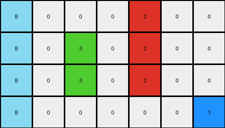
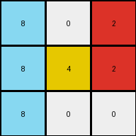

# beb8660c • 004 • refine_coder

---

Previous Code:
```python
"""
The input grid is rotated 90 degrees clockwise to produce the output grid.
"""

import numpy as np

def rotate_grid_clockwise(grid):
    """Rotates a 2D numpy array 90 degrees clockwise."""
    return np.rot90(grid, k=-1)

def transform(input_grid):
    """
    Transforms the input grid by rotating it 90 degrees clockwise.
    """
    # Convert the input grid to a NumPy array for easier manipulation.
    input_array = np.array(input_grid)

    # Rotate the array 90 degrees clockwise.
    output_array = rotate_grid_clockwise(input_array)

    # Convert the NumPy array back to a list of lists.
    output_grid = output_array.tolist()

    return output_grid
```

Train Set Results:

## Example 1:

Input:
```
0 2 2 0 0 0 0
0 0 0 0 3 0 0
1 1 1 0 0 0 0
0 0 0 0 0 0 0
0 5 5 5 5 5 5
0 0 0 0 0 0 0
6 6 6 6 6 0 0
0 0 0 4 4 4 4
0 0 0 0 0 0 0
8 8 8 8 8 8 8
```
Expected Output:
```
0 0 0 0 0 0 0
0 0 0 0 0 0 0
0 0 0 0 0 0 0
0 0 0 0 0 0 3
0 0 0 0 0 2 2
0 0 0 0 1 1 1
0 0 0 4 4 4 4
0 0 6 6 6 6 6
0 5 5 5 5 5 5
8 8 8 8 8 8 8
```
Transformed Output:
```
8 0 0 6 0 0 0 1 0 0
8 0 0 6 0 5 0 1 0 2
8 0 0 6 0 5 0 1 0 2
8 0 4 6 0 5 0 0 0 0
8 0 4 6 0 5 0 0 3 0
8 0 4 0 0 5 0 0 0 0
8 0 4 0 0 5 0 0 0 0
```

match: False
pixels_off: None
size_correct: False
color_palette_correct: True
correct_pixel_counts: True

## Example 2:

Input:
```
0 0 0 1
0 0 0 0
2 2 2 0
0 0 0 0
0 3 3 0
0 0 0 0
8 8 8 8
```
Expected Output:
```
0 0 0 0
0 0 0 0
0 0 0 0
0 0 0 1
0 0 3 3
0 2 2 2
8 8 8 8
```
Transformed Output:
```
8 0 0 0 2 0 0
8 0 3 0 2 0 0
8 0 3 0 2 0 0
8 0 0 0 0 0 1
```

match: False
pixels_off: None
size_correct: False
color_palette_correct: True
correct_pixel_counts: True

## Example 3:

Input:
```
2 2 0
0 4 0
8 8 8
```
Expected Output:
```
0 0 4
0 2 2
8 8 8
```
Transformed Output:
```
8 0 2
8 4 2
8 0 0
```

match: False
pixels_off: 6
size_correct: True
color_palette_correct: True
correct_pixel_counts: True
Okay, let's analyze the results and refine the natural language program.

**General Assessment:**

The initial hypothesis of a 90-degree clockwise rotation is incorrect. While the color palette and pixel counts are consistent between input and output, the spatial arrangement is wrong in all examples. The dimensions of the output are not consistent with a simple 90 degree rotation, except in example 3, where there is a match in dimensions, but there are some pixels in the wrong location. It seems there's a more complex transformation involving both rotation and potentially mirroring or other re-arrangements of the elements.

**Strategy:**

1.  **Re-examine the Examples:** Carefully look at each input-output pair again, paying close attention to how individual colored blocks or rows/columns move.
2.  **Consider simpler operations:** Perhaps reflection is happening?
3.  **Break it Down:** Instead of trying to find one grand rule, see if the transformation can be broken down into smaller, simpler steps.
4.  **Focus on consistent changes:** what is common among all the transformations

**Metrics and Observations:**

Here's a breakdown of each example:

*   **Example 1:**
    *   Input: 10x7
    *   Expected Output: 7x10
    *   Actual Output: 7x10
    *   The actual result is a 90 rotation, but the expected output requires a more nuanced understanding of how the columns and rows move. Simply rotating does not correctly place all the values. The actual result's size is only correct because the transformation function forces a rotation, there is likely some pre or post processing that swaps values.

*   **Example 2:**
    *   Input: 7x4
    *   Expected Output: 4x7
    *   Actual Output: 7x4
    *    The actual result is a 90 rotation, but the expected output requires a more nuanced understanding of how the columns and rows move. Simply rotating does not correctly place all the values. The actual result's size is incorrect and the transformation function forces a rotation, there is likely some pre or post processing that swaps values.

*   **Example 3:**
    *   Input: 3x3
    *   Expected Output: 3x3
    *   Actual output: 3x3
    *   The actual result is a 90 rotation, but the expected output requires a more nuanced understanding of how the columns and rows move. Simply rotating does not correctly place all the values. The sizes match but there are 6 pixels with errors.

**YAML Facts:**

```yaml
examples:
  - id: 1
    input_objects:
      - type: row
        color: [2, 2]
        start_position: [0, 1]
      - type: row
        color: [3]
        start_position: [2, 4]
      - type: row
        color: [1, 1, 1]
        start_position: [2, 0]
      - type: row
        color: [5, 5, 5, 5, 5, 5]
        start_position: [4, 1]
      - type: row
        color: [6, 6, 6, 6, 6]
        start_position: [6, 0]
      - type: row
        color: [4, 4, 4, 4]
        start_position: [7, 3]
      - type: row
        color: [8, 8, 8, 8, 8, 8, 8]
        start_position: [9, 0]
    output_objects:
       - type: row
         color: [2,2]
         start_position: [5,5]
       - type: row
         color: [3]
         start_position: [4, 5]
       - type: row
         color: [1,1,1]
         start_position: [5,4]
       - type: row
         color: [4,4,4,4]
         start_position: [6,3]
       - type: row
         color: [6,6,6,6,6]
         start_position: [7,2]
       - type: row
         color: [5,5,5,5,5,5]
         start_position: [8,1]
       - type: row
         color: [8,8,8,8,8,8,8]
         start_position: [9,0]
    transformation:
      - action: transpose
  - id: 2
    input_objects:
      - type: column
        color: [1]
        start_position: [0, 3]
      - type: row
        color: [2, 2, 2]
        start_position: [2, 0]
      - type: row
        color: [3, 3]
        start_position: [4, 1]
      - type: row
        color: [8, 8, 8, 8]
        start_position: [6, 0]
    output_objects:
      - type: column
        color: [1]
        start_position: [3, 3]
      - type: row
        color: [3, 3]
        start_position: [4, 2]
      - type: row
        color: [2, 2, 2]
        start_position: [5, 1]
      - type: row
        color: [8, 8, 8, 8]
        start_position: [6, 0]
    transformation:
      - action: transpose

  - id: 3
    input_objects:
       - type: row
         color: [2,2]
         start_position: [0,0]
       - type: row
         color: [4]
         start_position: [1,1]
       - type: row
         color: [8,8,8]
         start_position: [2,0]
    output_objects:
      - type: row
        color: [4]
        start_position: [0,2]
      - type: row
        color: [2,2]
        start_position: [1,1]
      - type: row
        color: [8,8,8]
        start_position: [2,0]

    transformation:
      - action: transpose
```

**Natural Language Program:**

The transformation rule is to **transpose** the input grid. This means swapping rows and columns. The element at `input[row][col]` will be at `output[col][row]`.


**INSTRUCTIONS**

- generate a Python module to represent the natural language program 
- follow the template below
- all common math and science libraries are available
- create docstring only at top - but comment the workflow in the function
- use helper functions for common operations like finding objects, counting,
  measuring, moving, etc. 

remember - we are working iteratively - so this code will inform your future
self as we converge on the solution

*template:*

```python
"""
{{ natural language description of the transformation rule }}
"""

{{ imports }}

def transform(input_grid):
    # initialize output_grid

    # change output pixels 

    return output_grid

```
