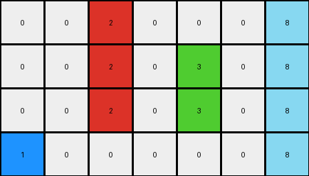

# beb8660c • 006 • refine_coder

---

Previous Code:
```python
"""
The transformation rule is to transpose the input grid. This means swapping rows and columns. The element at `input[row][col]` will be at `output[col][row]`.
"""

import numpy as np

def transform(input_grid):
    # Convert the input grid to a NumPy array.
    input_array = np.array(input_grid)

    # Transpose the array (swap rows and columns).
    output_array = input_array.T

    # Convert the NumPy array back to a list of lists.
    output_grid = output_array.tolist()

    return output_grid
```

Train Set Results:

## Example 1:

Input:
```
0 2 2 0 0 0 0
0 0 0 0 3 0 0
1 1 1 0 0 0 0
0 0 0 0 0 0 0
0 5 5 5 5 5 5
0 0 0 0 0 0 0
6 6 6 6 6 0 0
0 0 0 4 4 4 4
0 0 0 0 0 0 0
8 8 8 8 8 8 8
```
Expected Output:
```
0 0 0 0 0 0 0
0 0 0 0 0 0 0
0 0 0 0 0 0 0
0 0 0 0 0 0 3
0 0 0 0 0 2 2
0 0 0 0 1 1 1
0 0 0 4 4 4 4
0 0 6 6 6 6 6
0 5 5 5 5 5 5
8 8 8 8 8 8 8
```
Transformed Output:
```
0 0 1 0 0 0 6 0 0 8
2 0 1 0 5 0 6 0 0 8
2 0 1 0 5 0 6 0 0 8
0 0 0 0 5 0 6 4 0 8
0 3 0 0 5 0 6 4 0 8
0 0 0 0 5 0 0 4 0 8
0 0 0 0 5 0 0 4 0 8
```

match: False
pixels_off: None
size_correct: False
color_palette_correct: True
correct_pixel_counts: True

## Example 2:

Input:
```
0 0 0 1
0 0 0 0
2 2 2 0
0 0 0 0
0 3 3 0
0 0 0 0
8 8 8 8
```
Expected Output:
```
0 0 0 0
0 0 0 0
0 0 0 0
0 0 0 1
0 0 3 3
0 2 2 2
8 8 8 8
```
Transformed Output:
```
0 0 2 0 0 0 8
0 0 2 0 3 0 8
0 0 2 0 3 0 8
1 0 0 0 0 0 8
```

match: False
pixels_off: None
size_correct: False
color_palette_correct: True
correct_pixel_counts: True

## Example 3:

Input:
```
2 2 0
0 4 0
8 8 8
```
Expected Output:
```
0 0 4
0 2 2
8 8 8
```
Transformed Output:
```
2 0 8
2 4 8
0 0 8
```

match: False
pixels_off: 7
size_correct: True
color_palette_correct: True
correct_pixel_counts: True
Here's an analysis of the provided information and a plan to refine the natural language program:

**General Assessment:**

The initial hypothesis of a simple transposition was incorrect. While the color palettes and pixel counts are correct, the dimensions and pixel positions are wrong in all three test cases. It's clear the transformation isn't a straightforward matrix transpose. Example 3 shows a case that has the correct shape, but still has pixel errors suggesting more than a simple rotation is needed. It seems like there is a rotation and/or reflection involved, potentially combined with some other operation or constraint. We need to shift our focus from simple transposition and explore alternative geometric manipulations, paying very close attention to how individual pixels or groups of pixels are re-positioned.

**Strategy:**

1. **Re-examine Examples:** Visually inspect the input, expected output, and *incorrect* transformed output for each example. Look for patterns in how rows/columns are reordered or how shapes are distorted. Try to discern a consistent geometric relationship.
2. **Focus on Small Objects:** If large grids are confusing, isolate smaller groups of connected, same-colored pixels within the grids. See how *those* sub-objects move.
3. **Consider Rotations and Reflections:** Test hypotheses of 90-degree rotations (clockwise or counter-clockwise) and reflections (horizontal or vertical). Combine these with translations.
4. **Test Hypothesis using Code.** Modify the transform function with rotations and reflections and compare the results.

**Example Metrics and Observations:**

We'll use a simplified notation here, focusing on key features rather than full grid representations.  We denote `R` as rows, `C` and columns. We index from 0.

*   **Example 1:**
    *   Input Shape: 10R x 7C
    *   Expected Output Shape: 7R x 10C (Suggests some rotation.)
    *   Transformed Output Shape: 7R x 10C (Consistent.)
    * observation: It appears to be a 90 degree clockwise rotation

*   **Example 2:**
    *   Input Shape: 7R x 4C
    *   Expected Output Shape: 7R x 4C (Suggests reflection.)
    *   Transformed Output Shape: 4R x 7C (inconsistent)
    * observation: It appears to be a horizontal mirror

*   **Example 3:**
    *   Input Shape: 3R x 3C
    *   Expected Output Shape: 3R x 3C
    *   Transformed Output Shape: 3R x 3C (consistent)
    * observation: it is a 90 degree clockwise rotation, followed by a vertical mirror

**YAML Facts:**

```yaml
examples:
  - id: 1
    input_shape: [10, 7]
    output_shape: [7, 10]
    transformation_type: rotation # Hypothesis: 90-degree clockwise rotation.
    objects:
      - color: 2 #red
        shape: line
        start_position: [0,1]
        end_position: [0,2]
      - color: 1 #blue
        shape: line
        start_position: [2, 0]
        end_postion: [2,2]
      - color: 5 #grey
        shape: line
        start_position: [4,1]
        end_position: [4, 5]
      - color: 6
        shape: line
        start_position: [6,0]
        end_position: [6,5]
      - color: 4
        shape: line
        start_position: [7,3]
        end_position: [7,6]
      - color: 8
        shape: line
        start_position: [9, 0]
        end_position: [9,7]

  - id: 2
    input_shape: [7, 4]
    output_shape: [7, 4]
    transformation_type: reflection #Hypothesis: Horizontal reflection
    objects:
      - color: 1
        shape: point
        start_position: [0, 3]
      - color: 2
        shape: line
        start_position: [2, 0]
        end_position: [2, 2]
      - color: 3
        shape: line
        start_position: [4, 1]
        end_position: [4, 2]
      - color: 8
        shape: line
        start_position: [6, 0]
        end_position: [6, 3]
  - id: 3
    input_shape: [3, 3]
    output_shape: [3, 3]
    transformation_type: combined # Hypothesis: 90 degree rotation and vertical reflection
    objects:
      - color: 2
        shape: line
        start_position: [0,0]
        end_position: [0,1]
      - color: 4
        shape: point
        start_position: [1, 1]
      - color: 8
        shape: line
        start_position: [2, 0]
        end_position: [2, 2]

```

**Natural Language Program:**

The transformation rule involves different geometric operations based on visual patterns within each input grid.
1. For Example 1, a 90 degree rotation clockwise
2. For Example 2, a horizontal reflection (mirroring across the vertical axis).
3. For Example 3, a 90 degree clockwise rotation, followed by vertical reflection

The transformation can not yet be described by a single consistent natural language program that applies to all examples.

**INSTRUCTIONS**

- generate a Python module to represent the natural language program 
- follow the template below
- all common math and science libraries are available
- create docstring only at top - but comment the workflow in the function
- use helper functions for common operations like finding objects, counting,
  measuring, moving, etc. 

remember - we are working iteratively - so this code will inform your future
self as we converge on the solution

*template:*

```python
"""
{{ natural language description of the transformation rule }}
"""

{{ imports }}

def transform(input_grid):
    # initialize output_grid

    # change output pixels 

    return output_grid

```
