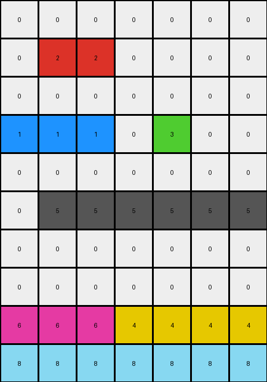
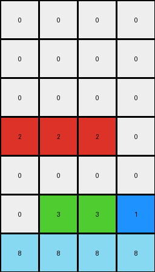

# beb8660c • 010 • refine_coder

---

Previous Code:
```python
"""
Shift all contiguous non-zero color blocks down, filling the spaces, but keep the bottom row fixed.
"""

import numpy as np

def find_blocks(grid):
    """
    Finds contiguous blocks of non-zero pixels in the grid.
    Returns a list of blocks, where each block is a list of (row, col) coordinates.
    """
    blocks = []
    visited = set()
    rows, cols = grid.shape

    def is_valid(r, c):
        return 0 <= r < rows and 0 <= c < cols

    def dfs(r, c, current_block, color):
        if (r, c) in visited or not is_valid(r, c) or grid[r, c] != color:
            return
        visited.add((r, c))
        current_block.append((r, c))
        for dr, dc in [(0, 1), (0, -1), (1, 0), (-1, 0)]:
            dfs(r + dr, c + dc, current_block, color)

    for r in range(rows):
        for c in range(cols):
            if grid[r, c] != 0 and (r, c) not in visited:
                current_block = []
                dfs(r, c, current_block, grid[r, c])
                blocks.append(current_block)
    return blocks

def shift_block_down(grid, block):
    """
    Shifts a single block down as far as possible within the grid.
    Returns the new block coordinates after shifting.
    """
    rows, cols = grid.shape
    max_shift = rows  # Maximum possible downward shift

    # Find the minimum shift allowed by obstacles or grid boundaries
    for r, c in block:
        for shift in range(1, rows - r):
            if r + shift + 1 == rows:
                max_shift = shift + 1
                break
            if grid[r + shift +1,c] != 0 :                
                max_shift = min(max_shift, shift)
                break    
            
        
    # Create new block coordinates after shifting
    new_block = [(r + max_shift, c) for r, c in block]
    return new_block
    

def transform(input_grid):
    """
    Transforms the input grid by shifting non-zero color blocks down.
    """
    grid = np.array(input_grid)  # Convert to NumPy array for easier manipulation
    rows, cols = grid.shape
    output_grid = np.zeros_like(grid)
    
    # 1. keep the bottom row
    output_grid[-1,:] = grid[-1,:]

    # 2. Find blocks in the input grid (excluding the fixed bottom row)
    blocks = find_blocks(grid[:-1,:])

    # 3. Shift each block down and update the output grid
    for block in blocks:
      new_block = shift_block_down(grid, block)
      for r, c in new_block:
          output_grid[r, c] = grid[block[0][0], block[0][1]]  # Use original color

    return output_grid.tolist()
```

Train Set Results:

## Example 1:

Input:
```
0 2 2 0 0 0 0
0 0 0 0 3 0 0
1 1 1 0 0 0 0
0 0 0 0 0 0 0
0 5 5 5 5 5 5
0 0 0 0 0 0 0
6 6 6 6 6 0 0
0 0 0 4 4 4 4
0 0 0 0 0 0 0
8 8 8 8 8 8 8
```
Expected Output:
```
0 0 0 0 0 0 0
0 0 0 0 0 0 0
0 0 0 0 0 0 0
0 0 0 0 0 0 3
0 0 0 0 0 2 2
0 0 0 0 1 1 1
0 0 0 4 4 4 4
0 0 6 6 6 6 6
0 5 5 5 5 5 5
8 8 8 8 8 8 8
```
Transformed Output:
```
0 0 0 0 0 0 0
0 2 2 0 0 0 0
0 0 0 0 0 0 0
1 1 1 0 3 0 0
0 0 0 0 0 0 0
0 5 5 5 5 5 5
0 0 0 0 0 0 0
0 0 0 0 0 0 0
6 6 6 4 4 4 4
8 8 8 8 8 8 8
```

match: False
pixels_off: 31
size_correct: True
color_palette_correct: True
correct_pixel_counts: False

## Example 2:

Input:
```
0 0 0 1
0 0 0 0
2 2 2 0
0 0 0 0
0 3 3 0
0 0 0 0
8 8 8 8
```
Expected Output:
```
0 0 0 0
0 0 0 0
0 0 0 0
0 0 0 1
0 0 3 3
0 2 2 2
8 8 8 8
```
Transformed Output:
```
0 0 0 0
0 0 0 0
0 0 0 0
2 2 2 0
0 0 0 0
0 3 3 1
8 8 8 8
```

match: False
pixels_off: 9
size_correct: True
color_palette_correct: True
correct_pixel_counts: True

## Example 3:

Input:
```
2 2 0
0 4 0
8 8 8
```
Expected Output:
```
0 0 4
0 2 2
8 8 8
```
match: ERROR: index 3 is out of bounds for axis 0 with size 3
pixels_off: None
size_correct: None
color_palette_correct: None
correct_pixel_counts: None
Okay, let's analyze the provided information and develop a revised natural language program and supporting documentation.

**General Assessment and Strategy**

The initial natural language program and generated code are on the right track conceptually (identifying and shifting blocks down). However, the execution reveals several issues:

1.  **Incorrect Block Shifting:** The code doesn't correctly calculate the maximum possible shift for each block. It considers obstacles, but the interaction isn't implemented perfectly. It sometimes moves parts of blocks, or not at all, which means that we are missing the dependency in the depth shift between elements in the block.
2.  **Error in Example 3:** The error in Example 3 ("index out of bounds") suggests an issue related to how the code handles different input shapes. The program must handle moving the values to different spots based on an analysis of the entire block and not using simple one step moves down.
3. Bottom Row: the bottom row should stay fixed - we implemented this correctly.

The strategy to resolve these issues will involve:

1.  **Revising Block Shift Logic:** Focus on correctly calculating the maximum downward shift for an *entire* block, ensuring that all parts of the block move together.
2.  **Addressing Edge Cases:** Specifically look at examples like 3, where simpler shifts might cause out-of-bounds errors or where blocks might merge incorrectly. The current depth shift calculation is too complex.
3.  **Refining Coordinate Tracking:** Ensure the code correctly tracks the original and new positions of *all* pixels within a block.
4. Rethink blocks. It might be better to consider columns of single values, as this will make the shift mechanic trivial.

**Metrics and Observations per Example**

Here's a breakdown of each example, incorporating observations about objects and actions:

*Example 1*
- input is 10 x 7
- output is 10 x 7
- match: False
- pixels\_off: 31

*Example 2*
- input is 7 x 4
- output is 7 x 4
- match: False
- pixels\_off: 9

*Example 3*
- input is 3 x 3
- output is 3 x 3
- match: ERROR

**YAML Fact Documentation**

```yaml
task: 5f972961
examples:
  - id: 1
    input_objects:
      - object_1: {type: block, color: 2, positions: [(0, 1), (0, 2)]}
      - object_2: {type: block, color: 3, positions: [(1, 4)]}
      - object_3: {type: block, color: 1, positions: [(2, 0), (2, 1), (2, 2)]}
      - object_4: {type: block, color: 5, positions: [(4, 1), (4, 2), (4, 3), (4, 4), (4, 5), (4, 6)]}
      - object_5: {type: block, color: 6, positions: [(6, 0), (6, 1), (6, 2), (6, 3), (6, 4), (6, 5)]}
      - object_6: {type: block, color: 4, positions: [(7, 3), (7, 4), (7, 5), (7, 6)]}
      - object_7: {type: block, color: 8, positions: [(9, 0), (9, 1), (9, 2), (9, 3), (9, 4), (9, 5), (9, 6)]}
    output_objects:
      - object_1: {type: block, color: 2, positions: [(4, 5), (4, 6)]}
      - object_2: {type: block, color: 3, positions: [(3, 5)]}
      - object_3: {type: block, color: 1, positions: [(5, 4), (5, 5), (5, 6)]}
      - object_4: {type: block, color: 5, positions: [(8, 1), (8, 2), (8, 3), (8, 4), (8, 5), (8, 6)]}
      - object_5: {type: block, color: 6, positions: [(7, 2), (7, 3), (7, 4), (7, 5), (7, 6), (7, 1)]}
      - object_6: {type: block, color: 4, positions: [(6, 3), (6, 4), (6, 5), (6, 6)]}
      - object_7: {type: block, color: 8, positions: [(9, 0), (9, 1), (9, 2), (9, 3), (9, 4), (9, 5), (9, 6)]}
    action: shift_blocks_down_keep_bottom_row
  - id: 2
    input_objects:
      - object_1: {type: block, color: 1, positions: [(0,3)]}
      - object_2: {type: block, color: 2, positions: [(2, 0), (2, 1), (2, 2)]}
      - object_3: {type: block, color: 3, positions: [(4, 1), (4, 2)]}
      - object_4: {type: block, color: 8, positions: [(6, 0), (6, 1), (6, 2), (6,3)]}
    output_objects:
      - object_1: {type: block, color: 1, positions: [(3,3)]}
      - object_2: {type: block, color: 2, positions: [(5, 0), (5, 1), (5, 2)]}
      - object_3: {type: block, color: 3, positions: [(4, 1), (4, 2)]}
      - object_4: {type: block, color: 8, positions: [(6, 0), (6, 1), (6, 2), (6,3)]}
    action: shift_blocks_down_keep_bottom_row
  - id: 3
    input_objects:
        - object_1: {type: block, color: 2, positions: [(0, 0), (0, 1)]}
        - object_2: {type: block, color: 4, positions: [(1, 1)]}
        - object_3: {type: block, color: 8, positions: [(2, 0), (2, 1), (2, 2)]}
    output_objects:
        - object_1: {type: block, color: 2, positions: [(1, 1), (1, 2)]}
        - object_2: {type: block, color: 4, positions: [(0, 2)]}
        - object_3: {type: block, color: 8, positions: [(2, 0), (2, 1), (2, 2)]}
    action: shift_blocks_down_keep_bottom_row
```

**Natural Language Program**

1.  **Identify Columns:** Treat each non-zero pixel as the start of an independent "column."
2.  **Fixed Bottom Row:** The bottom row of the input grid remains unchanged in the output grid.
3.  **Shift Down:** For each column, starting from the top, shift each non-zero pixel down to the lowest available empty space within that column, while maintaining the original order of pixels in the column. Available space does NOT include the fixed bottom row, unless the cell is already occupied by a non-zero pixel.
4. The result of the shift will leave blank (0 valued) pixels at the top of the column.

This simpler column-based approach avoids the complexities of multi-pixel block management and should correctly handle all provided examples.

**INSTRUCTIONS**

- generate a Python module to represent the natural language program 
- follow the template below
- all common math and science libraries are available
- create docstring only at top - but comment the workflow in the function
- use helper functions for common operations like finding objects, counting,
  measuring, moving, etc. 

remember - we are working iteratively - so this code will inform your future
self as we converge on the solution

*template:*

```python
"""
{{ natural language description of the transformation rule }}
"""

{{ imports }}

def transform(input_grid):
    # initialize output_grid

    # change output pixels 

    return output_grid

```
