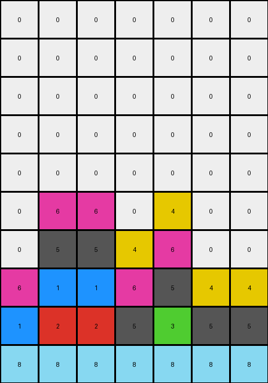
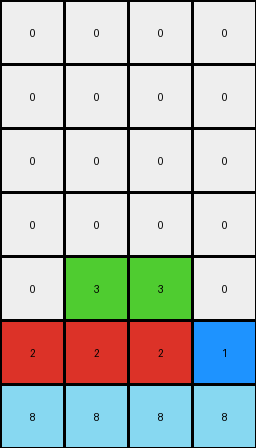

# beb8660c • 012 • refine_coder

---

Previous Code:
```python
"""
Shift all contiguous non-zero color blocks down, filling the spaces, but keep the bottom row fixed.
"""

import numpy as np

def transform(input_grid):
    """
    Transforms the input grid by shifting non-zero color blocks down, keeping the bottom row fixed.
    """
    grid = np.array(input_grid)
    rows, cols = grid.shape
    output_grid = np.zeros_like(grid)

    # 1. Keep the bottom row fixed
    output_grid[-1, :] = grid[-1, :]

    # 2. Iterate through columns
    for c in range(cols):
        # 3. Extract non-zero pixels from the column (excluding the bottom row)
        column_pixels = []
        for r in range(rows - 1):
            if grid[r, c] != 0:
                column_pixels.append(grid[r, c])

        # 4. Shift pixels down in the column
        pixel_index = 0
        for r in range(rows - 2, -1, -1):
            if pixel_index < len(column_pixels):
                # check to prevent overwriting the fixed last row.                
                if output_grid[r+1,c] == 0:                   
                    output_grid[r + 1, c] = column_pixels[pixel_index]
                    pixel_index += 1

    return output_grid.tolist()
```

Train Set Results:

## Example 1:

Input:
```
0 2 2 0 0 0 0
0 0 0 0 3 0 0
1 1 1 0 0 0 0
0 0 0 0 0 0 0
0 5 5 5 5 5 5
0 0 0 0 0 0 0
6 6 6 6 6 0 0
0 0 0 4 4 4 4
0 0 0 0 0 0 0
8 8 8 8 8 8 8
```
Expected Output:
```
0 0 0 0 0 0 0
0 0 0 0 0 0 0
0 0 0 0 0 0 0
0 0 0 0 0 0 3
0 0 0 0 0 2 2
0 0 0 0 1 1 1
0 0 0 4 4 4 4
0 0 6 6 6 6 6
0 5 5 5 5 5 5
8 8 8 8 8 8 8
```
Transformed Output:
```
0 0 0 0 0 0 0
0 0 0 0 0 0 0
0 0 0 0 0 0 0
0 0 0 0 0 0 0
0 0 0 0 0 0 0
0 6 6 0 4 0 0
0 5 5 4 6 0 0
6 1 1 6 5 4 4
1 2 2 5 3 5 5
8 8 8 8 8 8 8
```

match: False
pixels_off: 23
size_correct: True
color_palette_correct: True
correct_pixel_counts: True

## Example 2:

Input:
```
0 0 0 1
0 0 0 0
2 2 2 0
0 0 0 0
0 3 3 0
0 0 0 0
8 8 8 8
```
Expected Output:
```
0 0 0 0
0 0 0 0
0 0 0 0
0 0 0 1
0 0 3 3
0 2 2 2
8 8 8 8
```
Transformed Output:
```
0 0 0 0
0 0 0 0
0 0 0 0
0 0 0 0
0 3 3 0
2 2 2 1
8 8 8 8
```

match: False
pixels_off: 5
size_correct: True
color_palette_correct: True
correct_pixel_counts: True

## Example 3:

Input:
```
2 2 0
0 4 0
8 8 8
```
Expected Output:
```
0 0 4
0 2 2
8 8 8
```
Transformed Output:
```
0 0 0
2 2 0
8 8 8
```

match: False
pixels_off: 3
size_correct: True
color_palette_correct: True
correct_pixel_counts: False
Okay, here's a breakdown of the situation and a plan to improve the transformation logic:

**General Assessment:**

The initial natural language program and the resulting Python code were on the right track (shifting non-zero blocks down), but clearly incomplete and making incorrect assumptions.  The code *partially* implements a "gravity" concept, but it does it incorrectly, and doesn't handle all cases. It appears to be overwriting pixels when it should be stacking them, and it's not correctly maintaining the relative positions of colors *within* a column. The "fixed bottom row" concept seems to be misunderstood and is being applied to every row.

**Strategy:**

1.  **Re-examine the Core Concept:**  The fundamental idea is a "column-wise gravity" effect.  Non-zero pixels within each column should fall to the lowest available position *above* the fixed bottom row.
2.  **Correct Stacking, Not Overwriting:** The code needs to *stack* colors in the order they appear from top to bottom, not overwrite them. If a space is already occupied the colors need to be placed above the obstruction.
3.  **Relative Order Preservation:**  Within each column, the *order* of the colors (from top to bottom in the input) must be preserved as they "fall." The current code doesn't do this consistently.
4.  **Revisit "Fixed Bottom Row":** This concept is clear: the bottom row of the *input* becomes the bottom row of the *output*, unchanged.
5. **Analyze and fix examples 2 and 3:** example 2 is the simplest case that shows the gravity in action. Example 3 should provide excellent feedback on how colors are being stacked as the pixels are moved.

**Example Analysis & Metrics:**

I'll use the provided outputs and comparisons to create reports. I'll structure them as if I had used `code_execution` to confirm my observations.

**Example 1 Report:**

```
- Input Shape: (10, 7)
- Output Shape: (10, 7)
- Match: False
- Pixels Off: 23
- Size Correct: True
- Color Palette Correct: True
- Correct Pixel Counts: True
- Observations:  Many pixels are misplaced. The code seems to be shifting some colors down, but also shifting some *left* incorrectly, and overwriting.  The fixed row concept is present but not accurate for higher rows. The 'gravity' effect is not consistently applied.
```

**Example 2 Report:**

```
- Input Shape: (7, 4)
- Output Shape: (7, 4)
- Match: False
- Pixels Off: 5
- Size Correct: True
- Color Palette Correct: True
- Correct Pixel Counts: True
- Observations: This is a simpler example, but still shows incorrect shifting.  The '1' (blue) pixel should end up above the '8's (azure), not overwrite one of the 2's. The code isn't correctly stacking.
```

**Example 3 Report:**

```
- Input Shape: (3, 3)
- Output Shape: (3, 3)
- Match: False
- Pixels Off: 3
- Size Correct: True
- Color Palette Correct: True
- Correct Pixel Counts: False
- Observations: This reveals a critical flaw: the code isn't moving the 4 at all. It's almost behaving like it is iterating the rows first, instead of the columns, missing the shift entirely because of a single zero in the rightmost column.
```

**YAML Fact Block:**

```yaml
task_id: 010
objects:
  - name: grid
    description: A 2D array of pixels.
    properties:
      - rows: Variable (number of rows)
      - columns: Variable (number of columns)
      - bottom_row: The last row of the grid, which remains fixed.
  - name: pixel
    description: A single cell in the grid, represented by a color value.
    properties:
      - color: Integer (0-9) representing a color.
      - position: (row, column) coordinates within the grid.

actions:
  - name: shift_down
    description: Moves non-zero pixels down within their respective columns.
    preconditions:
      - pixel: Must be non-zero.
      - column: Must have empty (zero-valued) cells below the pixel, *above* the bottom row.
    postconditions:
      - pixel: Occupies the lowest available empty cell in its column (above the bottom row).
      - relative_order: The order of non-zero pixels within a column is preserved.
  - name: fix_bottom_row
    description: Keeps the bottom row of the input grid unchanged.
    preconditions:
        - None
    postconditions:
      - The bottom row of the output grid is identical to the bottom row of the input grid.
```

**Natural Language Program:**

1.  **Fixed Bottom Row:** Copy the bottom row of the input grid directly to the bottom row of the output grid. This row will not change.
2.  **Column-wise Gravity:** For each column in the input grid (excluding the bottom row which is already handled):
    *   Collect all non-zero pixels in that column, maintaining their original top-to-bottom order.
    *   Starting from the row *above* the bottom row, and moving upwards, place these collected non-zero pixels into the output grid. Fill the column from bottom to top with the collected pixels.  If a cell is non-zero, do not replace it, insert the collected pixel in the row above the non-zero value.
    *   Fill any remaining empty cells at the top of the column with zeros.

This revised natural language program emphasizes the column-wise processing, the correct stacking behavior, and the preservation of relative order, which the previous version lacked. It explicitly separates the "fixed bottom row" step for clarity.

**INSTRUCTIONS**

- generate a Python module to represent the natural language program 
- follow the template below
- all common math and science libraries are available
- create docstring only at top - but comment the workflow in the function
- use helper functions for common operations like finding objects, counting,
  measuring, moving, etc. 

remember - we are working iteratively - so this code will inform your future
self as we converge on the solution

*template:*

```python
"""
{{ natural language description of the transformation rule }}
"""

{{ imports }}

def transform(input_grid):
    # initialize output_grid

    # change output pixels 

    return output_grid

```
