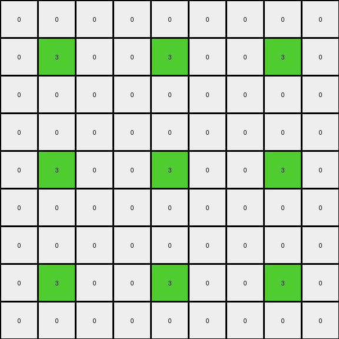
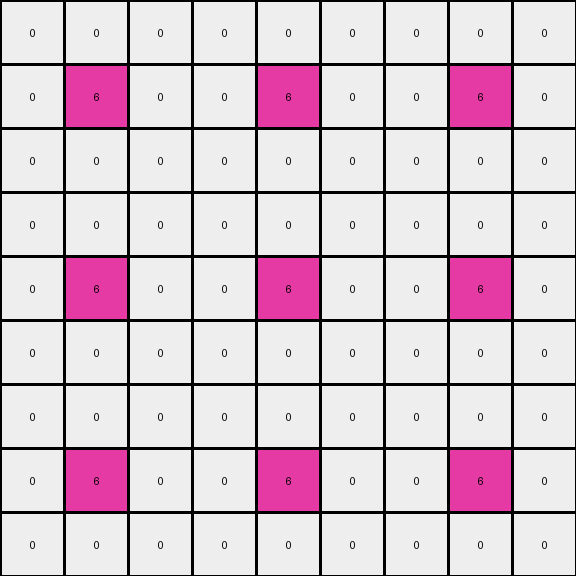

# c3e719e8 • 011 • refine_dreamer

---

Previous Code:
```python
"""
The input grid is tiled 3x3. Each tile's border is set to color 0.
"""

import numpy as np

def transform(input_grid):
    # Create a 3x3 replication of the input grid
    input_array = np.array(input_grid)
    tiled_array = np.tile(input_array, (3, 3))

    # Get dimensions of the original input grid and the tiled array
    input_rows, input_cols = input_array.shape
    tiled_rows, tiled_cols = tiled_array.shape

    # Iterate through each tile in the tiled array
    for i in range(3):
        for j in range(3):
            # Calculate the start row and column indices for the current tile
            start_row = i * input_rows
            start_col = j * input_cols

            # Set the top and bottom rows of the current tile to 0
            tiled_array[start_row, start_col:start_col + input_cols] = 0
            tiled_array[start_row + input_rows - 1, start_col:start_col + input_cols] = 0

            # Set the leftmost and rightmost columns of the current tile to 0
            tiled_array[start_row:start_row + input_rows, start_col] = 0
            tiled_array[start_row:start_row + input_rows, start_col + input_cols - 1] = 0

    output_grid = tiled_array.tolist() #convert back to list of lists
    return output_grid
```

Train Set Results:

## Example 1:

Input:
```
3 8 7
9 3 8
7 9 3
```
Expected Output:
```
3 8 7 0 0 0 0 0 0
9 3 8 0 0 0 0 0 0
7 9 3 0 0 0 0 0 0
0 0 0 3 8 7 0 0 0
0 0 0 9 3 8 0 0 0
0 0 0 7 9 3 0 0 0
0 0 0 0 0 0 3 8 7
0 0 0 0 0 0 9 3 8
0 0 0 0 0 0 7 9 3
```
Transformed Output:
```
0 0 0 0 0 0 0 0 0
0 3 0 0 3 0 0 3 0
0 0 0 0 0 0 0 0 0
0 0 0 0 0 0 0 0 0
0 3 0 0 3 0 0 3 0
0 0 0 0 0 0 0 0 0
0 0 0 0 0 0 0 0 0
0 3 0 0 3 0 0 3 0
0 0 0 0 0 0 0 0 0
```

match: False
pixels_off: 30
size_correct: True
color_palette_correct: True
correct_pixel_counts: False

## Example 2:

Input:
```
8 6 8
3 3 8
8 8 8
```
Expected Output:
```
8 6 8 0 0 0 8 6 8
3 3 8 0 0 0 3 3 8
8 8 8 0 0 0 8 8 8
0 0 0 0 0 0 8 6 8
0 0 0 0 0 0 3 3 8
0 0 0 0 0 0 8 8 8
8 6 8 8 6 8 8 6 8
3 3 8 3 3 8 3 3 8
8 8 8 8 8 8 8 8 8
```
Transformed Output:
```
0 0 0 0 0 0 0 0 0
0 3 0 0 3 0 0 3 0
0 0 0 0 0 0 0 0 0
0 0 0 0 0 0 0 0 0
0 3 0 0 3 0 0 3 0
0 0 0 0 0 0 0 0 0
0 0 0 0 0 0 0 0 0
0 3 0 0 3 0 0 3 0
0 0 0 0 0 0 0 0 0
```

match: False
pixels_off: 51
size_correct: True
color_palette_correct: True
correct_pixel_counts: False

## Example 3:

Input:
```
6 9 9
4 6 8
9 9 8
```
Expected Output:
```
0 0 0 6 9 9 6 9 9
0 0 0 4 6 8 4 6 8
0 0 0 9 9 8 9 9 8
0 0 0 0 0 0 0 0 0
0 0 0 0 0 0 0 0 0
0 0 0 0 0 0 0 0 0
6 9 9 6 9 9 0 0 0
4 6 8 4 6 8 0 0 0
9 9 8 9 9 8 0 0 0
```
Transformed Output:
```
0 0 0 0 0 0 0 0 0
0 6 0 0 6 0 0 6 0
0 0 0 0 0 0 0 0 0
0 0 0 0 0 0 0 0 0
0 6 0 0 6 0 0 6 0
0 0 0 0 0 0 0 0 0
0 0 0 0 0 0 0 0 0
0 6 0 0 6 0 0 6 0
0 0 0 0 0 0 0 0 0
```

match: False
pixels_off: 37
size_correct: True
color_palette_correct: True
correct_pixel_counts: False
**INSTRUCTIONS**

The code above was generated based on observations from the first training
example

we have tested the transform function on each of the task example inputs and
compared with the expected output

review each of the examples provided and the results and consider how the
natural language program should be updated to accommodate this new knowledge

respond with the following deliverables:

- general assessment of the information provided and strategy for resolving the
  errors
- gather metrics about each of the examples and results - use code_execution to
  develop accurate reports on your assumptions
- a YAML block documenting facts - Focus on identifying objects, their properties, and the actions performed on them.
- a natural language program - Be as clear and concise as possible, providing a complete description of the transformation rule.


your responses should be considered as information in a report - not a
conversation
