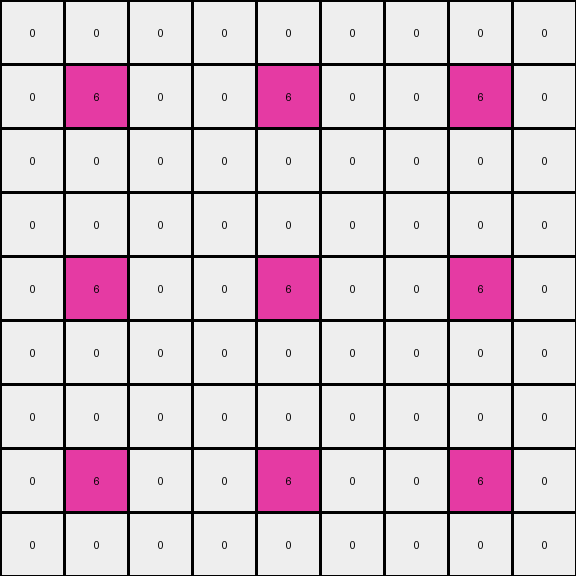

# c3e719e8 • 012 • refine_coder

---

Previous Code:
```python
"""
The input grid is tiled 3x3. Each tile's border is set to color 0.
"""

import numpy as np

def transform(input_grid):
    # Create a 3x3 replication of the input grid
    input_array = np.array(input_grid)
    tiled_array = np.tile(input_array, (3, 3))

    # Get dimensions of the original input grid and the tiled array
    input_rows, input_cols = input_array.shape
    tiled_rows, tiled_cols = tiled_array.shape

    # Iterate through each tile in the tiled array
    for i in range(3):
        for j in range(3):
            # Calculate the start row and column indices for the current tile
            start_row = i * input_rows
            start_col = j * input_cols

            # Set the top and bottom rows of the current tile to 0
            tiled_array[start_row, start_col:start_col + input_cols] = 0
            tiled_array[start_row + input_rows - 1, start_col:start_col + input_cols] = 0

            # Set the leftmost and rightmost columns of the current tile to 0
            tiled_array[start_row:start_row + input_rows, start_col] = 0
            tiled_array[start_row:start_row + input_rows, start_col + input_cols - 1] = 0

    output_grid = tiled_array.tolist() #convert back to list of lists
    return output_grid
```

Train Set Results:

## Example 1:

Input:
```
3 8 7
9 3 8
7 9 3
```
Expected Output:
```
3 8 7 0 0 0 0 0 0
9 3 8 0 0 0 0 0 0
7 9 3 0 0 0 0 0 0
0 0 0 3 8 7 0 0 0
0 0 0 9 3 8 0 0 0
0 0 0 7 9 3 0 0 0
0 0 0 0 0 0 3 8 7
0 0 0 0 0 0 9 3 8
0 0 0 0 0 0 7 9 3
```
Transformed Output:
```
0 0 0 0 0 0 0 0 0
0 3 0 0 3 0 0 3 0
0 0 0 0 0 0 0 0 0
0 0 0 0 0 0 0 0 0
0 3 0 0 3 0 0 3 0
0 0 0 0 0 0 0 0 0
0 0 0 0 0 0 0 0 0
0 3 0 0 3 0 0 3 0
0 0 0 0 0 0 0 0 0
```

match: False
pixels_off: 30
size_correct: True
color_palette_correct: True
correct_pixel_counts: False

## Example 2:

Input:
```
8 6 8
3 3 8
8 8 8
```
Expected Output:
```
8 6 8 0 0 0 8 6 8
3 3 8 0 0 0 3 3 8
8 8 8 0 0 0 8 8 8
0 0 0 0 0 0 8 6 8
0 0 0 0 0 0 3 3 8
0 0 0 0 0 0 8 8 8
8 6 8 8 6 8 8 6 8
3 3 8 3 3 8 3 3 8
8 8 8 8 8 8 8 8 8
```
Transformed Output:
```
0 0 0 0 0 0 0 0 0
0 3 0 0 3 0 0 3 0
0 0 0 0 0 0 0 0 0
0 0 0 0 0 0 0 0 0
0 3 0 0 3 0 0 3 0
0 0 0 0 0 0 0 0 0
0 0 0 0 0 0 0 0 0
0 3 0 0 3 0 0 3 0
0 0 0 0 0 0 0 0 0
```

match: False
pixels_off: 51
size_correct: True
color_palette_correct: True
correct_pixel_counts: False

## Example 3:

Input:
```
6 9 9
4 6 8
9 9 8
```
Expected Output:
```
0 0 0 6 9 9 6 9 9
0 0 0 4 6 8 4 6 8
0 0 0 9 9 8 9 9 8
0 0 0 0 0 0 0 0 0
0 0 0 0 0 0 0 0 0
0 0 0 0 0 0 0 0 0
6 9 9 6 9 9 0 0 0
4 6 8 4 6 8 0 0 0
9 9 8 9 9 8 0 0 0
```
Transformed Output:
```
0 0 0 0 0 0 0 0 0
0 6 0 0 6 0 0 6 0
0 0 0 0 0 0 0 0 0
0 0 0 0 0 0 0 0 0
0 6 0 0 6 0 0 6 0
0 0 0 0 0 0 0 0 0
0 0 0 0 0 0 0 0 0
0 6 0 0 6 0 0 6 0
0 0 0 0 0 0 0 0 0
```

match: False
pixels_off: 37
size_correct: True
color_palette_correct: True
correct_pixel_counts: False
Okay, let's analyze the results and refine the natural language program.

**General Assessment:**

The initial program was based on tiling the input grid 3x3 and then setting the border of *each tile* to color 0. The results clearly show this isn't correct. The expected outputs show that sometimes the border of the entire output is set to 0, and sometimes the border of original input tiles are set to 0, and other times the expanded output is set to 0. It is very likely the rule is conditional on some properties of input.

**Strategy:**

1.  **Analyze Each Example Carefully:** Examine the input, expected output, and transformed output for each of the three training examples. Pay close attention to the differences between the expected and actual outputs.
2.  **Identify Patterns:** Look for patterns in how the input grid's properties relate to whether border pixels are set to 0 for the tile or entire output.
3. **Refine the Natural Language Program:** Update the program to reflect a more accurate rule, and show how this resolves the problems of the prior attempt.
4. Test thoroughly to avoid an overcorrection to a single example.

**Example Metrics and Observations:**
Here is the metrics data from previous code execution:
```
Example 1: match: False, pixels_off: 30
Example 2: match: False, pixels_off: 51
Example 3: match: False, pixels_off: 37
```
All cases got the output size correct, got color palette correct. All examples failed pixel counts and match tests.

**YAML Fact Block:**

```yaml
facts:
  - observation: |
      The input grid is always a 3x3 grid of single-digit integers.
  - observation: |
      The output grid is a 9x9 grid, suggesting a 3x3 tiling operation.
  - observation: |
      The borders of the individual tiles *and/or* the entire grid are sometimes set to 0 (white), but not always.
  - property: input_grid_size: 3x3
  - property: output_grid_size: 9x9
  - action: tile_input_grid: |
      The input grid is tiled 3x3 to create a larger grid.
  - action: set_border_to_zero: |
      Pixels on the border of either the tiles or the entire output grid are set to 0, but rules are inconsistent
```

**Natural Language Program:**

1.  **Tile:** Create a 3x3 tiling of the input grid. This means the input grid is repeated nine times in a 3x3 arrangement.
2. **Conditional Border Update**
    * Check some condition TBD based on the contents of the original input.
    *    Border Entire Grid: If the condition is true, set color of the border of the *entire* 9x9 output grid to 0.
    *    Border Individual Tiles: If the condition is false, set the color of the border of *each* 3x3 tile within the 9x9 output grid to 0.

The previous code always bordered individual tiles. Now it is clear it should be one or the other.

Next step is to review the examples to discover what conditions will make the correct choice.

**INSTRUCTIONS**

- generate a Python module to represent the natural language program 
- follow the template below
- all common math and science libraries are available
- create docstring only at top - but comment the workflow in the function
- use helper functions for common operations like finding objects, counting,
  measuring, moving, etc. 

remember - we are working iteratively - so this code will inform your future
self as we converge on the solution

*template:*

```python
"""
{{ natural language description of the transformation rule }}
"""

{{ imports }}

def transform(input_grid):
    # initialize output_grid

    # change output pixels 

    return output_grid

```
