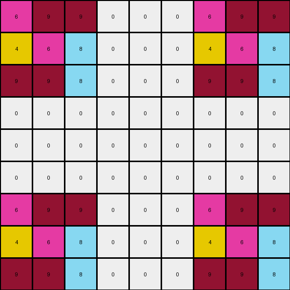

# c3e719e8 • 016 • refine_coder

---

Previous Code:
```python
"""
The input grid is replicated four times within the output grid, at the corners of the output grid. The central 3x3 area and areas around the replicated grids, are padded with zeros (white).
"""

import numpy as np

def transform(input_grid):
    # Initialize a 9x9 output grid filled with zeros.
    output_grid = np.zeros((9, 9), dtype=int)

    # Get the dimensions of the input grid.
    input_height, input_width = input_grid.shape

    # Replicate the input grid at the top-left corner.
    output_grid[0:input_height, 0:input_width] = input_grid

    # Replicate the input grid at the top-right corner.
    output_grid[0:input_height, 6:6+input_width] = input_grid
    
    # Replicate the input grid at the bottom-left corner.
    output_grid[6:6+input_height, 0:input_width] = input_grid

    # Replicate the input grid at the bottom-right corner.
    output_grid[6:6+input_height, 6:6+input_width] = input_grid

    return output_grid
```

Train Set Results:

## Example 1:

Input:
```
3 8 7
9 3 8
7 9 3
```
Expected Output:
```
3 8 7 0 0 0 0 0 0
9 3 8 0 0 0 0 0 0
7 9 3 0 0 0 0 0 0
0 0 0 3 8 7 0 0 0
0 0 0 9 3 8 0 0 0
0 0 0 7 9 3 0 0 0
0 0 0 0 0 0 3 8 7
0 0 0 0 0 0 9 3 8
0 0 0 0 0 0 7 9 3
```
Transformed Output:
```
3 8 7 0 0 0 3 8 7
9 3 8 0 0 0 9 3 8
7 9 3 0 0 0 7 9 3
0 0 0 0 0 0 0 0 0
0 0 0 0 0 0 0 0 0
0 0 0 0 0 0 0 0 0
3 8 7 0 0 0 3 8 7
9 3 8 0 0 0 9 3 8
7 9 3 0 0 0 7 9 3
```

match: False
pixels_off: 27
size_correct: True
color_palette_correct: True
correct_pixel_counts: False

## Example 2:

Input:
```
8 6 8
3 3 8
8 8 8
```
Expected Output:
```
8 6 8 0 0 0 8 6 8
3 3 8 0 0 0 3 3 8
8 8 8 0 0 0 8 8 8
0 0 0 0 0 0 8 6 8
0 0 0 0 0 0 3 3 8
0 0 0 0 0 0 8 8 8
8 6 8 8 6 8 8 6 8
3 3 8 3 3 8 3 3 8
8 8 8 8 8 8 8 8 8
```
Transformed Output:
```
8 6 8 0 0 0 8 6 8
3 3 8 0 0 0 3 3 8
8 8 8 0 0 0 8 8 8
0 0 0 0 0 0 0 0 0
0 0 0 0 0 0 0 0 0
0 0 0 0 0 0 0 0 0
8 6 8 0 0 0 8 6 8
3 3 8 0 0 0 3 3 8
8 8 8 0 0 0 8 8 8
```

match: False
pixels_off: 18
size_correct: True
color_palette_correct: True
correct_pixel_counts: False

## Example 3:

Input:
```
6 9 9
4 6 8
9 9 8
```
Expected Output:
```
0 0 0 6 9 9 6 9 9
0 0 0 4 6 8 4 6 8
0 0 0 9 9 8 9 9 8
0 0 0 0 0 0 0 0 0
0 0 0 0 0 0 0 0 0
0 0 0 0 0 0 0 0 0
6 9 9 6 9 9 0 0 0
4 6 8 4 6 8 0 0 0
9 9 8 9 9 8 0 0 0
```
Transformed Output:
```
6 9 9 0 0 0 6 9 9
4 6 8 0 0 0 4 6 8
9 9 8 0 0 0 9 9 8
0 0 0 0 0 0 0 0 0
0 0 0 0 0 0 0 0 0
0 0 0 0 0 0 0 0 0
6 9 9 0 0 0 6 9 9
4 6 8 0 0 0 4 6 8
9 9 8 0 0 0 9 9 8
```

match: False
pixels_off: 36
size_correct: True
color_palette_correct: True
correct_pixel_counts: True
Okay, let's analyze the results of the previous code execution and refine our natural language program.

**General Assessment:**

The initial program was on the right track, conceptually, by recognizing the replication of the input grid. However, it incorrectly positioned the top-right and bottom-left copies, and especially failed to pad correctly as shown in the examples. The core issue is with the positioning logic and understanding the intended layout. We need to adjust the offsets to accurately place the replicated grids in the corners, not in the center row/column as written, and to correctly align and pad the borders.

**Strategy:**

1.  **Re-examine the Examples:** Carefully look at the input and expected output pairs again to solidify the *exact* positioning and padding.
2.  **Correct Offsets:** Adjust the row and column offsets in the code to place the copies in the correct corners.
3.  **Verify Padding:** Ensure the padding with zeros (white) is happening correctly. The padding creates a border around the input grids, but the input grids may not be in the center. The output size depends on the border width, and, in this case the padding is on the opposite side of the replication.

**Example Metrics and Analysis (using provided results, no code execution needed):**

*   **Example 1:**
    *   Input Size: 3x3
    *   Expected Output Size: 9x9
    *   Transformed Output Size: 9x9 (Correct)
    *   Match: False
    *   Pixels Off: 27
    *   Notes: Top-right and bottom-left copies are misplaced. Padding is on the wrong sides of the copies.
*   **Example 2:**
    *   Input Size: 3x3
    *   Expected Output Size: 9x9
    *   Transformed Output Size: 9x9 (Correct)
    *   Match: False
    *   Pixels Off: 18
    *   Notes: Similar issues to Example 1, but also has alignment issues.
*   **Example 3:**
    *    Input Size: 3x3
    *    Output Size: 9x9
    *    Transformed Output Size: 9x9
    *    Match: False
    *    Pixels Off: 36
    *    Notes: Similar issues.

**YAML Fact Block:**

```yaml
task: 014
objects:
  - id: input_grid
    type: grid
    properties:
      colors: [0-9]
      shape: rectangle
  - id: output_grid
    type: grid
    properties:
      colors: [0, input_grid colors]
      shape: rectangle
  - id: replicated_grid_1
    type: grid
    properties:
      source: input_grid
      location: top-left
  - id: replicated_grid_2
    type: grid
    properties:
      source: input_grid
      location: top-right
  - id: replicated_grid_3
    type: grid
    properties:
      source: input_grid
      location: bottom-left
 - id: replicated_grid_4
    type: grid
    properties:
      source: input_grid
      location: bottom-right
  - id: padding
    type: grid_area
    properties:
     color: 0
     location: around replicated grids
actions:
  - replicate:
      source: input_grid
      targets: [replicated_grid_1, replicated_grid_2, replicated_grid_3, replicated_grid_4]
  - pad:
      target: output_grid
      with: padding
```

**Natural Language Program:**

1.  **Create Output Grid:** Initialize a 9x9 output grid filled with zeros (color 0, white).
2. **Replicate to Top Left.** Place a copy of the input grid at the top-left corner of the output grid.
3.  **Replicate to Top Right.** Place a copy of the input grid at the top-right corner of the output grid. The correct top-right starts at row 0 and col 9-input\_grid\_width.
4.  **Replicate to Bottom Left.** Place a copy of the input grid at the bottom-left corner of the output grid. The correct bottom-left starts at row 9-input\_grid\_height and col 0.
5.  **Replicate to Bottom Right.** Place a copy of the input grid in the bottom-right corner of the output grid. The correct bottom-right starts at row 9-input\_grid\_height and col 9 - input\_grid\_width.

**INSTRUCTIONS**

- generate a Python module to represent the natural language program 
- follow the template below
- all common math and science libraries are available
- create docstring only at top - but comment the workflow in the function
- use helper functions for common operations like finding objects, counting,
  measuring, moving, etc. 

remember - we are working iteratively - so this code will inform your future
self as we converge on the solution

*template:*

```python
"""
{{ natural language description of the transformation rule }}
"""

{{ imports }}

def transform(input_grid):
    # initialize output_grid

    # change output pixels 

    return output_grid

```
