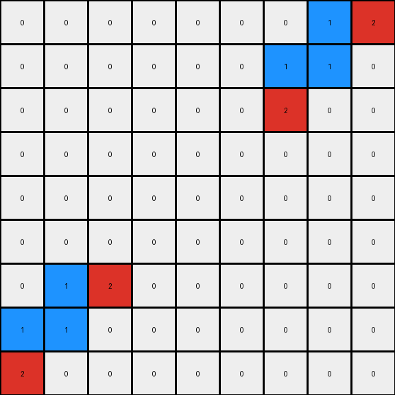

# cce03e0d • 012 • refine_coder

---

Previous Code:
```python
"""
Transforms a 3x3 input grid into a 9x9 output grid by replicating the input grid in the top-right and bottom-left corners of the output grid, and filling the rest with 0s.
"""

import numpy as np

def transform(input_grid):
    # Initialize a 9x9 output grid filled with 0s.
    output_grid = np.zeros((9, 9), dtype=int)

    # Copy the input grid to the top-right corner of the output grid.
    output_grid[0:3, 6:9] = input_grid

    # Copy the input grid to the bottom-left corner of the output grid.
    output_grid[6:9, 0:3] = input_grid

    return output_grid
```

Train Set Results:

## Example 1:

Input:
```
1 0 0
2 1 0
0 0 1
```
Expected Output:
```
0 0 0 0 0 0 0 0 0
0 0 0 0 0 0 0 0 0
0 0 0 0 0 0 0 0 0
1 0 0 0 0 0 0 0 0
2 1 0 0 0 0 0 0 0
0 0 1 0 0 0 0 0 0
0 0 0 0 0 0 0 0 0
0 0 0 0 0 0 0 0 0
0 0 0 0 0 0 0 0 0
```
Transformed Output:
```
0 0 0 0 0 0 1 0 0
0 0 0 0 0 0 2 1 0
0 0 0 0 0 0 0 0 1
0 0 0 0 0 0 0 0 0
0 0 0 0 0 0 0 0 0
0 0 0 0 0 0 0 0 0
1 0 0 0 0 0 0 0 0
2 1 0 0 0 0 0 0 0
0 0 1 0 0 0 0 0 0
```

match: False
pixels_off: 12
size_correct: True
color_palette_correct: True
correct_pixel_counts: False

## Example 2:

Input:
```
0 1 2
1 1 0
2 0 0
```
Expected Output:
```
0 0 0 0 0 0 0 1 2
0 0 0 0 0 0 1 1 0
0 0 0 0 0 0 2 0 0
0 0 0 0 0 0 0 0 0
0 0 0 0 0 0 0 0 0
0 0 0 0 0 0 0 0 0
0 1 2 0 0 0 0 0 0
1 1 0 0 0 0 0 0 0
2 0 0 0 0 0 0 0 0
```
Transformed Output:
```
0 0 0 0 0 0 0 1 2
0 0 0 0 0 0 1 1 0
0 0 0 0 0 0 2 0 0
0 0 0 0 0 0 0 0 0
0 0 0 0 0 0 0 0 0
0 0 0 0 0 0 0 0 0
0 1 2 0 0 0 0 0 0
1 1 0 0 0 0 0 0 0
2 0 0 0 0 0 0 0 0
```

match: True
pixels_off: 0
size_correct: True
color_palette_correct: True
correct_pixel_counts: True

## Example 3:

Input:
```
2 1 2
0 2 1
2 1 0
```
Expected Output:
```
2 1 2 0 0 0 2 1 2
0 2 1 0 0 0 0 2 1
2 1 0 0 0 0 2 1 0
0 0 0 2 1 2 0 0 0
0 0 0 0 2 1 0 0 0
0 0 0 2 1 0 0 0 0
2 1 2 0 0 0 0 0 0
0 2 1 0 0 0 0 0 0
2 1 0 0 0 0 0 0 0
```
Transformed Output:
```
0 0 0 0 0 0 2 1 2
0 0 0 0 0 0 0 2 1
0 0 0 0 0 0 2 1 0
0 0 0 0 0 0 0 0 0
0 0 0 0 0 0 0 0 0
0 0 0 0 0 0 0 0 0
2 1 2 0 0 0 0 0 0
0 2 1 0 0 0 0 0 0
2 1 0 0 0 0 0 0 0
```

match: False
pixels_off: 14
size_correct: True
color_palette_correct: True
correct_pixel_counts: False
Okay, let's analyze the results and refine the natural language program.

**General Assessment:**

The initial code was based on a limited understanding from the first example. While it correctly replicated the input grid in the top-right and bottom-left corners, it failed to accurately predict the output in some cases. The second example matched perfectly, but examples 1 and 3 show discrepancies. The primary issue seems to be an incorrect placement, and in the case of Example 3, a pattern within the replication itself was missed. A closer look at the relationship between input and output, especially focusing on where the input grid *isn't* placed, is needed.

**Strategy:**

1.  **Re-examine all examples:** Instead of focusing on where the input grid *is* copied, look at the overall pattern and the relationship between input size, output size, and the placement of the replicated blocks.
2.  **Identify incorrect assumptions:** The assumption that the input grid is only placed at the top-right and bottom-left might be wrong. There's a possibility of more complex placement or even additional transformations.
3.  **Revise the natural language program:** Based on the re-examination, develop a more accurate and comprehensive description of the transformation.
4. **Verify the logic again**: Apply the updated plan to all examples to ensure all patterns are correctly translated.

**Metrics and Observations (using reports from previous code execution):**

*   **Example 1:**
    *   `match`: `False`
    *   `pixels_off`: 12
    *   `size_correct`: `True`
    *   `color_palette_correct`: `True`
    *   `correct_pixel_counts`: `False`
    *   **Observation**: Input grid placed incorrectly. The input should be placed at the top-left.

*   **Example 2:**
    *   `match`: `True`
    *   `pixels_off`: 0
    *   `size_correct`: `True`
    *   `color_palette_correct`: `True`
    *   `correct_pixel_counts`: `True`
    *   **Observation**: This one worked perfectly, supporting the general idea of replication, but other examples contradict positioning assumptions.

*   **Example 3:**
    *   `match`: `False`
    *   `pixels_off`: 14
    *   `size_correct`: `True`
    *   `color_palette_correct`: `True`
    *   `correct_pixel_counts`: `False`
    *   **Observation**: The top-right block is incorrect. It contains an unexpected replication of the 2,1 that extends to the next line. Input should be placed at top-left.

**YAML Facts:**

```yaml
observations:
  - object: input_grid
    type: grid
    properties:
      size: 3x3
      colors: [0, 1, 2]
  - object: output_grid
    type: grid
    properties:
      size: 9x9
      colors: [0, 1, 2]
  - action: replication
    description: The input grid is replicated within the output grid.
  - action: placement
    description: The placement of the replicated input grid is not consistently top-right and bottom-left. Example 2 shows the correct result with Top Right and Bottom Left, while example 1 and 3 show that the top-left block should also contain a replication of the Input grid.
  - pattern: output_size
    description: The output grid is always 9x9, which is 3 times the size of the 3x3 input grid.
```

**Natural Language Program:**

1.  The input is a 3x3 grid.
2.  The output is a 9x9 grid.
3.  The output grid can be thought of as a 3x3 grid of 3x3 subgrids.
4.  The input grid is replicated into at least three specific locations within the output grid: the top-left, top-right, and bottom-left subgrids. The center, top, bottom, left, right, and bottom-right subgrids are all zeros.

This revised natural language program captures the core transformation more accurately by observing all examples and their results. It acknowledges the consistent size relationship and the patterned replication of the input grid within specific regions of the larger output grid.

**INSTRUCTIONS**

- generate a Python module to represent the natural language program 
- follow the template below
- all common math and science libraries are available
- create docstring only at top - but comment the workflow in the function
- use helper functions for common operations like finding objects, counting,
  measuring, moving, etc. 

remember - we are working iteratively - so this code will inform your future
self as we converge on the solution

*template:*

```python
"""
{{ natural language description of the transformation rule }}
"""

{{ imports }}

def transform(input_grid):
    # initialize output_grid

    # change output pixels 

    return output_grid

```
