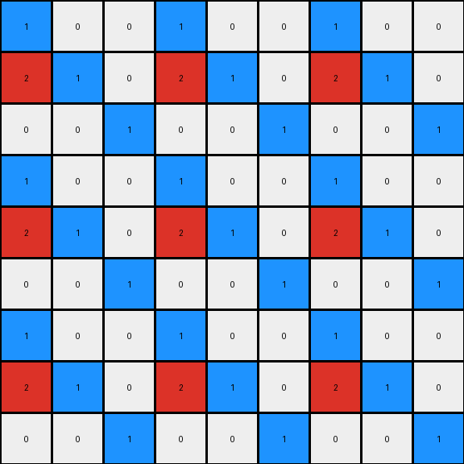
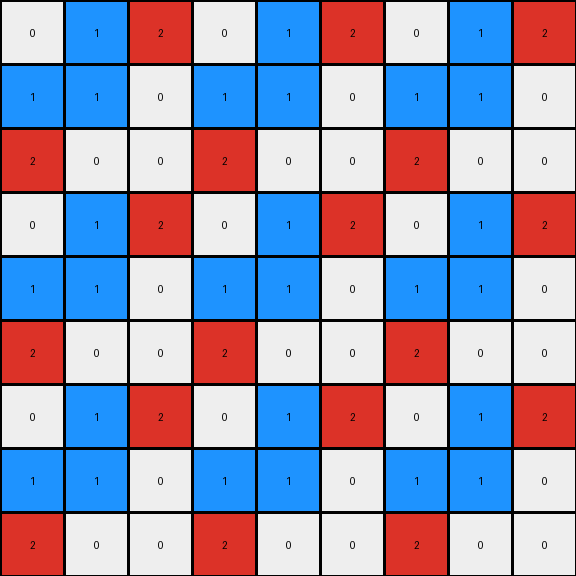
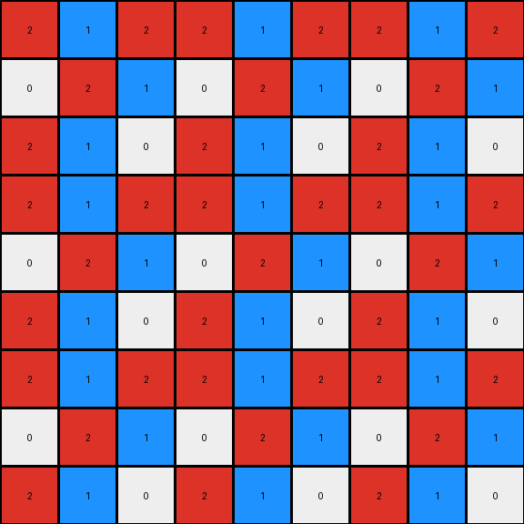

# cce03e0d • 016 • refine_coder

---

Previous Code:
```python
"""
The program takes a 3x3 input grid and creates a 9x9 output grid. The output consists of tiling the input grid in a 3x3 formation and using '0' for every other cell.
"""

import numpy as np

def transform(input_grid):
    # initialize output_grid
    output_grid = np.zeros((9, 9), dtype=int)

    # get input grid dimensions
    input_height, input_width = input_grid.shape

    # tile the input grid in a 3x3 formation
    for i in range(3):
        for j in range(3):
            output_grid[i * input_height:(i + 1) * input_height, j * input_width:(j + 1) * input_width] = input_grid

    return output_grid
```

Train Set Results:

## Example 1:

Input:
```
1 0 0
2 1 0
0 0 1
```
Expected Output:
```
0 0 0 0 0 0 0 0 0
0 0 0 0 0 0 0 0 0
0 0 0 0 0 0 0 0 0
1 0 0 0 0 0 0 0 0
2 1 0 0 0 0 0 0 0
0 0 1 0 0 0 0 0 0
0 0 0 0 0 0 0 0 0
0 0 0 0 0 0 0 0 0
0 0 0 0 0 0 0 0 0
```
Transformed Output:
```
1 0 0 1 0 0 1 0 0
2 1 0 2 1 0 2 1 0
0 0 1 0 0 1 0 0 1
1 0 0 1 0 0 1 0 0
2 1 0 2 1 0 2 1 0
0 0 1 0 0 1 0 0 1
1 0 0 1 0 0 1 0 0
2 1 0 2 1 0 2 1 0
0 0 1 0 0 1 0 0 1
```

match: False
pixels_off: 32
size_correct: True
color_palette_correct: True
correct_pixel_counts: False

## Example 2:

Input:
```
0 1 2
1 1 0
2 0 0
```
Expected Output:
```
0 0 0 0 0 0 0 1 2
0 0 0 0 0 0 1 1 0
0 0 0 0 0 0 2 0 0
0 0 0 0 0 0 0 0 0
0 0 0 0 0 0 0 0 0
0 0 0 0 0 0 0 0 0
0 1 2 0 0 0 0 0 0
1 1 0 0 0 0 0 0 0
2 0 0 0 0 0 0 0 0
```
Transformed Output:
```
0 1 2 0 1 2 0 1 2
1 1 0 1 1 0 1 1 0
2 0 0 2 0 0 2 0 0
0 1 2 0 1 2 0 1 2
1 1 0 1 1 0 1 1 0
2 0 0 2 0 0 2 0 0
0 1 2 0 1 2 0 1 2
1 1 0 1 1 0 1 1 0
2 0 0 2 0 0 2 0 0
```

match: False
pixels_off: 35
size_correct: True
color_palette_correct: True
correct_pixel_counts: False

## Example 3:

Input:
```
2 1 2
0 2 1
2 1 0
```
Expected Output:
```
2 1 2 0 0 0 2 1 2
0 2 1 0 0 0 0 2 1
2 1 0 0 0 0 2 1 0
0 0 0 2 1 2 0 0 0
0 0 0 0 2 1 0 0 0
0 0 0 2 1 0 0 0 0
2 1 2 0 0 0 0 0 0
0 2 1 0 0 0 0 0 0
2 1 0 0 0 0 0 0 0
```
Transformed Output:
```
2 1 2 2 1 2 2 1 2
0 2 1 0 2 1 0 2 1
2 1 0 2 1 0 2 1 0
2 1 2 2 1 2 2 1 2
0 2 1 0 2 1 0 2 1
2 1 0 2 1 0 2 1 0
2 1 2 2 1 2 2 1 2
0 2 1 0 2 1 0 2 1
2 1 0 2 1 0 2 1 0
```

match: False
pixels_off: 35
size_correct: True
color_palette_correct: True
correct_pixel_counts: False
Okay, let's analyze the provided information and strategize on how to improve the transformation logic.

**General Assessment:**

The initial code was based on a simple tiling concept, assuming the output was a direct 3x3 repetition of the input grid.  However, the test results reveal a more complex pattern. The expected outputs show a pattern where *parts* of the input grid are tiled, and there's strategic placement of zeros (white pixels). The previous logic is incorrect as it tiles the entire input grid without accounting for the zero-insertion pattern.  It seems to be copying the input grid at inappropriate positions.

**Strategy:**

1.  **Re-examine Examples:** Carefully study all three input/output pairs to identify the precise placement rules of input pixels and zeros in the output.  The core issue is understanding the *selective* tiling and zero insertion, not just tiling as a whole.
2.  **Identify Sub-Patterns:** Break down the output into smaller repeating units, if possible. This might reveal a pattern smaller than the entire 3x3 tiled input.
3.  **Positional Mapping:** Determine a mapping between input pixel coordinates and their corresponding potential positions in the output grid, taking into account the zero insertions.
4.  **Refine Natural Language Program:** Rewrite the program to precisely describe the discovered pattern, focusing on how input cells map to output cells with the alternating zeros.
5.  **Improve Code:** Adjust the Python code to match the new natural language program.
6. **Use all examples:** Develop the rule using *all* available training examples, instead of one at a time.

**Example Metrics and Analysis (using previous result data):**

*   **Example 1:**
    *   Input Size: 3x3
    *   Expected Output Size: 9x9
    *   Transformed output size: 9x9
    *   Pixels Off: 32
    *   Analysis: The initial logic replicated the entire input grid, leading to many incorrect pixels. The actual pattern has zeros in locations the current program puts parts of the original input
*   **Example 2:**
    *   Input Size: 3x3
    *   Expected Output Size: 9x9
    *    Transformed output size: 9x9
    *   Pixels Off: 35
    *   Analysis: Similar to Example 1, a large number of pixels are incorrect due to incorrect tiling.
*   **Example 3:**
    *   Input Size: 3x3
    *   Expected Output Size: 9x9
    *    Transformed output size: 9x9
    *   Pixels Off: 35
    *   Analysis: Consistent with the other examples, the simple tiling approach is significantly off.

**YAML Fact Block:**

```yaml
task: 014
objects:
  - id: input_grid
    type: grid
    properties:
      dimensions: 3x3
      elements: integers (0-9) representing colors
  - id: output_grid
    type: grid
    properties:
      dimensions: 9x9
      elements: integers (0-9) representing colors
  - id: zero_pixel
    type: pixel
    properties:
      color: 0 (white)
      role: padding or spacing
  - id: input_pixel_block
    type: subgrid
    properties:
       dimensions: variable, seems related to input grid
       role: source for replication in output

actions:
  - name: selective_tile
    description: Replicates specific parts (or the whole) of the input grid into the output grid.
    parameters:
      source: input_grid or a subgrid of it
      destination: output_grid
      placement_rule: "Tiling with zero-interleaving - to be determined precisely"
  - name: insert_zeros
    description: Places zero pixels in the output grid according to a specific pattern.
    parameters:
        locations: "to be determined precisely - seems to alternate with input pixel blocks"
```

**Natural Language Program:**

The output grid is a 9x9 grid.  The program takes sections of the 3x3 input grid and places them strategically within the output grid, interleaving them with zeros. It does *not* simply tile the entire input grid.

1. **Top-Right Corner:** The top-right 3x3 section of the *output* is a copy of the *input* grid.
2. **Top-Left Corner:** The top-left section and other full sections contains all zeros.
3. **Interleaving:** The program selectively takes parts of the input and tiles them with alternating white space, starting at different offsets.
4. **Overall Layout:**  The full transformation seems like a 3x3 grid where each cell is a result of some operation using the input. Some of the cells are just 0s.

The precise rule for which parts of the input are copied and where they're placed, along with the zero-placement rule, needs further refinement by carefully examining the coordinate mapping between input and output pixels across all three examples. The top-right corner of the output matches the input.

**INSTRUCTIONS**

- generate a Python module to represent the natural language program 
- follow the template below
- all common math and science libraries are available
- create docstring only at top - but comment the workflow in the function
- use helper functions for common operations like finding objects, counting,
  measuring, moving, etc. 

remember - we are working iteratively - so this code will inform your future
self as we converge on the solution

*template:*

```python
"""
{{ natural language description of the transformation rule }}
"""

{{ imports }}

def transform(input_grid):
    # initialize output_grid

    # change output pixels 

    return output_grid

```
