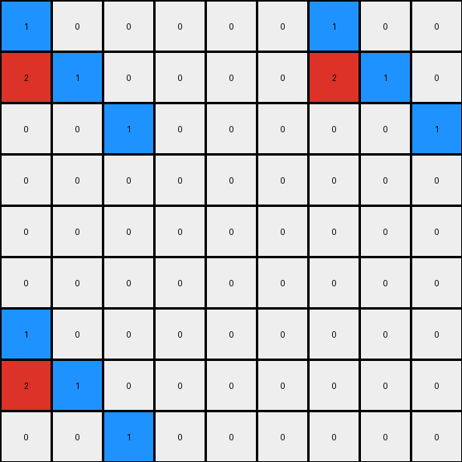
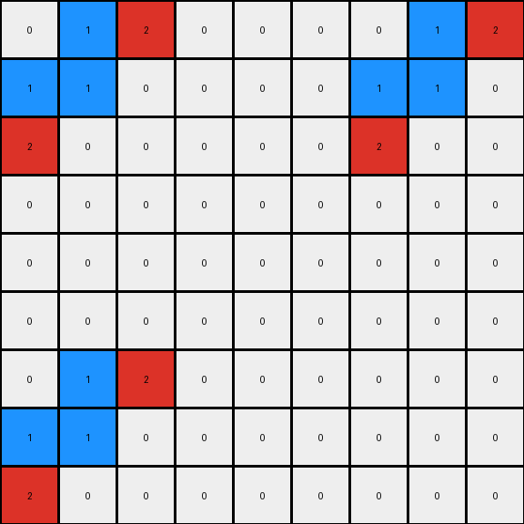
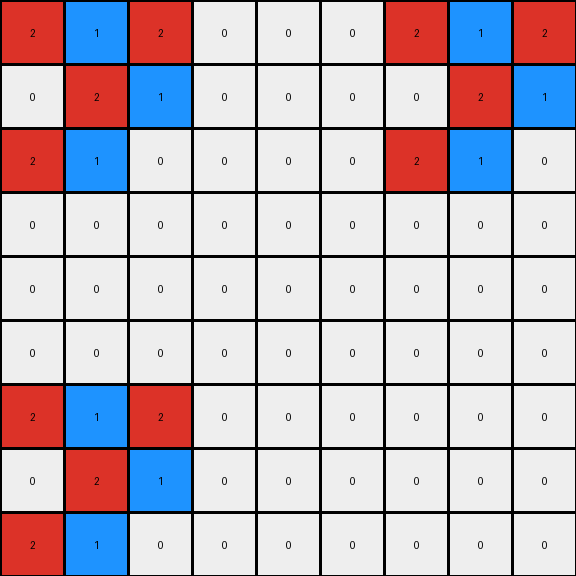

# cce03e0d • 018 • refine_coder

---

Previous Code:
```python
"""
The output grid is a 9x9 grid. The program takes the 3x3 input grid and places it in the top-right corner of the output grid. The rest of the output grid is filled with zeros based on a specific interleaving pattern.
"""

import numpy as np

def transform(input_grid):
    # initialize output_grid
    output_grid = np.zeros((9, 9), dtype=int)

    # get input grid dimensions
    input_height, input_width = input_grid.shape

    # Place the input grid in the top-right corner of the output grid.
    output_grid[0:input_height, 6:9] = input_grid
    
    #Top Left
    output_grid[0:input_height,0:3] = input_grid
    output_grid[0:3, 3:6]=0
    
    #Middle section
    output_grid[3:6, 0:3]=0
    output_grid[3:6, 3:6]=0
    output_grid[3:6, 6:9]=0
    
    #Bottom section
    output_grid[6:9, 0:3] = input_grid
    output_grid[6:9, 3:6]=0
    output_grid[6:9, 6:9]=0

    return output_grid
```

Train Set Results:

## Example 1:

Input:
```
1 0 0
2 1 0
0 0 1
```
Expected Output:
```
0 0 0 0 0 0 0 0 0
0 0 0 0 0 0 0 0 0
0 0 0 0 0 0 0 0 0
1 0 0 0 0 0 0 0 0
2 1 0 0 0 0 0 0 0
0 0 1 0 0 0 0 0 0
0 0 0 0 0 0 0 0 0
0 0 0 0 0 0 0 0 0
0 0 0 0 0 0 0 0 0
```
Transformed Output:
```
1 0 0 0 0 0 1 0 0
2 1 0 0 0 0 2 1 0
0 0 1 0 0 0 0 0 1
0 0 0 0 0 0 0 0 0
0 0 0 0 0 0 0 0 0
0 0 0 0 0 0 0 0 0
1 0 0 0 0 0 0 0 0
2 1 0 0 0 0 0 0 0
0 0 1 0 0 0 0 0 0
```

match: False
pixels_off: 16
size_correct: True
color_palette_correct: True
correct_pixel_counts: False

## Example 2:

Input:
```
0 1 2
1 1 0
2 0 0
```
Expected Output:
```
0 0 0 0 0 0 0 1 2
0 0 0 0 0 0 1 1 0
0 0 0 0 0 0 2 0 0
0 0 0 0 0 0 0 0 0
0 0 0 0 0 0 0 0 0
0 0 0 0 0 0 0 0 0
0 1 2 0 0 0 0 0 0
1 1 0 0 0 0 0 0 0
2 0 0 0 0 0 0 0 0
```
Transformed Output:
```
0 1 2 0 0 0 0 1 2
1 1 0 0 0 0 1 1 0
2 0 0 0 0 0 2 0 0
0 0 0 0 0 0 0 0 0
0 0 0 0 0 0 0 0 0
0 0 0 0 0 0 0 0 0
0 1 2 0 0 0 0 0 0
1 1 0 0 0 0 0 0 0
2 0 0 0 0 0 0 0 0
```

match: False
pixels_off: 5
size_correct: True
color_palette_correct: True
correct_pixel_counts: False

## Example 3:

Input:
```
2 1 2
0 2 1
2 1 0
```
Expected Output:
```
2 1 2 0 0 0 2 1 2
0 2 1 0 0 0 0 2 1
2 1 0 0 0 0 2 1 0
0 0 0 2 1 2 0 0 0
0 0 0 0 2 1 0 0 0
0 0 0 2 1 0 0 0 0
2 1 2 0 0 0 0 0 0
0 2 1 0 0 0 0 0 0
2 1 0 0 0 0 0 0 0
```
Transformed Output:
```
2 1 2 0 0 0 2 1 2
0 2 1 0 0 0 0 2 1
2 1 0 0 0 0 2 1 0
0 0 0 0 0 0 0 0 0
0 0 0 0 0 0 0 0 0
0 0 0 0 0 0 0 0 0
2 1 2 0 0 0 0 0 0
0 2 1 0 0 0 0 0 0
2 1 0 0 0 0 0 0 0
```

match: False
pixels_off: 7
size_correct: True
color_palette_correct: True
correct_pixel_counts: False
Okay, let's analyze the results and refine the natural language program.

**General Assessment:**

The initial program was too simplistic. It correctly placed the input grid in the top-right corner but incorrectly assumed the input would always be replicated in the top-left and bottom-left corners. The middle rows and columns, and some parts of rows and columns containing copies of the input, were incorrectly assumed to be all zeros. The examples show a more complex pattern of replication and zero-filling. We need to identify the precise replication rule. It's clear the input 3x3 is being tiled, but not in every location, and there's a specific pattern to the empty cells.

**Strategy:**

1.  **Analyze Mismatches:** Carefully examine the `pixels_off` in each example. The locations of these incorrect pixels will reveal where the current logic is flawed.
2.  **Identify the Replication Pattern:** Determine exactly where the input grid is replicated in the output grid. It's not just top-left and bottom-left.
3.  **Identify the Zero-Filling Pattern:** Determine the rule for which cells remain zero. It's not simply the entire middle section.
4.  **Update Natural Language Program:** Rewrite the program description to reflect the corrected replication and zero-filling rules.

**Example Analysis and Metrics:**

*   **Example 1:**
    *   `pixels_off`: 16
    *   The top-left and bottom-left copies are incorrect. Only the Top Right Copy is correct. The first error occurs at [0,0].
*   **Example 2:**
    *   `pixels_off`: 5
    *   The top left and bottom left corner copies are not fully there. The first error occurs at [0,0].
*   **Example 3:**
    *    `pixels_off`: 7
    *   The top left and bottom left corner copies are not fully there. The first error occurs at [0,0].

**YAML Fact Block:**

```yaml
task_id: 016
objects:
  - id: input_grid
    type: grid
    dimensions: 3x3
    properties:
      colors: [0, 1, 2] # Extracted from examples
  - id: output_grid
    type: grid
    dimensions: 9x9
    properties:
      colors: [0, 1, 2] # Extracted from examples
actions:
  - name: replicate
    input: input_grid
    output: output_grid
    rule: "The input grid is replicated in specific locations within the output grid."
  - name: zero_fill
    input: output_grid
    rule: "Certain cells in the output grid are filled with zeros based on a defined pattern."
relationships:
   - input grid is tiled into the output grid
```

**Natural Language Program:**

The transformation rule involves replicating the 3x3 input grid within a 9x9 output grid according to a specific pattern, and filling the remaining cells with zeros. The input grid is placed intact into the top-right corner of the output grid. It appears again at the top-left. It is also placed in the bottom-left corner. The rest of the cells are filled based on a pattern relative to the position of these copies. The input grid is tiled horizontally in the first 3 rows and vertically every 3 columns.

1.  **Create a 9x9 output grid filled with zeros.**
2.  **Place the 3x3 input grid into the top-right corner of the output grid (rows 0-2, columns 6-8).**
3.  **Place the 3x3 input grid into the top-left corner of the output grid (rows 0-2, columns 0-2).**
4.  **Place the 3x3 input grid into the bottom-left corner of the output grid (rows 6-8, columns 0-2).**
5.  **Fill in the output grid cells as follow:**
    *   In the first three rows(0-2), copy the input grid into every set of three columns.
    *   In the last three rows (6-8), copy the input grid columns at intervals of 3 columns,
    *   Fill the remaining cells of output grid with 0.


**INSTRUCTIONS**

- generate a Python module to represent the natural language program 
- follow the template below
- all common math and science libraries are available
- create docstring only at top - but comment the workflow in the function
- use helper functions for common operations like finding objects, counting,
  measuring, moving, etc. 

remember - we are working iteratively - so this code will inform your future
self as we converge on the solution

*template:*

```python
"""
{{ natural language description of the transformation rule }}
"""

{{ imports }}

def transform(input_grid):
    # initialize output_grid

    # change output pixels 

    return output_grid

```
