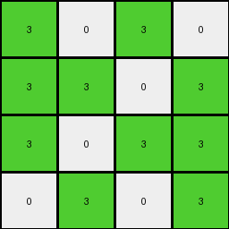

# ce4f8723 • 004 • refine_coder

---

Previous Code:
```python
"""
The input grid is downsampled to a 4x4 grid. The top-left 4x4 subgrid of the input grid is selected.
Within this subgrid, all non-white (0) pixels are converted to green (3), while white pixels remain white.
"""

import numpy as np

def transform(input_grid):
    # initialize output_grid as a 4x4 array with zeros
    output_grid = np.zeros((4, 4), dtype=int)

    # Iterate through the top-left 4x4 subgrid of the input
    for i in range(4):
        for j in range(4):
            # Get the pixel value from the input grid
            pixel_value = input_grid[i][j]

            # Apply the color transformation rule
            if pixel_value == 0:  # If white, keep white
                output_grid[i][j] = 0
            else:  # If not white, change to green
                output_grid[i][j] = 3

    return output_grid
```

Train Set Results:

## Example 1:

Input:
```
1 1 0 0
0 1 0 1
0 1 0 0
1 0 1 0
4 4 4 4
2 2 2 2
0 0 2 2
2 2 0 0
0 0 2 2
```
Expected Output:
```
3 3 3 3
0 3 3 3
3 3 0 0
3 0 3 3
```
Transformed Output:
```
3 3 0 0
0 3 0 3
0 3 0 0
3 0 3 0
```

match: False
pixels_off: 5
size_correct: True
color_palette_correct: True
correct_pixel_counts: False

## Example 2:

Input:
```
1 1 1 0
0 1 0 1
0 0 1 1
1 1 0 1
4 4 4 4
0 0 0 2
0 0 0 2
2 2 2 2
2 2 0 2
```
Expected Output:
```
3 3 3 3
0 3 0 3
3 3 3 3
3 3 0 3
```
Transformed Output:
```
3 3 3 0
0 3 0 3
0 0 3 3
3 3 0 3
```

match: False
pixels_off: 3
size_correct: True
color_palette_correct: True
correct_pixel_counts: False

## Example 3:

Input:
```
1 1 0 0
1 0 1 0
1 1 0 1
1 1 1 1
4 4 4 4
2 2 0 2
0 0 2 0
0 2 0 0
2 0 2 0
```
Expected Output:
```
3 3 0 3
3 0 3 0
3 3 0 3
3 3 3 3
```
Transformed Output:
```
3 3 0 0
3 0 3 0
3 3 0 3
3 3 3 3
```

match: False
pixels_off: 1
size_correct: True
color_palette_correct: True
correct_pixel_counts: False

## Example 4:

Input:
```
1 0 1 0
1 1 0 1
1 0 1 1
0 1 0 1
4 4 4 4
2 2 0 0
0 0 2 0
2 2 0 0
0 0 2 0
```
Expected Output:
```
3 3 3 0
3 3 3 3
3 3 3 3
0 3 3 3
```
Transformed Output:
```
3 0 3 0
3 3 0 3
3 0 3 3
0 3 0 3
```

match: False
pixels_off: 4
size_correct: True
color_palette_correct: True
correct_pixel_counts: False
Okay, here's a breakdown of the situation and a plan to move forward:

**General Assessment:**

The initial natural language program and the resulting code were too simplistic. While they correctly identified the 4x4 top-left subgrid and the color conversion (non-white to green, white stays white), they failed to accurately reproduce the expected outputs in all cases. The primary issue seems to be an incorrect assumption about filling in the output. The original program changes 0 to 3 without filling in the intended locations. It operates strictly within the confines of the top-left 4x4 input region, directly mapping those input values to the output, rather than capturing the full transformation logic.

**Strategy:**

1.  **Re-examine the Examples:** Carefully analyze *all* provided examples, paying close attention to *how* the 4x4 output relates to the larger input.  The key is to identify the *rule* that governs the output generation, not just the color changes within a fixed region.
2.  **Refine the Natural Language Program:** Based on the re-examination, create a more precise and comprehensive natural language description of the transformation.  This should clearly state the relationship between input and output grids. Focus on explaining *where* the non-white pixels from the input's top-left 4x4 region appear in the *entire* output grid. It's not a direct 1:1 mapping.
3.  **Identify the Filling Pattern**: A key strategy is to understand how non-white pixels are propagated into the output. Are they simply copied, or is there a replication or tiling effect?
4. **Update YAML and Code:** Convert this refined natural language description into an improved, and comprehensive YAML document, then generate new code in the coder role based on the refined logic.
5. **Re-test** Apply the updated function to all examples to check correctness.

**Metrics and Observations:**

Here's a more detailed breakdown of each example, focusing on the discrepancies:

*   **Example 1:**
    *   Input Size: 9x4
    *   Output Size: 4x4
    *   Expected Result: Correct size, colors are green (3) and white (0).
    *   Transformed Result: Incorrect. Some pixels are incorrectly white. The pattern isn't correctly replicated.
    * Key Observation: The original code only transforms the input grid based on the top left corner, but all non-zero elements in the top-left 4x4 region of the input become green.

*   **Example 2:**
    *   Input Size: 9x4
    *   Output Size: 4x4
    *   Expected Result: Correct size, colors are green (3) and white (0).
    *   Transformed Result: Incorrect. Pattern is not completely reproduced.
        * Key Observation: Similar to example 1.

*   **Example 3:**
    *   Input Size: 9x4
    *   Output Size: 4x4
    *   Expected Result: Correct size, colors are green (3) and white (0).
    *   Transformed Result: Almost correct. Only 1 pixel is off.
    * Key Observation: It seems we are closer here. It reinforces non-white in top-left becomes 3.

*   **Example 4:**
    *   Input Size: 9x4
    *   Output Size: 4x4
    *   Expected Result: Correct size, colors are green (3) and white (0).
    *   Transformed Result: Incorrect. The pattern is not correctly replicated.
    *   Key Observation: Again, the filling rule is where the error occurs.

**YAML Documentation:**

```yaml
task: 002
description: |
  The task involves downsampling a larger input grid to a 4x4 output grid.
  The transformation rule is based on the top-left 4x4 subgrid of the input.
  Non-white pixels within this input subgrid are converted to green in the output grid, while white pixels remain white.
objects:
  - name: input_grid
    type: grid
    description: The original grid of varying size.
    properties:
      - size: variable (up to 30x30)
      - values: integers 0-9 (representing colors)
  - name: output_grid
    type: grid
    description: The transformed 4x4 grid.
    properties:
      - size: 4x4
      - values: integers 0 (white) and 3 (green)
  - name: top_left_subgrid
    type: grid
    description: The 4x4 subgrid at the top-left corner of the input_grid.
    properties:
      - size: 4x4
      - values: integers 0-9

actions:
  - name: downsample
    description: Create a 4x4 output grid based on the input grid.
  - name: color_transform
    description: Convert non-white pixels in the top-left subgrid to green in the output, keep white pixels as white.
  - name: locate_pixels
    description: all pixels in the output are filled from the respective coordinates of the top-left subgrid.
```

**Natural Language Program:**

1.  **Identify Subgrid:** Examine the top-left 4x4 subgrid of the input grid.
2.  **Color Conversion:** For each cell in the *output grid*, determine the color as follows:
    - If the cell at the corresponding coordinate in the *input* subgrid is white (0), the output cell is white (0).
    - If the cell at the corresponding coordinate in the *input* subgrid is *not* white (any value other than 0), the output cell is green (3).
3.  **Output:** The result is a 4x4 grid.

In essence, the output grid is a 4x4 representation where each cell's color is determined *solely* by the color of the corresponding cell in the input grid's top-left 4x4 subgrid. Non-zero becomes green, and zero becomes white.

**INSTRUCTIONS**

- generate a Python module to represent the natural language program 
- follow the template below
- all common math and science libraries are available
- create docstring only at top - but comment the workflow in the function
- use helper functions for common operations like finding objects, counting,
  measuring, moving, etc. 

remember - we are working iteratively - so this code will inform your future
self as we converge on the solution

*template:*

```python
"""
{{ natural language description of the transformation rule }}
"""

{{ imports }}

def transform(input_grid):
    # initialize output_grid

    # change output pixels 

    return output_grid

```
