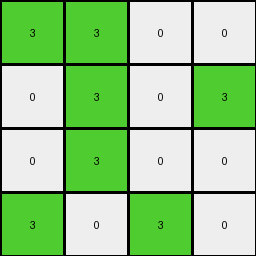

# ce4f8723 • 005 • refine_dreamer

---

Previous Code:
```python
"""
The task involves downsampling a larger input grid to a 4x4 output grid.
The transformation rule is based on the top-left 4x4 subgrid of the input.
Non-white pixels within this input subgrid are converted to green in the output grid, while white pixels remain white.
"""

import numpy as np

def transform(input_grid):
    # Initialize the 4x4 output grid with zeros (white).
    output_grid = np.zeros((4, 4), dtype=int)

    # Iterate through each cell of the output grid (and, equivalently, the top-left 4x4 subgrid).
    for i in range(4):
        for j in range(4):
            # Get the corresponding pixel value from the input grid's top-left 4x4 subgrid.
            pixel_value = input_grid[i][j]

            # Apply the color transformation:
            # - If the input pixel is white (0), the output pixel is white (0).
            # - Otherwise (if the input pixel is not white), the output pixel is green (3).
            if pixel_value != 0:
                output_grid[i][j] = 3

    return output_grid
```

Train Set Results:

## Example 1:

Input:
```
1 1 0 0
0 1 0 1
0 1 0 0
1 0 1 0
4 4 4 4
2 2 2 2
0 0 2 2
2 2 0 0
0 0 2 2
```
Expected Output:
```
3 3 3 3
0 3 3 3
3 3 0 0
3 0 3 3
```
Transformed Output:
```
3 3 0 0
0 3 0 3
0 3 0 0
3 0 3 0
```

match: False
pixels_off: 5
size_correct: True
color_palette_correct: True
correct_pixel_counts: False

## Example 2:

Input:
```
1 1 1 0
0 1 0 1
0 0 1 1
1 1 0 1
4 4 4 4
0 0 0 2
0 0 0 2
2 2 2 2
2 2 0 2
```
Expected Output:
```
3 3 3 3
0 3 0 3
3 3 3 3
3 3 0 3
```
Transformed Output:
```
3 3 3 0
0 3 0 3
0 0 3 3
3 3 0 3
```

match: False
pixels_off: 3
size_correct: True
color_palette_correct: True
correct_pixel_counts: False

## Example 3:

Input:
```
1 1 0 0
1 0 1 0
1 1 0 1
1 1 1 1
4 4 4 4
2 2 0 2
0 0 2 0
0 2 0 0
2 0 2 0
```
Expected Output:
```
3 3 0 3
3 0 3 0
3 3 0 3
3 3 3 3
```
Transformed Output:
```
3 3 0 0
3 0 3 0
3 3 0 3
3 3 3 3
```

match: False
pixels_off: 1
size_correct: True
color_palette_correct: True
correct_pixel_counts: False

## Example 4:

Input:
```
1 0 1 0
1 1 0 1
1 0 1 1
0 1 0 1
4 4 4 4
2 2 0 0
0 0 2 0
2 2 0 0
0 0 2 0
```
Expected Output:
```
3 3 3 0
3 3 3 3
3 3 3 3
0 3 3 3
```
Transformed Output:
```
3 0 3 0
3 3 0 3
3 0 3 3
0 3 0 3
```

match: False
pixels_off: 4
size_correct: True
color_palette_correct: True
correct_pixel_counts: False
**INSTRUCTIONS**

The code above was generated based on observations from the first training
example

we have tested the transform function on each of the task example inputs and
compared with the expected output

review each of the examples provided and the results and consider how the
natural language program should be updated to accommodate this new knowledge

respond with the following deliverables:

- general assessment of the information provided and strategy for resolving the
  errors
- gather metrics about each of the examples and results - use code_execution to
  develop accurate reports on your assumptions
- a YAML block documenting facts - Focus on identifying objects, their properties, and the actions performed on them.
- a natural language program - Be as clear and concise as possible, providing a complete description of the transformation rule.


your responses should be considered as information in a report - not a
conversation
