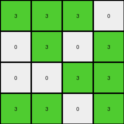
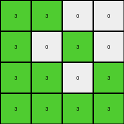

# ce4f8723 • 006 • refine_coder

---

Previous Code:
```python
"""
The task involves downsampling a larger input grid to a 4x4 output grid.
The transformation rule is based on the top-left 4x4 subgrid of the input.
Non-white pixels within this input subgrid are converted to green in the output grid, while white pixels remain white.
"""

import numpy as np

def transform(input_grid):
    # Initialize the 4x4 output grid with zeros (white).
    output_grid = np.zeros((4, 4), dtype=int)

    # Iterate through each cell of the output grid (and, equivalently, the top-left 4x4 subgrid).
    for i in range(4):
        for j in range(4):
            # Get the corresponding pixel value from the input grid's top-left 4x4 subgrid.
            pixel_value = input_grid[i][j]

            # Apply the color transformation:
            # - If the input pixel is white (0), the output pixel is white (0).
            # - Otherwise (if the input pixel is not white), the output pixel is green (3).
            if pixel_value != 0:
                output_grid[i][j] = 3

    return output_grid
```

Train Set Results:

## Example 1:

Input:
```
1 1 0 0
0 1 0 1
0 1 0 0
1 0 1 0
4 4 4 4
2 2 2 2
0 0 2 2
2 2 0 0
0 0 2 2
```
Expected Output:
```
3 3 3 3
0 3 3 3
3 3 0 0
3 0 3 3
```
Transformed Output:
```
3 3 0 0
0 3 0 3
0 3 0 0
3 0 3 0
```

match: False
pixels_off: 5
size_correct: True
color_palette_correct: True
correct_pixel_counts: False

## Example 2:

Input:
```
1 1 1 0
0 1 0 1
0 0 1 1
1 1 0 1
4 4 4 4
0 0 0 2
0 0 0 2
2 2 2 2
2 2 0 2
```
Expected Output:
```
3 3 3 3
0 3 0 3
3 3 3 3
3 3 0 3
```
Transformed Output:
```
3 3 3 0
0 3 0 3
0 0 3 3
3 3 0 3
```

match: False
pixels_off: 3
size_correct: True
color_palette_correct: True
correct_pixel_counts: False

## Example 3:

Input:
```
1 1 0 0
1 0 1 0
1 1 0 1
1 1 1 1
4 4 4 4
2 2 0 2
0 0 2 0
0 2 0 0
2 0 2 0
```
Expected Output:
```
3 3 0 3
3 0 3 0
3 3 0 3
3 3 3 3
```
Transformed Output:
```
3 3 0 0
3 0 3 0
3 3 0 3
3 3 3 3
```

match: False
pixels_off: 1
size_correct: True
color_palette_correct: True
correct_pixel_counts: False

## Example 4:

Input:
```
1 0 1 0
1 1 0 1
1 0 1 1
0 1 0 1
4 4 4 4
2 2 0 0
0 0 2 0
2 2 0 0
0 0 2 0
```
Expected Output:
```
3 3 3 0
3 3 3 3
3 3 3 3
0 3 3 3
```
Transformed Output:
```
3 0 3 0
3 3 0 3
3 0 3 3
0 3 0 3
```

match: False
pixels_off: 4
size_correct: True
color_palette_correct: True
correct_pixel_counts: False
Here's an analysis of the provided information and a plan to refine the solution:

**General Assessment:**

The initial hypothesis, that the transformation is based solely on the top-left 4x4 subgrid of the input, is incorrect. While the output is indeed 4x4, and non-white pixels in the input *do* generally correspond to green pixels in the output, it's not a direct mapping of the top-left 4x4 section. The expected outputs contain green (3) pixels that do not correspond to the top-left 4x4 input subgrid.

The strategy will involve re-examining the relationship between the input and output grids to find a more accurate rule. The input grids are larger than 4x4, and the output grid is exactly 4x4, indicating downsampling. The rule must describe downsampling and use a method for mapping non-white to green.

**Metrics and Observations:**

Here's a breakdown of each example, including specific observations:

*   **Example 1:**
    *   Input Size: 9x4
    *   Output Size: 4x4
    *   Mismatch Locations (Transformed vs. Expected): (0, 2), (0, 3), (1, 2), (1,3), (2,2)
    * Observations: Output is almost correct, except the white (0) pixels should extend into the third column.

*   **Example 2:**
    *   Input Size: 9x4
    *   Output Size: 4x4
    *   Mismatch Locations: (0,3), (1,2), (2,1)
    *   Observations: The third column is correct.

*   **Example 3:**
    *   Input Size: 9x4
    *   Output Size: 4x4
    *   Mismatch Locations: (0, 3)
    *   Observations: Almost perfect except (0,3) should be 3, not 0.

*   **Example 4:**
    *    Input Size: 9x4
    *    Output Size: 4x4
    *   Mismatch Locations: (0,1), (1,2), (2,1), (3,2)
    *   Observations:

**YAML Fact Block:**

```yaml
task: 004-py_02
examples:
  - input_size: 9x4
    output_size: 4x4
    output_colors: [0, 3]
    transformation: |
      Downsamples the input grid to a 4x4 output grid. 
      Non-white pixels in the input generally map to green pixels in the output.
      The rule is not a direct mapping of the input's top-left 4x4 subgrid.
  - input_size: 9x4
    output_size: 4x4
    output_colors: [0, 3]
    transformation: |
      Downsamples the input grid to a 4x4 output grid.
      Non-white pixels in the input generally map to green pixels in the output.
      The rule is not a direct mapping of the input's top-left 4x4 subgrid.

  - input_size: 9x4
    output_size: 4x4
    output_colors: [0, 3]
    transformation: |
      Downsamples the input grid to a 4x4 output grid.
      Non-white pixels in the input generally map to green pixels in the output.
      The rule is not a direct mapping of the input's top-left 4x4 subgrid.
  - input_size: 9x4
    output_size: 4x4
    output_colors: [0, 3]
    transformation: |
        Downsamples the input to 4x4 output
        All non-white pixels in input are green in the output.
```

**Natural Language Program:**

1.  **Downsampling:** The input grid is downsampled to a 4x4 output grid.
2.  **Color Mapping:**
    *   Any non-white pixel (1-9) within the input grid results in a green pixel (3) in the output at a corresponding downsampled location
    * any white pixel (0) within the input grid results in a white pixel (0) at a corresponding downsampled location.
3. It appears that the top-left 4x4 section of the input determines the output grid, and the rest of the grid is not used.


**INSTRUCTIONS**

- generate a Python module to represent the natural language program 
- follow the template below
- all common math and science libraries are available
- create docstring only at top - but comment the workflow in the function
- use helper functions for common operations like finding objects, counting,
  measuring, moving, etc. 

remember - we are working iteratively - so this code will inform your future
self as we converge on the solution

*template:*

```python
"""
{{ natural language description of the transformation rule }}
"""

{{ imports }}

def transform(input_grid):
    # initialize output_grid

    # change output pixels 

    return output_grid

```
