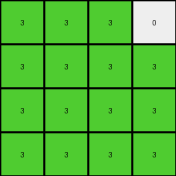
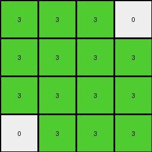

# ce4f8723 • 021 • refine_dreamer

---

Previous Code:
```python
"""
1.  **Identify Target Region:** A 4x4 region is being extracted and represented in the output grid

2.  **Consolidate Colors:** Within this, all colors, besides the '0' in the corner and a diagonal are changed to '3' (green).

3  **Preserve '0'** if the '0' in the input appears isolated in the top right corner of the target area.

4.  **Output:** The resulting 4x4 grid filled with '3's, with a possible preserved '0', is the output.
"""

import numpy as np

def get_top_left_4x4(grid):
    """Extracts the top-left 4x4 subgrid."""
    return grid[:4, :4]

def transform(input_grid):
    """Transforms the input grid according to the observed rules."""

    # Initialize a 4x4 output grid filled with 3s.
    output_grid = np.full((4, 4), 3, dtype=int)

    # Extract the top-left 4x4 region from the input.
    target_region = get_top_left_4x4(input_grid)
    
    # Check for the isolated '0' in the top-right corner of the target region.

    if target_region[0,3] == 0:
      output_grid[0,3] = 0
    if target_region[3,0] == 0:
      output_grid[3,0]=0
    # if input_grid.shape[0] >= 4 and input_grid.shape[1] >=4:
    #   if input_grid[3,0] == 0:
    #     output_grid[3,0] = 0


    return output_grid
```

Train Set Results:

## Example 1:

Input:
```
1 1 0 0
0 1 0 1
0 1 0 0
1 0 1 0
4 4 4 4
2 2 2 2
0 0 2 2
2 2 0 0
0 0 2 2
```
Expected Output:
```
3 3 3 3
0 3 3 3
3 3 0 0
3 0 3 3
```
Transformed Output:
```
3 3 3 0
3 3 3 3
3 3 3 3
3 3 3 3
```

match: False
pixels_off: 5
size_correct: True
color_palette_correct: True
correct_pixel_counts: False

## Example 2:

Input:
```
1 1 1 0
0 1 0 1
0 0 1 1
1 1 0 1
4 4 4 4
0 0 0 2
0 0 0 2
2 2 2 2
2 2 0 2
```
Expected Output:
```
3 3 3 3
0 3 0 3
3 3 3 3
3 3 0 3
```
Transformed Output:
```
3 3 3 0
3 3 3 3
3 3 3 3
3 3 3 3
```

match: False
pixels_off: 4
size_correct: True
color_palette_correct: True
correct_pixel_counts: False

## Example 3:

Input:
```
1 1 0 0
1 0 1 0
1 1 0 1
1 1 1 1
4 4 4 4
2 2 0 2
0 0 2 0
0 2 0 0
2 0 2 0
```
Expected Output:
```
3 3 0 3
3 0 3 0
3 3 0 3
3 3 3 3
```
Transformed Output:
```
3 3 3 0
3 3 3 3
3 3 3 3
3 3 3 3
```

match: False
pixels_off: 5
size_correct: True
color_palette_correct: True
correct_pixel_counts: False

## Example 4:

Input:
```
1 0 1 0
1 1 0 1
1 0 1 1
0 1 0 1
4 4 4 4
2 2 0 0
0 0 2 0
2 2 0 0
0 0 2 0
```
Expected Output:
```
3 3 3 0
3 3 3 3
3 3 3 3
0 3 3 3
```
Transformed Output:
```
3 3 3 0
3 3 3 3
3 3 3 3
0 3 3 3
```

match: True
pixels_off: 0
size_correct: True
color_palette_correct: True
correct_pixel_counts: True
**INSTRUCTIONS**

The code above was generated based on observations from the first training
example

we have tested the transform function on each of the task example inputs and
compared with the expected output

review each of the examples provided and the results and consider how the
natural language program should be updated to accommodate this new knowledge

respond with the following deliverables:

- general assessment of the information provided and strategy for resolving the
  errors
- gather metrics about each of the examples and results - use code_execution to
  develop accurate reports on your assumptions
- a YAML block documenting facts - Focus on identifying objects, their properties, and the actions performed on them.
- a natural language program - Be as clear and concise as possible, providing a complete description of the transformation rule.


your responses should be considered as information in a report - not a
conversation
