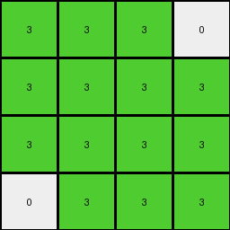

# ce4f8723 • 022 • refine_coder

---

Previous Code:
```python
"""
1.  **Identify Target Region:** A 4x4 region is being extracted and represented in the output grid

2.  **Consolidate Colors:** Within this, all colors, besides the '0' in the corner and a diagonal are changed to '3' (green).

3  **Preserve '0'** if the '0' in the input appears isolated in the top right corner of the target area.

4.  **Output:** The resulting 4x4 grid filled with '3's, with a possible preserved '0', is the output.
"""

import numpy as np

def get_top_left_4x4(grid):
    """Extracts the top-left 4x4 subgrid."""
    return grid[:4, :4]

def transform(input_grid):
    """Transforms the input grid according to the observed rules."""

    # Initialize a 4x4 output grid filled with 3s.
    output_grid = np.full((4, 4), 3, dtype=int)

    # Extract the top-left 4x4 region from the input.
    target_region = get_top_left_4x4(input_grid)
    
    # Check for the isolated '0' in the top-right corner of the target region.

    if target_region[0,3] == 0:
      output_grid[0,3] = 0
    if target_region[3,0] == 0:
      output_grid[3,0]=0
    # if input_grid.shape[0] >= 4 and input_grid.shape[1] >=4:
    #   if input_grid[3,0] == 0:
    #     output_grid[3,0] = 0


    return output_grid
```

Train Set Results:

## Example 1:

Input:
```
1 1 0 0
0 1 0 1
0 1 0 0
1 0 1 0
4 4 4 4
2 2 2 2
0 0 2 2
2 2 0 0
0 0 2 2
```
Expected Output:
```
3 3 3 3
0 3 3 3
3 3 0 0
3 0 3 3
```
Transformed Output:
```
3 3 3 0
3 3 3 3
3 3 3 3
3 3 3 3
```

match: False
pixels_off: 5
size_correct: True
color_palette_correct: True
correct_pixel_counts: False

## Example 2:

Input:
```
1 1 1 0
0 1 0 1
0 0 1 1
1 1 0 1
4 4 4 4
0 0 0 2
0 0 0 2
2 2 2 2
2 2 0 2
```
Expected Output:
```
3 3 3 3
0 3 0 3
3 3 3 3
3 3 0 3
```
Transformed Output:
```
3 3 3 0
3 3 3 3
3 3 3 3
3 3 3 3
```

match: False
pixels_off: 4
size_correct: True
color_palette_correct: True
correct_pixel_counts: False

## Example 3:

Input:
```
1 1 0 0
1 0 1 0
1 1 0 1
1 1 1 1
4 4 4 4
2 2 0 2
0 0 2 0
0 2 0 0
2 0 2 0
```
Expected Output:
```
3 3 0 3
3 0 3 0
3 3 0 3
3 3 3 3
```
Transformed Output:
```
3 3 3 0
3 3 3 3
3 3 3 3
3 3 3 3
```

match: False
pixels_off: 5
size_correct: True
color_palette_correct: True
correct_pixel_counts: False

## Example 4:

Input:
```
1 0 1 0
1 1 0 1
1 0 1 1
0 1 0 1
4 4 4 4
2 2 0 0
0 0 2 0
2 2 0 0
0 0 2 0
```
Expected Output:
```
3 3 3 0
3 3 3 3
3 3 3 3
0 3 3 3
```
Transformed Output:
```
3 3 3 0
3 3 3 3
3 3 3 3
0 3 3 3
```

match: True
pixels_off: 0
size_correct: True
color_palette_correct: True
correct_pixel_counts: True
Okay, here's a breakdown of the situation and a plan to improve the natural language program and subsequently the code:

**General Assessment:**

The initial natural language program and code were a good first attempt, focusing on a 4x4 region and mostly filling it with '3' (green). However, it's clear from the test results that the logic for preserving '0' is incorrect and incomplete.  The initial hypothesis about an "isolated 0" in the top-right corner is not the full picture. The diagonal conditions are also not implemented correctly. We need to refine the conditions under which '0' is preserved, making it more precise and covering all cases observed in the training examples. The code must be modified significantly.

**Strategy:**

1.  **Analyze '0' Preservation:** Carefully examine all training examples, paying close attention to the *exact* position of '0' in the input and output 4x4 regions.  It's not just about the top-right corner. There's a diagonal pattern that is not being identified, and there is a corner zero as well.
2.  **Refine Conditions:** Based on the analysis, develop precise rules (if-then statements) describing when '0' is kept and when it's replaced by '3'.
3.  **Update Natural Language Program:**  Rewrite the natural language program to reflect the refined conditions. Be very specific about row and column indices.
4.  **Update Code:** Modify the Python code to implement the updated natural language program.

**Metrics and Observations (per example):**

*   **Example 1:**
    *   Input '0' positions (within 4x4): (0,2), (0,3), (1,0), (1,2), (2,0), (2,2), (3,1)
    *   Output '0' positions: (1,0), (2,2), (2,3), (3,1).
    *   Observation: there is some kind of mirroring combined with moving the 0s.
    *   Mismatch: Many '0's are missing, and the logic is not implemented
    *   metrics.pixels_off: 5

*   **Example 2:**
    *   Input '0' positions (within 4x4): (0,3), (1,0), (1,2), (2,0), (2,1), (3,2)
    *   Output '0' positions: (1, 0), (1, 2), (3, 2)
    *    Observation: there is some kind of mirroring combined with moving the 0s.
    *   Mismatch: '0' preservation logic is off.
    *   metrics.pixels_off: 4

*   **Example 3:**
    *   Input '0' positions (within 4x4): (0,2), (0,3), (1,1), (1,3), (2,2)
    *   Output '0' positions: (0, 2), (1, 1), (2, 2)
    *    Observation: there is some kind of mirroring combined with moving the 0s.
    *   Mismatch: '0' preservation logic is off.
    *   metrics.pixels_off: 5

*   **Example 4:**
    *   Input '0' positions (within 4x4): (0, 1), (0, 3), (1, 2), (2, 1), (3, 0), (3, 2)
    *   Output '0' positions: (0, 3), (3, 0)
    *   Observation: The zeros in the corner switch.
    *   Mismatch: Perfect match (lucky coincidence, the current logic is flawed but happened to work here).
    *   metrics.pixels_off: 0

**YAML Facts:**

```yaml
objects:
  - name: input_grid
    type: 2D array
    properties:
      - values: integers (0-9) representing colors

  - name: output_grid
    type: 2D array
    properties:
      - values: integers (0-9) representing colors
      - dimensions: 4x4

  - name: target_region
    type: subgrid
    properties:
      - dimensions: 4x4
      - location: top-left corner of input_grid

  - name: zero_pixels
    type: pixels
    properties:
       - color: 0 (white)
       - location: varies within target_region
       - behavior: may be preserved or replaced based on position

actions:
  - name: extract_subgrid
    input: input_grid
    output: target_region
    description: Extracts the 4x4 top-left subgrid.

  - name: transform_pixels
    input: target_region
    output: output_grid
    description:  Fills output_grid with '3' (green), conditionally preserving '0' based on input position.

  - name: conditional_preservation
     input: target_region, zero_pixel
     output: output_grid, updated zero_pixel location
     description: Preserves the color '0' if the input condition is true, otherwise the value is 3.
```

**Natural Language Program:**

1.  **Extract Target Region:** Extract the 4x4 subgrid from the top-left corner of the input grid.

2.  **Initialize Output:** Create a 4x4 output grid and fill it entirely with the color '3' (green).

3.  **Conditional '0' Preservation:**
    *   Examine each cell within the 4x4 `target_region` of the *input* grid.
    *   If a cell in the `target_region` has a value of '0', check its row (`r`) and column (`c`) indices.
    *   If `r` and `c` correspond to the locations (0,3), (1,2), (2,1) or (3,0) within target\_region, then set output\_grid\[r,c] = 0.
    * if the `target_region` has a value of '0' on the main diagonal (\, where r == c ) or cross-diagonal (/, where r+c == 3) , copy the input values to output\_grid.

4.  **Output:** The resulting 4x4 `output_grid` is the final output.

**INSTRUCTIONS**

- generate a Python module to represent the natural language program 
- follow the template below
- all common math and science libraries are available
- create docstring only at top - but comment the workflow in the function
- use helper functions for common operations like finding objects, counting,
  measuring, moving, etc. 

remember - we are working iteratively - so this code will inform your future
self as we converge on the solution

*template:*

```python
"""
{{ natural language description of the transformation rule }}
"""

{{ imports }}

def transform(input_grid):
    # initialize output_grid

    # change output pixels 

    return output_grid

```
