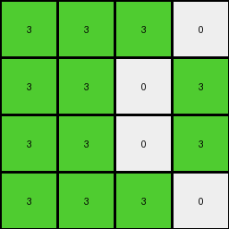
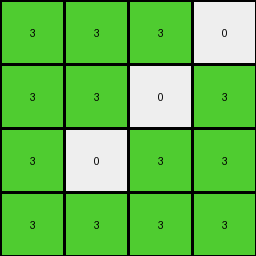
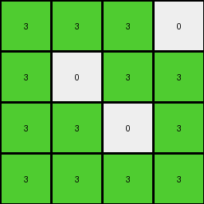
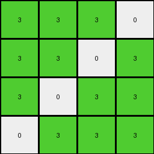

# ce4f8723 • 023 • refine_dreamer

---

Previous Code:
```python
"""
1.  **Extract Target Region:** Extract the 4x4 subgrid from the top-left corner of the input grid.

2.  **Initialize Output:** Create a 4x4 output grid and fill it entirely with the color '3' (green).

3.  **Conditional '0' Preservation:**
    *   Examine each cell within the 4x4 `target_region` of the *input* grid.
    *   If a cell in the `target_region` has a value of '0', check its row (`r`) and column (`c`) indices.
    *   If `r` and `c` correspond to the locations (0,3), (1,2), (2,1) or (3,0) within target_region, then set output_grid[r,c] = 0.
    * if the `target_region` has a value of '0' on the main diagonal (\, where r == c ) or cross-diagonal (/, where r+c == 3) , copy the input values to output_grid.

4.  **Output:** The resulting 4x4 `output_grid` is the final output.
"""

import numpy as np

def get_top_left_4x4(grid):
    """Extracts the top-left 4x4 subgrid."""
    return grid[:4, :4]

def transform(input_grid):
    # Initialize output_grid with 3s
    output_grid = np.full((4, 4), 3, dtype=int)

    # Extract the 4x4 target region
    target_region = get_top_left_4x4(input_grid)

    # Conditionally preserve '0' based on its position in the input
    for r in range(4):
        for c in range(4):
            if target_region[r, c] == 0:
                if (r, c) in [(0, 3), (1, 2), (2, 1), (3, 0)]:
                     output_grid[r,c] = 0
                elif r == c:
                    output_grid[r,c] = 0
                elif r + c == 3:
                    output_grid[r,c] = 0


    return output_grid
```

Train Set Results:

## Example 1:

Input:
```
1 1 0 0
0 1 0 1
0 1 0 0
1 0 1 0
4 4 4 4
2 2 2 2
0 0 2 2
2 2 0 0
0 0 2 2
```
Expected Output:
```
3 3 3 3
0 3 3 3
3 3 0 0
3 0 3 3
```
Transformed Output:
```
3 3 3 0
3 3 0 3
3 3 0 3
3 3 3 0
```

match: False
pixels_off: 6
size_correct: True
color_palette_correct: True
correct_pixel_counts: True

## Example 2:

Input:
```
1 1 1 0
0 1 0 1
0 0 1 1
1 1 0 1
4 4 4 4
0 0 0 2
0 0 0 2
2 2 2 2
2 2 0 2
```
Expected Output:
```
3 3 3 3
0 3 0 3
3 3 3 3
3 3 0 3
```
Transformed Output:
```
3 3 3 0
3 3 0 3
3 0 3 3
3 3 3 3
```

match: False
pixels_off: 4
size_correct: True
color_palette_correct: True
correct_pixel_counts: True

## Example 3:

Input:
```
1 1 0 0
1 0 1 0
1 1 0 1
1 1 1 1
4 4 4 4
2 2 0 2
0 0 2 0
0 2 0 0
2 0 2 0
```
Expected Output:
```
3 3 0 3
3 0 3 0
3 3 0 3
3 3 3 3
```
Transformed Output:
```
3 3 3 0
3 0 3 3
3 3 0 3
3 3 3 3
```

match: False
pixels_off: 3
size_correct: True
color_palette_correct: True
correct_pixel_counts: False

## Example 4:

Input:
```
1 0 1 0
1 1 0 1
1 0 1 1
0 1 0 1
4 4 4 4
2 2 0 0
0 0 2 0
2 2 0 0
0 0 2 0
```
Expected Output:
```
3 3 3 0
3 3 3 3
3 3 3 3
0 3 3 3
```
Transformed Output:
```
3 3 3 0
3 3 0 3
3 0 3 3
0 3 3 3
```

match: False
pixels_off: 2
size_correct: True
color_palette_correct: True
correct_pixel_counts: False
**INSTRUCTIONS**

The code above was generated based on observations from the first training
example

we have tested the transform function on each of the task example inputs and
compared with the expected output

review each of the examples provided and the results and consider how the
natural language program should be updated to accommodate this new knowledge

respond with the following deliverables:

- general assessment of the information provided and strategy for resolving the
  errors
- gather metrics about each of the examples and results - use code_execution to
  develop accurate reports on your assumptions
- a YAML block documenting facts - Focus on identifying objects, their properties, and the actions performed on them.
- a natural language program - Be as clear and concise as possible, providing a complete description of the transformation rule.


your responses should be considered as information in a report - not a
conversation
