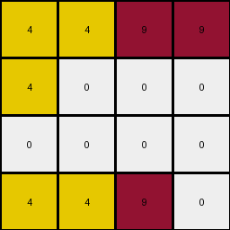
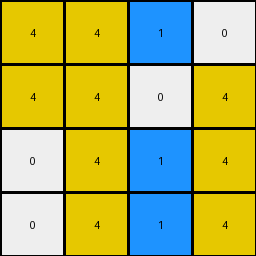

# cf98881b • 005 • refine_dreamer

---

Previous Code:
```python
"""
1.  **Identify Target Columns:** Examine the input grid and identify columns that contain at least one pixel with the color 4 (yellow), 9 (maroon), or 1 (blue).

2.  **Determine Column Output Order:** Order the target columns based on the row index of the *first* occurrence of colors 4, 9, or 1 within each target column. Sort these columns in ascending order of this row index.

3.  **Extract Subgrid:** Create a new, intermediate grid containing *only* the target columns, *preserving the newly determined order.*

4.  **Vertical Reduction:** Within each column of the intermediate grid:
    *   Identify contiguous vertical sequences (blocks) of the *same* color.
    *   Keep only the *first* such sequence encountered in each column, setting other pixels in that column to color 0 (white).

5.  **Limit Size:** Keep only the first 4 columns (or fewer if less than 4 were created)

6.  **Output:** The resulting grid is the final output.
"""

import numpy as np

def get_target_columns(input_grid):
    """
    Identifies columns containing 9, 4, or 1, and returns them with their first occurrence row index.
    """
    target_columns = []
    for j in range(input_grid.shape[1]):
        for i in range(input_grid.shape[0]):
            if input_grid[i, j] in (9, 4, 1):
                target_columns.append((j, i))  # Store column index and row index of first occurrence
                break  # Move to the next column after finding the first target color
    return target_columns

def order_columns(target_columns):
    """
    Orders target columns based on the row index of the first occurrence of 9, 4, or 1.
    """
    target_columns.sort(key=lambda x: x[1])  # Sort by the row index (second element of the tuple)
    return target_columns

def extract_subgrid(input_grid, ordered_columns):
    """
    Extracts a subgrid based on the ordered target columns.
    """
    column_indices = [col for col, _ in ordered_columns]
    subgrid = input_grid[:, column_indices]
    return subgrid

def reduce_vertically(input_grid):
    """
    Keeps only the first contiguous vertical sequence of each color in each column.
    """
    output_grid = np.zeros_like(input_grid)
    rows, cols = input_grid.shape

    for j in range(cols):
        first_sequence_found = {}  # Track if the first sequence of a color has been found
        current_sequence_color = -1  # Initialize with a non-existent color
        
        for i in range(rows):
            current_color = input_grid[i,j]
            
            if current_color not in first_sequence_found:  # New color encountered
               
                if current_color != 0:
                  first_sequence_found[current_color] = True # found the first instance
                  current_sequence_color = current_color
                  output_grid[i,j] = current_color
                else:
                  output_grid[i,j] = 0 # still white / blank
            elif current_color == current_sequence_color: # if we are in a sequence
                output_grid[i, j] = current_color
            else:
                output_grid[i,j] = 0

    return output_grid
    

def transform(input_grid):
    # initialize output_grid
    input_grid = np.array(input_grid)

    # get target columns and the row index of the first occurrence of the target colors
    target_cols = get_target_columns(input_grid)
    
    # order the target columns by the first occurence
    ordered_cols = order_columns(target_cols)

    # extract the subgrid, using the reordered columns
    subgrid = extract_subgrid(input_grid, ordered_cols)

    # reduce each column vertically, keeping only first contiguous sequence
    reduced_grid = reduce_vertically(subgrid)
    
    # select at most the first 4 columns
    output_grid = reduced_grid[:, :4]
    
    return output_grid.tolist()
```

Train Set Results:

## Example 1:

Input:
```
0 4 0 4 2 9 9 0 0 2 0 0 0 0
0 4 0 0 2 0 0 9 9 2 0 1 0 0
4 0 0 0 2 0 0 0 0 2 1 1 1 0
4 4 4 4 2 9 0 9 0 2 1 1 0 1
```
Expected Output:
```
9 4 0 4
0 4 9 9
4 1 1 0
4 4 4 4
```
Transformed Output:
```
4 4 9 9
4 0 0 0
0 0 0 0
4 4 9 0
```

match: False
pixels_off: 12
size_correct: True
color_palette_correct: True
correct_pixel_counts: False

## Example 2:

Input:
```
4 4 4 4 2 9 0 9 0 2 0 0 0 1
4 4 0 0 2 9 9 0 0 2 1 0 0 0
4 0 4 4 2 0 0 0 9 2 0 1 0 1
0 0 0 0 2 0 0 9 0 2 1 0 1 0
```
Expected Output:
```
4 4 4 4
4 4 0 0
4 1 4 4
1 0 9 0
```
Transformed Output:
```
4 4 4 4
4 4 0 0
4 0 4 4
0 0 0 0
```

match: False
pixels_off: 3
size_correct: True
color_palette_correct: True
correct_pixel_counts: False

## Example 3:

Input:
```
4 4 4 0 2 9 9 0 9 2 0 1 0 1
0 4 0 4 2 0 0 9 0 2 0 1 0 0
0 4 0 4 2 0 0 9 9 2 1 0 0 1
4 0 4 4 2 9 9 9 0 2 0 0 0 1
```
Expected Output:
```
4 4 4 9
0 4 9 4
1 4 9 4
4 9 4 4
```
Transformed Output:
```
4 4 4 9
0 4 0 0
0 4 0 0
4 0 4 9
```

match: False
pixels_off: 7
size_correct: True
color_palette_correct: True
correct_pixel_counts: False

## Example 4:

Input:
```
0 0 0 4 2 0 0 0 9 2 0 0 0 0
4 4 0 4 2 9 0 9 0 2 0 0 0 0
4 0 4 4 2 0 9 9 0 2 1 1 0 1
0 4 4 4 2 0 9 0 0 2 1 1 1 1
```
Expected Output:
```
0 0 0 4
4 4 9 4
4 9 4 4
1 4 4 4
```
Transformed Output:
```
4 9 0 0
4 0 4 4
4 0 4 0
4 0 0 4
```

match: False
pixels_off: 10
size_correct: True
color_palette_correct: True
correct_pixel_counts: False

## Example 5:

Input:
```
4 0 4 0 2 0 0 0 0 2 0 0 0 1
4 4 4 4 2 0 0 0 9 2 1 1 0 0
0 4 4 4 2 0 9 9 0 2 1 1 0 1
0 4 4 0 2 0 0 9 0 2 0 1 0 1
```
Expected Output:
```
4 0 4 1
4 4 4 4
1 4 4 4
0 4 4 1
```
Transformed Output:
```
4 4 1 0
4 4 0 4
0 4 1 4
0 4 1 4
```

match: False
pixels_off: 8
size_correct: True
color_palette_correct: True
correct_pixel_counts: False
**INSTRUCTIONS**

The code above was generated based on observations from the first training
example

we have tested the transform function on each of the task example inputs and
compared with the expected output

review each of the examples provided and the results and consider how the
natural language program should be updated to accommodate this new knowledge

respond with the following deliverables:

- general assessment of the information provided and strategy for resolving the
  errors
- gather metrics about each of the examples and results - use code_execution to
  develop accurate reports on your assumptions
- a YAML block documenting facts - Focus on identifying objects, their properties, and the actions performed on them.
- a natural language program - Be as clear and concise as possible, providing a complete description of the transformation rule.


your responses should be considered as information in a report - not a
conversation
