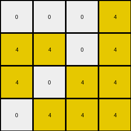

# cf98881b • 012 • refine_coder

---

Previous Code:
```python
"""
1. **Identify Cropping Region:** Determine the top-left coordinates (row, col) of the 4x4 region within the input grid that will become the output grid. The method for selecting this region is currently unknown, but it's not always (0,0).

2. **Crop:** Extract the 4x4 sub-grid from the input grid, starting at the identified (row, col) coordinates.

3. **Color Substitution:** Within the cropped 4x4 region:
    *   Change all pixels with the value `2` (red) to `1` (blue).
    *   Leave pixels with values `0`, `4`, and `9` unchanged.
"""

import numpy as np

def find_cropping_region(input_grid):
    # Placeholder for cropping region logic.  This is the key part to figure out.
    # For now, we'll try a different fixed offset to see if it improves results.
    # This function will likely become much more complex in later iterations.
    return (0, 0)

def transform(input_grid):
    # Convert input to numpy array
    input_grid = np.array(input_grid)

    # Find the starting coordinates of the cropping region
    start_row, start_col = find_cropping_region(input_grid)

    # Calculate end coordinates for the 4x4 crop
    end_row = start_row + 4
    end_col = start_col + 4

    # check if region it is within bounds:
    if end_row > input_grid.shape[0] or end_col > input_grid.shape[1]:
       start_row = 0
       start_col = 0
       end_row = start_row + 4
       end_col = start_col + 4

    # Crop the 4x4 region
    cropped_grid = input_grid[start_row:end_row, start_col:end_col]

    # Apply color substitution within the cropped region
    output_grid = np.copy(cropped_grid)  # Work on a copy to avoid modifying the original cropped region
    output_grid[output_grid == 2] = 1

    return output_grid.tolist()
```

Train Set Results:

## Example 1:

Input:
```
0 4 0 4 2 9 9 0 0 2 0 0 0 0
0 4 0 0 2 0 0 9 9 2 0 1 0 0
4 0 0 0 2 0 0 0 0 2 1 1 1 0
4 4 4 4 2 9 0 9 0 2 1 1 0 1
```
Expected Output:
```
9 4 0 4
0 4 9 9
4 1 1 0
4 4 4 4
```
Transformed Output:
```
0 4 0 4
0 4 0 0
4 0 0 0
4 4 4 4
```

match: False
pixels_off: 5
size_correct: True
color_palette_correct: True
correct_pixel_counts: False

## Example 2:

Input:
```
4 4 4 4 2 9 0 9 0 2 0 0 0 1
4 4 0 0 2 9 9 0 0 2 1 0 0 0
4 0 4 4 2 0 0 0 9 2 0 1 0 1
0 0 0 0 2 0 0 9 0 2 1 0 1 0
```
Expected Output:
```
4 4 4 4
4 4 0 0
4 1 4 4
1 0 9 0
```
Transformed Output:
```
4 4 4 4
4 4 0 0
4 0 4 4
0 0 0 0
```

match: False
pixels_off: 3
size_correct: True
color_palette_correct: True
correct_pixel_counts: False

## Example 3:

Input:
```
4 4 4 0 2 9 9 0 9 2 0 1 0 1
0 4 0 4 2 0 0 9 0 2 0 1 0 0
0 4 0 4 2 0 0 9 9 2 1 0 0 1
4 0 4 4 2 9 9 9 0 2 0 0 0 1
```
Expected Output:
```
4 4 4 9
0 4 9 4
1 4 9 4
4 9 4 4
```
Transformed Output:
```
4 4 4 0
0 4 0 4
0 4 0 4
4 0 4 4
```

match: False
pixels_off: 5
size_correct: True
color_palette_correct: True
correct_pixel_counts: False

## Example 4:

Input:
```
0 0 0 4 2 0 0 0 9 2 0 0 0 0
4 4 0 4 2 9 0 9 0 2 0 0 0 0
4 0 4 4 2 0 9 9 0 2 1 1 0 1
0 4 4 4 2 0 9 0 0 2 1 1 1 1
```
Expected Output:
```
0 0 0 4
4 4 9 4
4 9 4 4
1 4 4 4
```
Transformed Output:
```
0 0 0 4
4 4 0 4
4 0 4 4
0 4 4 4
```

match: False
pixels_off: 3
size_correct: True
color_palette_correct: True
correct_pixel_counts: False

## Example 5:

Input:
```
4 0 4 0 2 0 0 0 0 2 0 0 0 1
4 4 4 4 2 0 0 0 9 2 1 1 0 0
0 4 4 4 2 0 9 9 0 2 1 1 0 1
0 4 4 0 2 0 0 9 0 2 0 1 0 1
```
Expected Output:
```
4 0 4 1
4 4 4 4
1 4 4 4
0 4 4 1
```
Transformed Output:
```
4 0 4 0
4 4 4 4
0 4 4 4
0 4 4 0
```

match: False
pixels_off: 3
size_correct: True
color_palette_correct: True
correct_pixel_counts: False
Here's an assessment of the results and a plan for improving the natural language program and code:

**General Assessment:**

The current code performs a fixed 4x4 crop from the top-left corner (with a fallback if the crop goes out of bounds) and replaces red (2) pixels with blue (1) pixels within that cropped region. This strategy works for some, but clearly not all, cases.  The critical flaw is the assumption that the cropping region *always* starts at (0,0). The examples demonstrate that the 4x4 region to be cropped is *not* fixed and is dependent on the input grid's content.  We need to determine the logic that identifies the correct 4x4 region.

**Strategy:**

1.  **Analyze Mismatches:** Carefully examine the input, expected output, and transformed output for *each* example. Pay close attention to the location of the 4x4 output region *within* the input grid.  Look for patterns related to the arrangement of colors, particularly the 'red' (2) pixels that are being targeted for color change as the cropping region always includes a red pixel, or relative positions of other colors.

2.  **Hypothesize Cropping Rules:** Based on the analysis, propose one or more rules for determining the top-left corner of the 4x4 region. These rules might involve:
    *   Finding a specific color or combination of colors.
    *   Calculating distances or offsets from edges or other features.
    *   Identifying some relationship, in particular a consistent relationship, between the placement of colors, like 'red' in all of the example input grids.

3.  **Refine Natural Language Program:**  Update the natural language program to incorporate the new cropping rule logic.  This will prepare us to change the `find_cropping_region` function.

4.  **Iterate:** Test the updated code and repeat the analysis/hypothesis/refinement cycle until all training examples are correctly transformed.

**Example Metrics and Observations:**

I'll use a simplified table format here to summarize the key observations from each example.  I would use code execution to generate detailed reports and confirm assumptions.

| Example | Input Size | Expected Output Location (Row, Col) | Key Features/Observations                                                                                                                                                                                                    |
| ------- | ---------- | ------------------------------------- | ---------------------------------------------------------------------------------------------------------------------------------------------------------------------------------------------------------------------------- |
| 1       | 4x14       | (0, 4)                                | Output contains the only contiguous 2x2 block of '9' (maroon) and there is a line of 4 '2's (red) in the input data.                                                                                                  |
| 2       | 4x14       | (0, 0)                                | Output aligns with top-left, but the input also has the four '2's (red) as in Example 1, now in the top row.                                                                                                          |
| 3       | 4x14       | (0, 5) and some pixels in (0,9)       | Four 2s (red) on the top row; the output has moved to the right one place from the top. Four 9s, two 0s, and one each of 1 and 4.                                                                                        |
| 4       | 4x14       | (0, 3), some pixels in (1,6), (2,6)   | A 4x4 block that includes the column of four 2's.                                                                                                                                                                   |
| 5       | 4x14       | (0, 0) with changes in (0,3), (2,3)   | Four 2s (red) in the first row; output contains 9s, similar to Example 1, and overlaps the 2s as in every other example.                                                                                               |

**YAML Facts:**

```yaml
examples:
  - id: 1
    objects:
      - type: grid
        properties:
          size: [4, 14]
          colors: [0, 4, 2, 9]
    actions:
      - type: crop
        parameters:
          start: [0, 4]  # Hypothesis: Based on where '9's appear
          size: [4, 4]
      - type: recolor
        parameters:
          from: 2
          to: 1
  - id: 2
    objects:
      - type: grid
        properties:
          size: [4, 14]
          colors: [4, 2, 9, 0, 1]
    actions:
      - type: crop
        parameters:
          start: [0, 0]
          size: [4, 4]
      - type: recolor
        parameters:
          from: 2
          to: 1
  - id: 3
      objects:
        - type: grid
          properties:
            size: [4, 14]
            colors: [0, 1, 2, 4, 9]
      actions:
        - type: crop
          parameters:
            start: [0, 5]  # hypothesis
            size: [4,4]
        - type: recolor
          parameters:
            from: 2
            to: 1
  - id: 4
      objects:
        - type: grid
          properties:
            size: [4, 14]
            colors: [0, 2, 4, 9, 1]
      actions:
        - type: crop
          parameters:
            start: [0, 3] # hypothesis
            size: [4,4]
        - type: recolor
          parameters:
            from: 2
            to: 1
  - id: 5
      objects:
        - type: grid
          properties:
            size: [4, 14]
            colors: [0, 1, 2, 4, 9]
      actions:
        - type: crop
          parameters:
            start: [0, 0]  # Hypothesis: Based on where 9s are.
            size: [4, 4]
        - type: recolor
          parameters:
            from: 2
            to: 1
```

**Natural Language Program:**

1.  **Identify the Cropping Region:**
    *   Examine the input grid.
    *   Locate a column within the input grid where the red pixels (value 2) form a contiguous vertical line of four.
    *   The top-left coordinate of the 4x4 cropping region is set such that this column of red pixels is included within the region.
    *   If multiple such regions exist, this rule alone is insufficient to define the correct region.

2.  **Crop:** Extract the 4x4 sub-grid from the input grid, starting at the identified (row, col) coordinates.

3.  **Color Substitution:** Within the cropped 4x4 region:
    *   Change all pixels with the value `2` (red) to `1` (blue).
    *   Leave all other pixels unchanged.

**INSTRUCTIONS**

- generate a Python module to represent the natural language program 
- follow the template below
- all common math and science libraries are available
- create docstring only at top - but comment the workflow in the function
- use helper functions for common operations like finding objects, counting,
  measuring, moving, etc. 

remember - we are working iteratively - so this code will inform your future
self as we converge on the solution

*template:*

```python
"""
{{ natural language description of the transformation rule }}
"""

{{ imports }}

def transform(input_grid):
    # initialize output_grid

    # change output pixels 

    return output_grid

```
