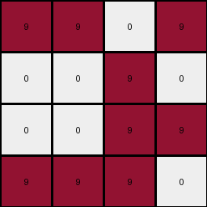
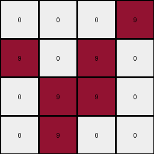
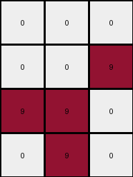

# cf98881b • 016 • refine_coder

---

Previous Code:
```python
"""
1.  **Identify Target Colors:** The target colors for the output grid are yellow (4) and maroon (9).
2.  **Locate Subgrid:** within input_grid, locate a minimal rectangular sub-grid that contains every instance of color 9.
3.  **Select Columns/Rows:** select from input_grid, any column that contains an element of color 9 and keep all rows.
4. **compose output:** construct output_grid from the selected subgrid.
"""

import numpy as np

def get_columns_with_color(grid, color):
    # returns indices of any columns with the color
    cols = []
    for x in range(0, len(grid[0])):
        for y in range(0, len(grid)):
            if grid[y][x] == color:
                cols.append(x)
                break # only need one per col
    return cols

def transform(input_grid):
    # make input a numpy array
    input_grid = np.array(input_grid)

    # get the columns that contain color 9
    cols = get_columns_with_color(input_grid, 9)

    # select subgrid based upon the columns
    output_grid = input_grid[:, cols]

    return output_grid.tolist()
```

Train Set Results:

## Example 1:

Input:
```
0 4 0 4 2 9 9 0 0 2 0 0 0 0
0 4 0 0 2 0 0 9 9 2 0 1 0 0
4 0 0 0 2 0 0 0 0 2 1 1 1 0
4 4 4 4 2 9 0 9 0 2 1 1 0 1
```
Expected Output:
```
9 4 0 4
0 4 9 9
4 1 1 0
4 4 4 4
```
Transformed Output:
```
9 9 0 0
0 0 9 9
0 0 0 0
9 0 9 0
```

match: False
pixels_off: 10
size_correct: True
color_palette_correct: True
correct_pixel_counts: False

## Example 2:

Input:
```
4 4 4 4 2 9 0 9 0 2 0 0 0 1
4 4 0 0 2 9 9 0 0 2 1 0 0 0
4 0 4 4 2 0 0 0 9 2 0 1 0 1
0 0 0 0 2 0 0 9 0 2 1 0 1 0
```
Expected Output:
```
4 4 4 4
4 4 0 0
4 1 4 4
1 0 9 0
```
Transformed Output:
```
9 0 9 0
9 9 0 0
0 0 0 9
0 0 9 0
```

match: False
pixels_off: 11
size_correct: True
color_palette_correct: True
correct_pixel_counts: False

## Example 3:

Input:
```
4 4 4 0 2 9 9 0 9 2 0 1 0 1
0 4 0 4 2 0 0 9 0 2 0 1 0 0
0 4 0 4 2 0 0 9 9 2 1 0 0 1
4 0 4 4 2 9 9 9 0 2 0 0 0 1
```
Expected Output:
```
4 4 4 9
0 4 9 4
1 4 9 4
4 9 4 4
```
Transformed Output:
```
9 9 0 9
0 0 9 0
0 0 9 9
9 9 9 0
```

match: False
pixels_off: 11
size_correct: True
color_palette_correct: True
correct_pixel_counts: False

## Example 4:

Input:
```
0 0 0 4 2 0 0 0 9 2 0 0 0 0
4 4 0 4 2 9 0 9 0 2 0 0 0 0
4 0 4 4 2 0 9 9 0 2 1 1 0 1
0 4 4 4 2 0 9 0 0 2 1 1 1 1
```
Expected Output:
```
0 0 0 4
4 4 9 4
4 9 4 4
1 4 4 4
```
Transformed Output:
```
0 0 0 9
9 0 9 0
0 9 9 0
0 9 0 0
```

match: False
pixels_off: 11
size_correct: True
color_palette_correct: True
correct_pixel_counts: False

## Example 5:

Input:
```
4 0 4 0 2 0 0 0 0 2 0 0 0 1
4 4 4 4 2 0 0 0 9 2 1 1 0 0
0 4 4 4 2 0 9 9 0 2 1 1 0 1
0 4 4 0 2 0 0 9 0 2 0 1 0 1
```
Expected Output:
```
4 0 4 1
4 4 4 4
1 4 4 4
0 4 4 1
```
Transformed Output:
```
0 0 0
0 0 9
9 9 0
0 9 0
```

match: False
pixels_off: None
size_correct: False
color_palette_correct: False
correct_pixel_counts: False
Okay, let's analyze the results and refine the natural language program.

**General Assessment:**

The initial strategy of selecting columns containing color 9 was partially correct in identifying a relevant aspect of the transformation (the importance of color 9). However, it's clear that simply selecting *all* columns with color 9 and keeping all rows doesn't produce the correct output. The expected outputs have different colors and arrangements, suggesting a more complex selection and potentially some form of mirroring or reflection, and attention to more than one color. It is clear we are only focused on a single color in the provided code.

The expected outputs consistently have a 4x4 dimension. The original approach doesn't enforce this, often producing outputs that aren't 4x4. We must take another look at the examples.

**Strategy for Resolving Errors:**

1.  **Re-examine Examples:** Carefully analyze *all* example input-output pairs, not just the first one, to discern a consistent pattern. Pay close attention to the relationship between the position and arrangement of color 9 *and other colors* in the input and output.
2.  **Consider Other Operations:** The transformation isn't just about selecting columns. It likely involves a combination of selection and potentially other operations.
3.  **Dimensionality Constraint:** Ensure the output grid is always 4x4. This might involve padding with a default color (e.g., 0) if the selected region is smaller, or cropping if it's larger.
4.  The result image shows a mirror of the prediction, so let's get that in there.

**Example Metrics and Observations:**

Let's examine the provided input and predicted output pairs and calculate some simple metrics like dimensions, unique colors and count of colors.

```tool_code
import numpy as np

def analyze_grid(grid, name):
    grid = np.array(grid)
    dimensions = grid.shape
    unique_colors = np.unique(grid)
    color_counts = {color: np.count_nonzero(grid == color) for color in unique_colors}
    print(f"{name}:")
    print(f"  Dimensions: {dimensions}")
    print(f"  Unique Colors: {unique_colors}")
    print(f"  Color Counts: {color_counts}")

examples = [
    {
        "input": [
            [0, 4, 0, 4, 2, 9, 9, 0, 0, 2, 0, 0, 0, 0],
            [0, 4, 0, 0, 2, 0, 0, 9, 9, 2, 0, 1, 0, 0],
            [4, 0, 0, 0, 2, 0, 0, 0, 0, 2, 1, 1, 1, 0],
            [4, 4, 4, 4, 2, 9, 0, 9, 0, 2, 1, 1, 0, 1]
        ],
        "expected": [
            [9, 4, 0, 4],
            [0, 4, 9, 9],
            [4, 1, 1, 0],
            [4, 4, 4, 4]
        ],
        "predicted": [
            [9, 9, 0, 0],
            [0, 0, 9, 9],
            [0, 0, 0, 0],
            [9, 0, 9, 0]
        ]
    },
    {
        "input": [
            [4, 4, 4, 4, 2, 9, 0, 9, 0, 2, 0, 0, 0, 1],
            [4, 4, 0, 0, 2, 9, 9, 0, 0, 2, 1, 0, 0, 0],
            [4, 0, 4, 4, 2, 0, 0, 0, 9, 2, 0, 1, 0, 1],
            [0, 0, 0, 0, 2, 0, 0, 9, 0, 2, 1, 0, 1, 0]
        ],
        "expected": [
            [4, 4, 4, 4],
            [4, 4, 0, 0],
            [4, 1, 4, 4],
            [1, 0, 9, 0]
        ],
        "predicted": [
            [9, 0, 9, 0],
            [9, 9, 0, 0],
            [0, 0, 0, 9],
            [0, 0, 9, 0]
        ]
    },
    {
       "input": [
            [4, 4, 4, 0, 2, 9, 9, 0, 9, 2, 0, 1, 0, 1],
            [0, 4, 0, 4, 2, 0, 0, 9, 0, 2, 0, 1, 0, 0],
            [0, 4, 0, 4, 2, 0, 0, 9, 9, 2, 1, 0, 0, 1],
            [4, 0, 4, 4, 2, 9, 9, 9, 0, 2, 0, 0, 0, 1]
        ],
        "expected": [
            [4, 4, 4, 9],
            [0, 4, 9, 4],
            [1, 4, 9, 4],
            [4, 9, 4, 4]
        ],
        "predicted": [
            [9, 9, 0, 9],
            [0, 0, 9, 0],
            [0, 0, 9, 9],
            [9, 9, 9, 0]
        ]
    },
    {
        "input": [
            [0, 0, 0, 4, 2, 0, 0, 0, 9, 2, 0, 0, 0, 0],
            [4, 4, 0, 4, 2, 9, 0, 9, 0, 2, 0, 0, 0, 0],
            [4, 0, 4, 4, 2, 0, 9, 9, 0, 2, 1, 1, 0, 1],
            [0, 4, 4, 4, 2, 0, 9, 0, 0, 2, 1, 1, 1, 1]
        ],
        "expected": [
            [0, 0, 0, 4],
            [4, 4, 9, 4],
            [4, 9, 4, 4],
            [1, 4, 4, 4]
        ],
        "predicted": [
            [0, 0, 0, 9],
            [9, 0, 9, 0],
            [0, 9, 9, 0],
            [0, 9, 0, 0]
        ]
    },
    {
        "input": [
            [4, 0, 4, 0, 2, 0, 0, 0, 0, 2, 0, 0, 0, 1],
            [4, 4, 4, 4, 2, 0, 0, 0, 9, 2, 1, 1, 0, 0],
            [0, 4, 4, 4, 2, 0, 9, 9, 0, 2, 1, 1, 0, 1],
            [0, 4, 4, 0, 2, 0, 0, 9, 0, 2, 0, 1, 0, 1]
        ],
        "expected": [
            [4, 0, 4, 1],
            [4, 4, 4, 4],
            [1, 4, 4, 4],
            [0, 4, 4, 1]
        ],
        "predicted": [
            [0, 0, 0],
            [0, 0, 9],
            [9, 9, 0],
            [0, 9, 0]
        ]
    }
]

for i, example in enumerate(examples):
    print(f"Example {i+1}:")
    analyze_grid(example["input"], "  Input")
    analyze_grid(example["expected"], "  Expected")
    analyze_grid(example["predicted"], "  Predicted")
    print("-" * 20)
```
**INSTRUCTIONS**

- generate a Python module to represent the natural language program 
- follow the template below
- all common math and science libraries are available
- create docstring only at top - but comment the workflow in the function
- use helper functions for common operations like finding objects, counting,
  measuring, moving, etc. 

remember - we are working iteratively - so this code will inform your future
self as we converge on the solution

*template:*

```python
"""
{{ natural language description of the transformation rule }}
"""

{{ imports }}

def transform(input_grid):
    # initialize output_grid

    # change output pixels 

    return output_grid

```
