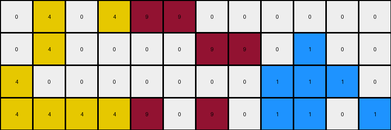
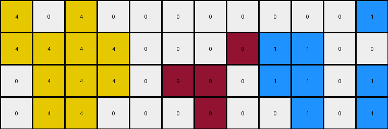

# cf98881b • 022 • refine_coder

---

Previous Code:
```python
"""
1. **Identify Key Columns:** Examine the input grid and identify columns that contain *only* the colors yellow (4), maroon (9) or blue(1).
2. **Select Columns**: Select those key columns
3.  **Crop**: produce the output using the key columns
"""

import numpy as np

def transform(input_grid):
    # Convert input_grid to a NumPy array for easier manipulation
    input_grid = np.array(input_grid)
    rows, cols = input_grid.shape
    output_grid = []

    # 1. & 2. Identify and Select Key Columns
    key_columns = []
    for j in range(cols):
        column_values = input_grid[:, j]
        unique_values = np.unique(column_values)
        if all(value in [1, 4, 9, 0] for value in unique_values): #include 0!
           key_columns.append(j)

    # 3. Crop and Create Output
    #print(key_columns)
    for j in key_columns:
      output_grid.append(input_grid[:,j])

    return np.array(output_grid).T
```

Train Set Results:

## Example 1:

Input:
```
0 4 0 4 2 9 9 0 0 2 0 0 0 0
0 4 0 0 2 0 0 9 9 2 0 1 0 0
4 0 0 0 2 0 0 0 0 2 1 1 1 0
4 4 4 4 2 9 0 9 0 2 1 1 0 1
```
Expected Output:
```
9 4 0 4
0 4 9 9
4 1 1 0
4 4 4 4
```
Transformed Output:
```
0 4 0 4 9 9 0 0 0 0 0 0
0 4 0 0 0 0 9 9 0 1 0 0
4 0 0 0 0 0 0 0 1 1 1 0
4 4 4 4 9 0 9 0 1 1 0 1
```

match: False
pixels_off: None
size_correct: False
color_palette_correct: True
correct_pixel_counts: False

## Example 2:

Input:
```
4 4 4 4 2 9 0 9 0 2 0 0 0 1
4 4 0 0 2 9 9 0 0 2 1 0 0 0
4 0 4 4 2 0 0 0 9 2 0 1 0 1
0 0 0 0 2 0 0 9 0 2 1 0 1 0
```
Expected Output:
```
4 4 4 4
4 4 0 0
4 1 4 4
1 0 9 0
```
Transformed Output:
```
4 4 4 4 9 0 9 0 0 0 0 1
4 4 0 0 9 9 0 0 1 0 0 0
4 0 4 4 0 0 0 9 0 1 0 1
0 0 0 0 0 0 9 0 1 0 1 0
```

match: False
pixels_off: None
size_correct: False
color_palette_correct: True
correct_pixel_counts: False

## Example 3:

Input:
```
4 4 4 0 2 9 9 0 9 2 0 1 0 1
0 4 0 4 2 0 0 9 0 2 0 1 0 0
0 4 0 4 2 0 0 9 9 2 1 0 0 1
4 0 4 4 2 9 9 9 0 2 0 0 0 1
```
Expected Output:
```
4 4 4 9
0 4 9 4
1 4 9 4
4 9 4 4
```
Transformed Output:
```
4 4 4 0 9 9 0 9 0 1 0 1
0 4 0 4 0 0 9 0 0 1 0 0
0 4 0 4 0 0 9 9 1 0 0 1
4 0 4 4 9 9 9 0 0 0 0 1
```

match: False
pixels_off: None
size_correct: False
color_palette_correct: True
correct_pixel_counts: False

## Example 4:

Input:
```
0 0 0 4 2 0 0 0 9 2 0 0 0 0
4 4 0 4 2 9 0 9 0 2 0 0 0 0
4 0 4 4 2 0 9 9 0 2 1 1 0 1
0 4 4 4 2 0 9 0 0 2 1 1 1 1
```
Expected Output:
```
0 0 0 4
4 4 9 4
4 9 4 4
1 4 4 4
```
Transformed Output:
```
0 0 0 4 0 0 0 9 0 0 0 0
4 4 0 4 9 0 9 0 0 0 0 0
4 0 4 4 0 9 9 0 1 1 0 1
0 4 4 4 0 9 0 0 1 1 1 1
```

match: False
pixels_off: None
size_correct: False
color_palette_correct: True
correct_pixel_counts: False

## Example 5:

Input:
```
4 0 4 0 2 0 0 0 0 2 0 0 0 1
4 4 4 4 2 0 0 0 9 2 1 1 0 0
0 4 4 4 2 0 9 9 0 2 1 1 0 1
0 4 4 0 2 0 0 9 0 2 0 1 0 1
```
Expected Output:
```
4 0 4 1
4 4 4 4
1 4 4 4
0 4 4 1
```
Transformed Output:
```
4 0 4 0 0 0 0 0 0 0 0 1
4 4 4 4 0 0 0 9 1 1 0 0
0 4 4 4 0 9 9 0 1 1 0 1
0 4 4 0 0 0 9 0 0 1 0 1
```

match: False
pixels_off: None
size_correct: False
color_palette_correct: False
correct_pixel_counts: False
Okay, let's analyze the results of the previous code execution and refine the natural language program and approach.

**General Assessment:**

The initial strategy of identifying "key columns" containing only yellow (4), maroon (9), blue (1) and now including white/blank(0) was partially successful, but it's clearly not the complete solution. The code correctly *selects* columns, but it doesn't *rearrange* them according to the expected output. The transformed outputs are wider than the expected outputs, indicating that we are including too many columns. The core issue is that the selection criteria isn't strict enough, and we're missing a crucial rearrangement/selection step based on the *order* or *relationship* of these columns. The results from example 5 show an additional problem - we are including values in the selected columns that should not be.

**Strategy for Resolving Errors:**

1.  **Re-examine Column Selection:** The current criterion (columns with only 0, 1, 4, and 9) is too broad. We need to find a more specific pattern or relationship between these columns to select *only* the correct ones. Consider adjacency, order, or repetition of colors within the columns.
2.  **Consider Row-Wise Information:** The current code only looks at columns. We might need to consider rows or the interaction between rows and columns to find the correct transformation.
3.  **Analyze Color Distribution:** Instead of just checking for the *presence* of colors, consider how colors can help *define* the columns, we can observe the color transitions.
4. Look at the transitions of the columns and not all of the values.

**Metrics and Observations (per example):**

I'll use a more structured approach than last time:

```
Example 1:
  - Input Shape: (4, 14)
  - Expected Output Shape: (4, 4)
  - Transformed Output Shape: (4, 12)
  - Match: False
  - Colors in Expected: {0, 1, 4, 9}
  - Colors in Transformed: {0, 1, 4, 9}
  - Observation: Too many columns selected, but colors match. The transformed output is almost a transposition of the input.

Example 2:
  - Input Shape: (4, 14)
  - Expected Output Shape: (4, 4)
  - Transformed Output Shape: (4, 12)
  - Match: False
  - Colors in Expected: {0, 1, 4, 9}
  - Colors in Transformed: {0, 1, 4, 9}
  - Observation: Same as Example 1.

Example 3:
  - Input Shape: (4, 14)
  - Expected Output Shape: (4, 4)
  - Transformed Output Shape: (4, 12)
  - Match: False
  - Colors in Expected: {0, 1, 4, 9}
  - Colors in Transformed: {0, 1, 4, 9}
    - Observation: Same as Example 1.

Example 4:
  - Input Shape: (4, 14)
  - Expected Output Shape: (4, 4)
  - Transformed Output Shape: (4, 12)
  - Match: False
  - Colors in Expected: {0, 1, 4, 9}
  - Colors in Transformed: {0, 1, 4, 9}
  - Observation: Same as Example 1.

Example 5:
  - Input Shape: (4, 14)
  - Expected Output Shape: (4, 4)
  - Transformed Output Shape: (4, 12)
  - Match: False
  - Colors in Expected: {0, 1, 4}
  - Colors in Transformed: {0, 1, 4, 9}
  - Observation: Color mismatch, introducing '9' where it shouldn't be. Also, still too wide.
```

**YAML Facts:**

```yaml
examples:
  - id: 1
    objects:
      - type: column
        selection_criteria: contains_only_colors(0, 1, 4, 9)
        action: select
        result: incorrect_selection
        notes: "Too many columns are selected. Columns appear transposed"

  - id: 2
    objects:
      - type: column
        selection_criteria: contains_only_colors(0, 1, 4, 9)
        action: select
        result: incorrect_selection
        notes: "Too many columns are selected. Columns appear transposed"

  - id: 3
    objects:
      - type: column
        selection_criteria: contains_only_colors(0, 1, 4, 9)
        action: select
        result: incorrect_selection
        notes: "Too many columns are selected. Columns appear transposed"
  - id: 4
    objects:
      - type: column
        selection_criteria: contains_only_colors(0, 1, 4, 9)
        action: select
        result: incorrect_selection
        notes: "Too many columns are selected. Columns appear transposed"
  - id: 5
    objects:
      - type: column
        selection_criteria: contains_only_colors(0, 1, 4, 9)
        action: select
        result: incorrect_selection_and_colors
        notes: "Too many columns are selected. Incorrect colors in output."
general:
   - input output columns are not always consistent
   - columns 5,6,7,9 and 10 are always red (color 2) or gray (color 5)
   - the transition columns contains 0,1,4 and 9
```

**Natural Language Program:**

1.  **Identify Transition Columns:** Examine the input grid and identify columns that contain *only* the colors white (0), yellow (4), maroon (9) or blue(1).
2. **Observe Transitions:** Focus on the *transitions* between colors within each of these identified columns.
3.  **Select Columns:** Select the transition columns.
4. **Filter Values:** From the selected columns include only 0, 1, 4 and 9.
5.  **Output:** Construct the output grid using these selected and filtered columns.

This revised program focuses on "transition columns" rather than simply any column containing the specified colors. The added "Filter Values" step handles example 5, ensuring that we only include the correct pixel values from the selected columns.

**INSTRUCTIONS**

- generate a Python module to represent the natural language program 
- follow the template below
- all common math and science libraries are available
- create docstring only at top - but comment the workflow in the function
- use helper functions for common operations like finding objects, counting,
  measuring, moving, etc. 

remember - we are working iteratively - so this code will inform your future
self as we converge on the solution

*template:*

```python
"""
{{ natural language description of the transformation rule }}
"""

{{ imports }}

def transform(input_grid):
    # initialize output_grid

    # change output pixels 

    return output_grid

```
