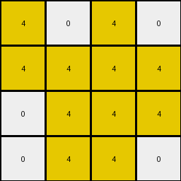

# cf98881b • 027 • refine_dreamer

---

Previous Code:
```python
"""
Extracts a subgrid from the input grid. The subgrid is defined by the bounding box of the largest contiguous yellow region, includes directly adjacent blue squares, and all other colors within this region are changed to white.
"""

import numpy as np

def find_largest_object(grid, color):
    # implementation of depth first search
    visited = np.zeros_like(grid, dtype=bool)
    max_size = 0
    max_object_coords = []

    def dfs(row, col):
        if (row < 0 or row >= grid.shape[0] or col < 0 or col >= grid.shape[1] or
                visited[row, col] or grid[row, col] != color):
            return 0, []

        visited[row, col] = True
        size = 1
        coords = [(row, col)]

        # Explore all 8 neighbors (including diagonals).
        for dr in [-1, 0, 1]:
            for dc in [-1, 0, 1]:
                if dr == 0 and dc == 0:
                    continue
                new_size, new_coords = dfs(row + dr, col + dc)
                size += new_size
                coords.extend(new_coords)

        return size, coords

    for r in range(grid.shape[0]):
        for c in range(grid.shape[1]):
            if grid[r, c] == color and not visited[r, c]:
                size, coords = dfs(r, c)
                if size > max_size:
                    max_size = size
                    max_object_coords = coords
    return max_object_coords

def get_bounding_box(coords):
    min_row = min(c[0] for c in coords)
    max_row = max(c[0] for c in coords)
    min_col = min(c[1] for c in coords)
    max_col = max(c[1] for c in coords)
    return min_row, max_row, min_col, max_col

def expand_bounding_box_for_blue(input_grid, bbox):
    min_row, max_row, min_col, max_col = bbox
    expanded_coords = []

    for r in range(min_row, max_row+1):
      for c in range(min_col, max_col+1):
        if input_grid[r,c] == 1: #blue
            #check neighbors to expand
            for dr in [-1, 0, 1]:
                for dc in [-1, 0, 1]:
                    if dr == 0 and dc == 0:
                        continue
                    nr, nc = r + dr, c + dc
                    if 0 <= nr < input_grid.shape[0] and 0 <= nc < input_grid.shape[1]:
                      expanded_coords.append((nr,nc))

    if len(expanded_coords) > 0:
        er, ec, _, _ = get_bounding_box(expanded_coords)
        min_row = min(min_row, er)
        max_row = max(max_row, er)
        min_col = min(min_col, ec)
        max_col = max(max_col, ec)
    return  min_row, max_row, min_col, max_col

def transform(input_grid):
    # Find the largest yellow object.
    yellow_coords = find_largest_object(input_grid, 4)

    # Get its bounding box.
    bbox = get_bounding_box(yellow_coords)

    # expand for adjacent blue
    bbox = expand_bounding_box_for_blue(input_grid, bbox)
    min_row, max_row, min_col, max_col = bbox

    # Extract the subgrid.
    output_grid = input_grid[min_row:max_row+1, min_col:max_col+1].copy()

    # Replace colors other than yellow and blue with white within subgrid
    for r in range(output_grid.shape[0]):
      for c in range(output_grid.shape[1]):
        if output_grid[r,c] != 4 and output_grid[r,c] != 1:
          output_grid[r,c] = 0

    return output_grid
```

Train Set Results:

## Example 1:

Input:
```
0 4 0 4 2 9 9 0 0 2 0 0 0 0
0 4 0 0 2 0 0 9 9 2 0 1 0 0
4 0 0 0 2 0 0 0 0 2 1 1 1 0
4 4 4 4 2 9 0 9 0 2 1 1 0 1
```
Expected Output:
```
9 4 0 4
0 4 9 9
4 1 1 0
4 4 4 4
```
Transformed Output:
```
0 4 0 4
0 4 0 0
4 0 0 0
4 4 4 4
```

match: False
pixels_off: 5
size_correct: True
color_palette_correct: True
correct_pixel_counts: False

## Example 2:

Input:
```
4 4 4 4 2 9 0 9 0 2 0 0 0 1
4 4 0 0 2 9 9 0 0 2 1 0 0 0
4 0 4 4 2 0 0 0 9 2 0 1 0 1
0 0 0 0 2 0 0 9 0 2 1 0 1 0
```
Expected Output:
```
4 4 4 4
4 4 0 0
4 1 4 4
1 0 9 0
```
Transformed Output:
```
4 4 4 4
4 4 0 0
4 0 4 4
```

match: False
pixels_off: None
size_correct: False
color_palette_correct: True
correct_pixel_counts: False

## Example 3:

Input:
```
4 4 4 0 2 9 9 0 9 2 0 1 0 1
0 4 0 4 2 0 0 9 0 2 0 1 0 0
0 4 0 4 2 0 0 9 9 2 1 0 0 1
4 0 4 4 2 9 9 9 0 2 0 0 0 1
```
Expected Output:
```
4 4 4 9
0 4 9 4
1 4 9 4
4 9 4 4
```
Transformed Output:
```
4 4 4 0
0 4 0 4
0 4 0 4
4 0 4 4
```

match: False
pixels_off: 5
size_correct: True
color_palette_correct: True
correct_pixel_counts: False

## Example 4:

Input:
```
0 0 0 4 2 0 0 0 9 2 0 0 0 0
4 4 0 4 2 9 0 9 0 2 0 0 0 0
4 0 4 4 2 0 9 9 0 2 1 1 0 1
0 4 4 4 2 0 9 0 0 2 1 1 1 1
```
Expected Output:
```
0 0 0 4
4 4 9 4
4 9 4 4
1 4 4 4
```
Transformed Output:
```
0 0 0 4
4 4 0 4
4 0 4 4
0 4 4 4
```

match: False
pixels_off: 3
size_correct: True
color_palette_correct: True
correct_pixel_counts: False

## Example 5:

Input:
```
4 0 4 0 2 0 0 0 0 2 0 0 0 1
4 4 4 4 2 0 0 0 9 2 1 1 0 0
0 4 4 4 2 0 9 9 0 2 1 1 0 1
0 4 4 0 2 0 0 9 0 2 0 1 0 1
```
Expected Output:
```
4 0 4 1
4 4 4 4
1 4 4 4
0 4 4 1
```
Transformed Output:
```
4 0 4 0
4 4 4 4
0 4 4 4
0 4 4 0
```

match: False
pixels_off: 3
size_correct: True
color_palette_correct: True
correct_pixel_counts: False
**INSTRUCTIONS**

The code above was generated based on observations from the first training
example

we have tested the transform function on each of the task example inputs and
compared with the expected output

review each of the examples provided and the results and consider how the
natural language program should be updated to accommodate this new knowledge

respond with the following deliverables:

- general assessment of the information provided and strategy for resolving the
  errors
- gather metrics about each of the examples and results - use code_execution to
  develop accurate reports on your assumptions
- a YAML block documenting facts - Focus on identifying objects, their properties, and the actions performed on them.
- a natural language program - Be as clear and concise as possible, providing a complete description of the transformation rule.


your responses should be considered as information in a report - not a
conversation
