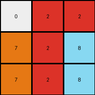
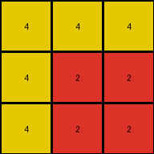

# d037b0a7 • 011 • refine_dreamer

---


Previous Code:
```python
"""
If a pixel is white (0), and the pixel directly *above* it has a different, non-zero color, then set the current pixel's color to the color of the pixel above it.
After applying the above rule to all cells, examine each pixel in the grid, row by row, and left to right.
If a pixel is not white, and the pixel to it's right is a `0` (white), set all `0` pixels to it's right to match the pixel's color until you encounter a non-white pixel.
"""

import numpy as np

def transform(input_grid):
    # Initialize the output grid as a copy of the input grid.
    output_grid = np.copy(input_grid)
    rows, cols = output_grid.shape

    # Iterate through each cell of the grid, applying the downward propagation rule.
    for i in range(rows):
        for j in range(cols):
            if output_grid[i, j] == 0:  # If the current pixel is white
                if i > 0:  # Check if there's a row above
                    if output_grid[i - 1, j] != 0:  # If the pixel above is not white
                        output_grid[i, j] = output_grid[i - 1, j]  # Set color to the pixel above

    # Iterate through the grid again to apply fill to the right rule
    for i in range(rows):
        for j in range(cols):
            if output_grid[i,j] != 0:
                for k in range(j+1, cols):
                    if output_grid[i,k] == 0:
                        output_grid[i,k] = output_grid[i,j]
                    else:
                        break # stop when a non-white is encountered

    return output_grid
```

Train Set Results:

## Example 1:

Input:
```
0 0 6
0 4 0
3 0 0
```
Expected Output:
```
0 0 6
0 4 6
3 4 6
```
Transformed Output:
```
0 0 6
0 4 6
3 4 6
```

match: True
pixels_off: 0
size_correct: True
color_palette_correct: True
correct_pixel_counts: True

## Example 2:

Input:
```
0 2 0
7 0 8
0 0 0
```
Expected Output:
```
0 2 0
7 2 8
7 2 8
```
Transformed Output:
```
0 2 2
7 2 8
7 2 8
```

match: False
pixels_off: 1
size_correct: True
color_palette_correct: True
correct_pixel_counts: False

## Example 3:

Input:
```
4 0 0
0 2 0
0 0 0
```
Expected Output:
```
4 0 0
4 2 0
4 2 0
```
Transformed Output:
```
4 4 4
4 2 2
4 2 2
```

match: False
pixels_off: 4
size_correct: True
color_palette_correct: True
correct_pixel_counts: False

**INSTRUCTIONS**

The code above was generated based on observations from the first training
example

we have tested the transform function on each of the task example inputs and
compared with the expected output

review each of the examples provided and the results and consider how the
natural language program should be updated to accommodate this new knowledge

respond with the following deliverables:

- general assessment of the information provided and strategy for resolving the
  errors
- gather metrics about each of the examples and results - use code_execution to
  develop accurate reports on your assumptions
- a YAML block documenting facts - Focus on identifying objects, their properties, and the actions performed on them.
- a natural language program - Be as clear and concise as possible, providing a complete description of the transformation rule.


your responses should be considered as information in a report - not a
conversation
