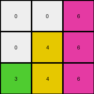
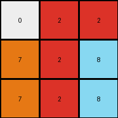
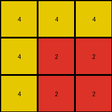

# d037b0a7 • 012 • refine_coder

---

Previous Code:
```python
"""
If a pixel is white (0), and the pixel directly *above* it has a different, non-zero color, then set the current pixel's color to the color of the pixel above it.
After applying the above rule to all cells, examine each pixel in the grid, row by row, and left to right.
If a pixel is not white, and the pixel to it's right is a `0` (white), set all `0` pixels to it's right to match the pixel's color until you encounter a non-white pixel.
"""

import numpy as np

def transform(input_grid):
    # Initialize the output grid as a copy of the input grid.
    output_grid = np.copy(input_grid)
    rows, cols = output_grid.shape

    # Iterate through each cell of the grid, applying the downward propagation rule.
    for i in range(rows):
        for j in range(cols):
            if output_grid[i, j] == 0:  # If the current pixel is white
                if i > 0:  # Check if there's a row above
                    if output_grid[i - 1, j] != 0:  # If the pixel above is not white
                        output_grid[i, j] = output_grid[i - 1, j]  # Set color to the pixel above

    # Iterate through the grid again to apply fill to the right rule
    for i in range(rows):
        for j in range(cols):
            if output_grid[i,j] != 0:
                for k in range(j+1, cols):
                    if output_grid[i,k] == 0:
                        output_grid[i,k] = output_grid[i,j]
                    else:
                        break # stop when a non-white is encountered

    return output_grid
```

Train Set Results:

## Example 1:

Input:
```
0 0 6
0 4 0
3 0 0
```
Expected Output:
```
0 0 6
0 4 6
3 4 6
```
Transformed Output:
```
0 0 6
0 4 6
3 4 6
```

match: True
pixels_off: 0
size_correct: True
color_palette_correct: True
correct_pixel_counts: True

## Example 2:

Input:
```
0 2 0
7 0 8
0 0 0
```
Expected Output:
```
0 2 0
7 2 8
7 2 8
```
Transformed Output:
```
0 2 2
7 2 8
7 2 8
```

match: False
pixels_off: 1
size_correct: True
color_palette_correct: True
correct_pixel_counts: False

## Example 3:

Input:
```
4 0 0
0 2 0
0 0 0
```
Expected Output:
```
4 0 0
4 2 0
4 2 0
```
Transformed Output:
```
4 4 4
4 2 2
4 2 2
```

match: False
pixels_off: 4
size_correct: True
color_palette_correct: True
correct_pixel_counts: False
Okay, here's a breakdown of the situation and a plan to improve the transformation rule:

**General Assessment:**

The initial natural language program and the resulting code were a good start, capturing the core idea of downward propagation and rightward filling. However, the errors in Examples 2 and 3 reveal a flaw in the rightward filling logic. It seems the filling should be conditional, dependent on the downward propagation, and not a blanket fill across the entire row. The strategy should be to refine the rightward filling rule to be more context-aware, specifically considering whether the downward propagation has already modified a cell.

**Strategy:**

1.  **Analyze the Errors:** Carefully examine the mismatched pixels in Examples 2 and 3 to pinpoint exactly *why* the current rule is failing.
2.  **Refine the Rightward Fill Condition:** Modify the natural language program to describe a more precise condition for the rightward fill. It seems the fill should only occur if a white pixel has just been colored by downward propagation.
3.  **Rewrite Code:** Translate the updated natural language program into a revised Python function.
4.  **Re-test:** Run the updated code on all three training examples and verify if the errors are resolved.

**Metrics and Observations:**

Here's a breakdown of each example, including observations to guide the rule refinement:

*   **Example 1:**
    *   **Input:** `[[0, 0, 6], [0, 4, 0], [3, 0, 0]]`
    *   **Expected:** `[[0, 0, 6], [0, 4, 6], [3, 4, 6]]`
    *   **Actual:** `[[0, 0, 6], [0, 4, 6], [3, 4, 6]]`
    *   **Match:** True
    *   **Observations:** The downward propagation and rightward fill worked as expected.
*   **Example 2:**
    *   **Input:** `[[0, 2, 0], [7, 0, 8], [0, 0, 0]]`
    *   **Expected:** `[[0, 2, 0], [7, 2, 8], [7, 2, 8]]`
    *   **Actual:** `[[0, 2, 2], [7, 2, 8], [7, 2, 8]]`
    *   **Match:** False
    *   **Observations:** The rightward fill incorrectly changed the top-right pixel (0,2) from `0` to `2`. This is the most important clue. The rightward filling should apply only to pixels that have been colored during the downward propagation phase.
*   **Example 3:**
    *   **Input:** `[[4, 0, 0], [0, 2, 0], [0, 0, 0]]`
    *   **Expected:** `[[4, 0, 0], [4, 2, 0], [4, 2, 0]]`
    *   **Actual:** `[[4, 4, 4], [4, 2, 2], [4, 2, 2]]`
    *   **Match:** False
    *   **Observations:**  Similar to Example 2, the rightward fill is too aggressive. It fills the entire row after encountering a non-zero pixel, regardless of whether that pixel was part of the downward propagation.

**YAML Facts:**

```yaml
objects:
  - type: grid
    properties:
      rows: 3
      columns: 3
      cells:
        - value: int (0-9) # Represents color
          properties:
            position: (row, column)

actions:
  - name: downward_propagation
    description: If a cell is 0, and the cell above is not 0, set the cell's value to the value of the cell above.
    preconditions:
      - cell_value == 0
      - cell_above_value != 0
    postconditions:
      - cell_value = cell_above_value

  - name: conditional_rightward_fill
    description: >
      If a cell has been modified by downward_propagation,
      fill all contiguous '0' cells to its right with the same color.
      Stop when a non-zero cell is encountered.
    preconditions:
      - cell_was_modified_by_downward_propagation
      - right_neighbor_cell_value == 0
    postconditions:
       - right_neighbor_cell_value = cell_value
```

**Natural Language Program:**

1.  **Downward Propagation:** Iterate through each cell of the grid. If a cell is white (0) and the cell directly above it has a different, non-zero color, set the current cell's color to the color of the cell above it. *Keep track of which cells are modified during this step.*

2.  **Conditional Rightward Fill:** Iterate through each cell of the grid again. If a cell was modified during the downward propagation step, examine the cells to its right. Fill any contiguous white (0) cells to the right with the modified cell's color. Stop filling when a non-white cell is encountered.

**INSTRUCTIONS**

- generate a Python module to represent the natural language program 
- follow the template below
- all common math and science libraries are available
- create docstring only at top - but comment the workflow in the function
- use helper functions for common operations like finding objects, counting,
  measuring, moving, etc. 

remember - we are working iteratively - so this code will inform your future
self as we converge on the solution

*template:*

```python
"""
{{ natural language description of the transformation rule }}
"""

{{ imports }}

def transform(input_grid):
    # initialize output_grid

    # change output pixels 

    return output_grid

```
