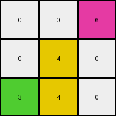
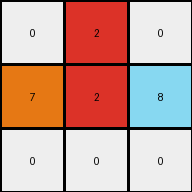

# d037b0a7 • 017 • refine_dreamer

---

Previous Code:
```python
"""
1.  Iterate through the input grid to find a yellow pixel (value 4).
2.  If a yellow pixel is found, copy it to the cell directly below it, *if it exists*. If that cell doesn't exist (at image boundary), do not modify.
3.  Iterate through the input grid to find a red pixel (value 2).
4.  If a red pixel is found, copy it to the cell directly below it, *if it exists*. If that cell doesn't exist (at image boundary), do not modify.
5. All other pixels remain unchanged.
6. The maximum extent of the rows should not exceed the original number of input grid rows, and each object has a bound equal to the count -1.
"""

import numpy as np

def find_pixel(grid, color_value):
    """Finds the coordinates of a pixel with a specific color value."""
    for r_idx, row in enumerate(grid):
        for c_idx, pixel in enumerate(row):
            if pixel == color_value:
                return r_idx, c_idx
    return None, None

def transform(input_grid):
    """Transforms the input grid according to the specified rules."""

    output_grid = np.copy(input_grid)  # Initialize output_grid as a copy of the input_grid
    rows, cols = output_grid.shape

    # Find and duplicate yellow pixel
    yellow_row, yellow_col = find_pixel(input_grid, 4)
    if yellow_row is not None and yellow_row + 1 < rows:
        output_grid[yellow_row + 1, yellow_col] = 4

    # Find and duplicate red pixel
    red_row, red_col = find_pixel(input_grid, 2)
    if red_row is not None and red_row + 1 < rows:
        output_grid[red_row + 1, red_col] = 2

    return output_grid
```

Train Set Results:

## Example 1:

Input:
```
0 0 6
0 4 0
3 0 0
```
Expected Output:
```
0 0 6
0 4 6
3 4 6
```
Transformed Output:
```
0 0 6
0 4 0
3 4 0
```

match: False
pixels_off: 2
size_correct: True
color_palette_correct: True
correct_pixel_counts: False

## Example 2:

Input:
```
0 2 0
7 0 8
0 0 0
```
Expected Output:
```
0 2 0
7 2 8
7 2 8
```
Transformed Output:
```
0 2 0
7 2 8
0 0 0
```

match: False
pixels_off: 3
size_correct: True
color_palette_correct: True
correct_pixel_counts: False

## Example 3:

Input:
```
4 0 0
0 2 0
0 0 0
```
Expected Output:
```
4 0 0
4 2 0
4 2 0
```
Transformed Output:
```
4 0 0
4 2 0
0 2 0
```

match: False
pixels_off: 1
size_correct: True
color_palette_correct: True
correct_pixel_counts: False
**INSTRUCTIONS**

The code above was generated based on observations from the first training
example

we have tested the transform function on each of the task example inputs and
compared with the expected output

review each of the examples provided and the results and consider how the
natural language program should be updated to accommodate this new knowledge

respond with the following deliverables:

- general assessment of the information provided and strategy for resolving the
  errors
- gather metrics about each of the examples and results - use code_execution to
  develop accurate reports on your assumptions
- a YAML block documenting facts - Focus on identifying objects, their properties, and the actions performed on them.
- a natural language program - Be as clear and concise as possible, providing a complete description of the transformation rule.


your responses should be considered as information in a report - not a
conversation
