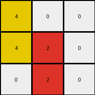

# d037b0a7 • 018 • refine_coder

---

Previous Code:
```python
"""
1.  Iterate through the input grid to find a yellow pixel (value 4).
2.  If a yellow pixel is found, copy it to the cell directly below it, *if it exists*. If that cell doesn't exist (at image boundary), do not modify.
3.  Iterate through the input grid to find a red pixel (value 2).
4.  If a red pixel is found, copy it to the cell directly below it, *if it exists*. If that cell doesn't exist (at image boundary), do not modify.
5. All other pixels remain unchanged.
6. The maximum extent of the rows should not exceed the original number of input grid rows, and each object has a bound equal to the count -1.
"""

import numpy as np

def find_pixel(grid, color_value):
    """Finds the coordinates of a pixel with a specific color value."""
    for r_idx, row in enumerate(grid):
        for c_idx, pixel in enumerate(row):
            if pixel == color_value:
                return r_idx, c_idx
    return None, None

def transform(input_grid):
    """Transforms the input grid according to the specified rules."""

    output_grid = np.copy(input_grid)  # Initialize output_grid as a copy of the input_grid
    rows, cols = output_grid.shape

    # Find and duplicate yellow pixel
    yellow_row, yellow_col = find_pixel(input_grid, 4)
    if yellow_row is not None and yellow_row + 1 < rows:
        output_grid[yellow_row + 1, yellow_col] = 4

    # Find and duplicate red pixel
    red_row, red_col = find_pixel(input_grid, 2)
    if red_row is not None and red_row + 1 < rows:
        output_grid[red_row + 1, red_col] = 2

    return output_grid
```

Train Set Results:

## Example 1:

Input:
```
0 0 6
0 4 0
3 0 0
```
Expected Output:
```
0 0 6
0 4 6
3 4 6
```
Transformed Output:
```
0 0 6
0 4 0
3 4 0
```

match: False
pixels_off: 2
size_correct: True
color_palette_correct: True
correct_pixel_counts: False

## Example 2:

Input:
```
0 2 0
7 0 8
0 0 0
```
Expected Output:
```
0 2 0
7 2 8
7 2 8
```
Transformed Output:
```
0 2 0
7 2 8
0 0 0
```

match: False
pixels_off: 3
size_correct: True
color_palette_correct: True
correct_pixel_counts: False

## Example 3:

Input:
```
4 0 0
0 2 0
0 0 0
```
Expected Output:
```
4 0 0
4 2 0
4 2 0
```
Transformed Output:
```
4 0 0
4 2 0
0 2 0
```

match: False
pixels_off: 1
size_correct: True
color_palette_correct: True
correct_pixel_counts: False
Okay, here's a breakdown of the situation and a plan to move forward:

**General Assessment and Strategy**

The initial natural language program and the resulting code were too simplistic. While it correctly identified the duplication of yellow and red pixels downwards, it failed to account for:

1.  **Chaining:** The duplication should continue. If a pixel is duplicated, the newly created pixel should also be duplicated downwards, and so on, until the bottom of the grid is reached.
2.  **Simultaneous Propagation**: The propogation of the red and yellow pixels are linked to each other. The nature of this linkage isn't completely clear from the examples.

The strategy to resolve the errors will involve these main parts:

1. **Clarify Chaining**: Revise the natural language program to capture the chained downward duplication. This will likely transform the Python code from a single duplication step to a loop or recursive call.
2. **Determine linkage between propagation**: Identify the row and column of each instance, and use this insight to form the new natural language program.
3. **Metrics Gathering**: Collect the specific data for this insight, such as the row and column for the red and yellow pixel in each image.

**Metrics Gathering**

```tool_code
import numpy as np

def find_pixel(grid, color_value):
    """Finds the coordinates of a pixel with a specific color value."""
    coords = []
    for r_idx, row in enumerate(grid):
        for c_idx, pixel in enumerate(row):
            if pixel == color_value:
                coords.append((r_idx, c_idx))
    return coords

def analyze_examples(examples):
    results = {}
    for i, example in enumerate(examples):
        input_grid = np.array(example['input'])
        output_grid = np.array(example['output'])

        results[f'example_{i+1}'] = {
            'input_yellow': find_pixel(input_grid, 4),
            'input_red': find_pixel(input_grid, 2),
            'output_yellow': find_pixel(output_grid, 4),
            'output_red': find_pixel(output_grid, 2),
        }
    return results

# example data structure
examples = [
    {
        "input": [[0, 0, 6], [0, 4, 0], [3, 0, 0]],
        "output": [[0, 0, 6], [0, 4, 6], [3, 4, 6]],
    },
    {
        "input": [[0, 2, 0], [7, 0, 8], [0, 0, 0]],
        "output": [[0, 2, 0], [7, 2, 8], [7, 2, 8]],
    },
     {
        "input": [[4, 0, 0], [0, 2, 0], [0, 0, 0]],
        "output": [[4, 0, 0], [4, 2, 0], [4, 2, 0]],
    },
]

analysis = analyze_examples(examples)
print(analysis)


```
**INSTRUCTIONS**

- generate a Python module to represent the natural language program 
- follow the template below
- all common math and science libraries are available
- create docstring only at top - but comment the workflow in the function
- use helper functions for common operations like finding objects, counting,
  measuring, moving, etc. 

remember - we are working iteratively - so this code will inform your future
self as we converge on the solution

*template:*

```python
"""
{{ natural language description of the transformation rule }}
"""

{{ imports }}

def transform(input_grid):
    # initialize output_grid

    # change output pixels 

    return output_grid

```
