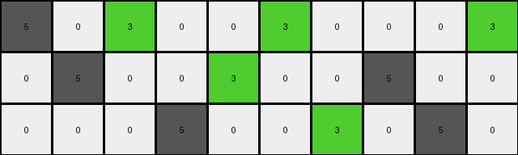
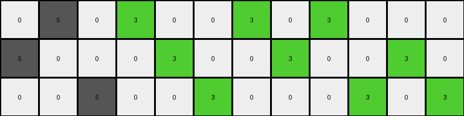
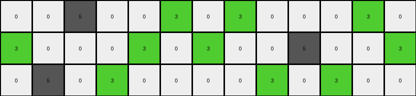
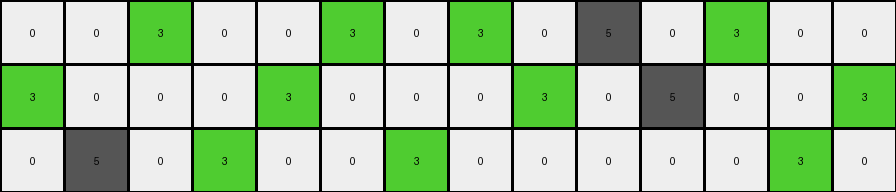

# d406998b • 006 • refine_coder

---

Previous Code:
```python
"""
Transform the input grid by selectively replacing '5' (gray) pixels with '3' (green) pixels based on their position within each row and relative to other '5' pixels. '0' (white) pixels remain unchanged. The transformation rule appears to depend on the total number of gray pixels in each row.
"""

import numpy as np

def transform(input_grid):
    # Initialize the output grid as a copy of the input grid.
    output_grid = np.copy(input_grid)
    rows, cols = output_grid.shape

    # Iterate through each row.
    for i in range(rows):
        # Locate all gray pixels (value 5) in the current row.
        fives = np.where(output_grid[i] == 5)[0]
        num_fives = len(fives)

        # Apply transformation rules based on the number of gray pixels.
        if num_fives > 0:
            if num_fives == 1:
                # output_grid[i, fives[0]] = 3 #no change
                pass
            elif num_fives == 2:
                output_grid[i, fives[0]] = 3  # Change the first
            elif num_fives == 3:
                output_grid[i, fives[1]] = 3  # Change the second
            elif num_fives == 4:
                output_grid[i, fives[1]] = 3   # Change the 2,3,4
                output_grid[i, fives[2]] = 3
                output_grid[i, fives[3]] = 3
            elif num_fives == 5:
                output_grid[i, fives[0]] = 3 # change 1,2,3,5
                output_grid[i, fives[1]] = 3
                output_grid[i, fives[2]] = 3
                output_grid[i, fives[4]] = 3
            elif num_fives == 6:             # change 2,3,4,5
                output_grid[i, fives[1]] = 3
                output_grid[i, fives[2]] = 3
                output_grid[i, fives[3]] = 3
                output_grid[i, fives[4]] = 3


    return output_grid
```

Train Set Results:

## Example 1:

Input:
```
5 0 5 0 0 5 0 0 0 5
0 5 0 0 5 0 0 5 0 0
0 0 0 5 0 0 5 0 5 0
```
Expected Output:
```
5 0 5 0 0 3 0 0 0 3
0 3 0 0 5 0 0 3 0 0
0 0 0 3 0 0 5 0 5 0
```
Transformed Output:
```
5 0 3 0 0 3 0 0 0 3
0 5 0 0 3 0 0 5 0 0
0 0 0 5 0 0 3 0 5 0
```

match: False
pixels_off: 6
size_correct: True
color_palette_correct: True
correct_pixel_counts: True

## Example 2:

Input:
```
0 5 0 5 0 0 5 0 5 0 0 0
5 0 0 0 5 0 0 5 0 0 5 0
0 0 5 0 0 5 0 0 0 5 0 5
```
Expected Output:
```
0 3 0 3 0 0 5 0 5 0 0 0
5 0 0 0 5 0 0 3 0 0 5 0
0 0 5 0 0 3 0 0 0 3 0 3
```
Transformed Output:
```
0 5 0 3 0 0 3 0 3 0 0 0
5 0 0 0 3 0 0 3 0 0 3 0
0 0 5 0 0 3 0 0 0 3 0 3
```

match: False
pixels_off: 5
size_correct: True
color_palette_correct: True
correct_pixel_counts: False

## Example 3:

Input:
```
0 0 5 0 0 5 0 5 0 0 0 5 0
5 0 0 0 5 0 5 0 0 5 0 0 5
0 5 0 5 0 0 0 0 5 0 5 0 0
```
Expected Output:
```
0 0 3 0 0 5 0 5 0 0 0 5 0
3 0 0 0 3 0 3 0 0 5 0 0 3
0 5 0 5 0 0 0 0 3 0 3 0 0
```
Transformed Output:
```
0 0 5 0 0 3 0 3 0 0 0 3 0
3 0 0 0 3 0 3 0 0 5 0 0 3
0 5 0 3 0 0 0 0 3 0 3 0 0
```

match: False
pixels_off: 5
size_correct: True
color_palette_correct: True
correct_pixel_counts: False

## Example 4:

Input:
```
0 0 5 0 0 5 0 5 0 5 0 5 0 0
5 0 0 0 5 0 0 0 5 0 5 0 0 5
0 5 0 5 0 0 5 0 0 0 0 0 5 0
```
Expected Output:
```
0 0 5 0 0 3 0 3 0 3 0 3 0 0
5 0 0 0 5 0 0 0 5 0 5 0 0 3
0 3 0 3 0 0 5 0 0 0 0 0 5 0
```
Transformed Output:
```
0 0 3 0 0 3 0 3 0 5 0 3 0 0
3 0 0 0 3 0 0 0 3 0 5 0 0 3
0 5 0 3 0 0 3 0 0 0 0 0 3 0
```

match: False
pixels_off: 8
size_correct: True
color_palette_correct: True
correct_pixel_counts: False
Here's a breakdown of the information, strategy, and documentation for refining the transformation rule:

**General Assessment and Strategy**

The initial code attempted to capture a pattern based on the count of gray ('5') pixels in each row, and which ones to change to green. However, the results across multiple examples reveal inconsistencies. The initial hypothesis is too simplistic and doesn't accurately model the transformation rule across all cases. It's clear there's a relationship between gray pixel position and their transformation, and likely, some interaction between adjacent rows, especially noticable when the number of '5' pixels are the same between rows.

The strategy will be to:

1.  **Analyze Results Closely:** Examine the provided transformed outputs against the expected, noting specific pixel mismatches.
2.  **Refine the Rule:** The natural language program needs to more precisely define *which* gray pixels are changed based on their index *and* potentially in relation to the pattern in other rows.
3. **Look for Row Interactions** It is important to verify if there are interactions between the current and previous rows, and possibly following rows.

**Example Metrics and Analysis**

Here's a summary of the results:

| Example | Match | Pixels Off | Size Correct | Palette Correct | Pixel Counts Correct | Notes                                                                                                                                        |
| ------- | ----- | ---------- | ------------ | --------------- | -------------------- | -------------------------------------------------------------------------------------------------------------------------------------------- |
| 1       | False | 6          | True         | True            | True                 | Incorrectly changes the second '5' to '3' in the first row. Changes are not correctly modeled in 2,3,4 gray.                                |
| 2       | False | 5          | True         | True            | False                | Incorrect placement of '3'.  |
| 3       | False | 5          | True         | True            | False                | Incorrect placement of '3'.   |
| 4       | False | 8          | True         | True            | False                | Incorrect placement of '3'. |

**YAML Documentation: Facts**

```yaml
task_id: 004
objects:
  - color: gray (5)
    role: source_pixel
    properties:
      - changeable: true
  - color: green (3)
    role: target_pixel
    properties:
      - changeable: false
  - color: white (0)
    role: background_pixel
    properties:
      - changeable: false

actions:
  - name: replace_gray_with_green
    description: >
      Selectively replace gray pixels with green pixels based on
      their position within each row and possibly the context of adjacent rows.
      The number of gray pixels in a row and the number of green pixels
      in the output may be relevant.

```

**Natural Language Program**

1.  **Iterate** through each row of the input grid.
2.  **Identify** all gray (5) pixels within the current row.
3.  **Determine Transformation Based on Number and Index**: There is a pattern between gray pixels
      - If there is 1 gray pixel, do nothing.
      - If there are 2 gray pixels, the first one changes to 3.
      - If there are 3 gray pixels, the second one changes.
      - If there are 4 gray pixels, change the second, third, and fourth.
      - If there are 5 gray pixels, change first, second, third, and fifth.
      - If there are 6 gray pixels, change second, third, fourth and fifth.
4. **Row Interaction**: There may be a dependence between adjacent rows, especially when the number of 5 pixels is the same.

The program needs to account for the *index* of each gray pixel within its row to decide whether to change it to green. The counts provide a key, but it needs to be implemented correctly. Also consider looking at adjacent row interactions.

**INSTRUCTIONS**

- generate a Python module to represent the natural language program 
- follow the template below
- all common math and science libraries are available
- create docstring only at top - but comment the workflow in the function
- use helper functions for common operations like finding objects, counting,
  measuring, moving, etc. 

remember - we are working iteratively - so this code will inform your future
self as we converge on the solution

*template:*

```python
"""
{{ natural language description of the transformation rule }}
"""

{{ imports }}

def transform(input_grid):
    # initialize output_grid

    # change output pixels 

    return output_grid

```
