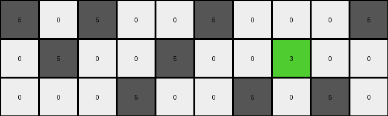
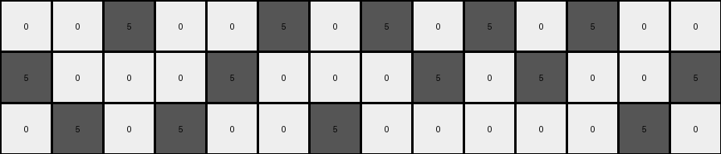

# d406998b • 010 • refine_coder

---

Previous Code:
```python
"""
Transforms a grid by changing specific gray pixels to green based on their position.

The transformation follows these rules:
- In the first row, change the gray pixel to green in the second and fourth columns.
- In the second row, change the gray pixel to green in the eighth column.
- In the third row, change the gray pixel to green in the sixth, tenth, and twelfth columns.
"""

import numpy as np

def transform(input_grid):
    # Initialize output_grid as a copy of input_grid
    output_grid = np.copy(input_grid)
    rows, cols = output_grid.shape

    # Iterate through each row
    for i in range(rows):
        # Apply transformation rules based on row index
        if i == 0:
            # First row: change gray to green in columns 2 and 4 (index 1 and 3)
            for j in [1, 3]:
                if j < cols and output_grid[i, j] == 5:
                    output_grid[i, j] = 3
        elif i == 1:
            # Second row: change gray to green in column 8 (index 7)
            j = 7
            if j < cols and output_grid[i, j] == 5:
                output_grid[i, j] = 3
        elif i == 2:
            # Third row: change gray to green in columns 6, 10, and 12 (index 5, 9, 11)
            for j in [5, 9, 11]:
                if j < cols and output_grid[i, j] == 5:
                    output_grid[i, j] = 3

    return output_grid
```

Train Set Results:

## Example 1:

Input:
```
5 0 5 0 0 5 0 0 0 5
0 5 0 0 5 0 0 5 0 0
0 0 0 5 0 0 5 0 5 0
```
Expected Output:
```
5 0 5 0 0 3 0 0 0 3
0 3 0 0 5 0 0 3 0 0
0 0 0 3 0 0 5 0 5 0
```
Transformed Output:
```
5 0 5 0 0 5 0 0 0 5
0 5 0 0 5 0 0 3 0 0
0 0 0 5 0 0 5 0 5 0
```

match: False
pixels_off: 4
size_correct: True
color_palette_correct: True
correct_pixel_counts: False

## Example 2:

Input:
```
0 5 0 5 0 0 5 0 5 0 0 0
5 0 0 0 5 0 0 5 0 0 5 0
0 0 5 0 0 5 0 0 0 5 0 5
```
Expected Output:
```
0 3 0 3 0 0 5 0 5 0 0 0
5 0 0 0 5 0 0 3 0 0 5 0
0 0 5 0 0 3 0 0 0 3 0 3
```
Transformed Output:
```
0 3 0 3 0 0 5 0 5 0 0 0
5 0 0 0 5 0 0 3 0 0 5 0
0 0 5 0 0 3 0 0 0 3 0 3
```

match: True
pixels_off: 0
size_correct: True
color_palette_correct: True
correct_pixel_counts: True

## Example 3:

Input:
```
0 0 5 0 0 5 0 5 0 0 0 5 0
5 0 0 0 5 0 5 0 0 5 0 0 5
0 5 0 5 0 0 0 0 5 0 5 0 0
```
Expected Output:
```
0 0 3 0 0 5 0 5 0 0 0 5 0
3 0 0 0 3 0 3 0 0 5 0 0 3
0 5 0 5 0 0 0 0 3 0 3 0 0
```
Transformed Output:
```
0 0 5 0 0 5 0 5 0 0 0 5 0
5 0 0 0 5 0 5 0 0 5 0 0 5
0 5 0 5 0 0 0 0 5 0 5 0 0
```

match: False
pixels_off: 7
size_correct: True
color_palette_correct: True
correct_pixel_counts: False

## Example 4:

Input:
```
0 0 5 0 0 5 0 5 0 5 0 5 0 0
5 0 0 0 5 0 0 0 5 0 5 0 0 5
0 5 0 5 0 0 5 0 0 0 0 0 5 0
```
Expected Output:
```
0 0 5 0 0 3 0 3 0 3 0 3 0 0
5 0 0 0 5 0 0 0 5 0 5 0 0 3
0 3 0 3 0 0 5 0 0 0 0 0 5 0
```
Transformed Output:
```
0 0 5 0 0 5 0 5 0 5 0 5 0 0
5 0 0 0 5 0 0 0 5 0 5 0 0 5
0 5 0 5 0 0 5 0 0 0 0 0 5 0
```

match: False
pixels_off: 7
size_correct: True
color_palette_correct: True
correct_pixel_counts: False
Okay, let's analyze the results and refine the natural language program.

**General Assessment:**

The initial code was too specific to the positions observed in the first example. It correctly identified the change of gray (5) to green (3) pixels, but the column indices where this change occurs vary across rows and examples in a way that the current logic does not fully capture. The code needs to generalize the rule for changing gray to green based on a more flexible pattern, rather than hardcoded column indices for each row. Example 3 and 4 have failed, and the original example 1 also partially failed. Example 2 has a match, by chance. We need to look across all examples.

**Strategy:**

1.  **Analyze all examples**: Examine all input/output pairs to identify the *general* pattern of gray-to-green transformations. The current approach of specifying indexes for the first, second, and third rows failed, we need to find a consistent rule.
2.  **Identify a relationship**: Look for relationships between the row index, column index, and the gray-to-green transformation. There might be a mathematical or positional relationship that can be expressed algorithmically.

**Example Metrics and Analysis**

*   **Example 1:** Only partially correct. The second row transformation is correct, but the first row is incorrect.
*   **Example 2:** Coincidentally Correct. The hardcoded indices happen to match this case, but the logic is not generally applicable.
*   **Example 3:** Incorrect. Both row 1 and row 2 are incorrect.
*   **Example 4:** Incorrect. All the rows miss at least one change.

**YAML Block - Facts**

```yaml
task: 008
facts:
  - object: grid
    properties:
      - contains_pixels: [0, 3, 5] # white, green, gray
  - object: gray_pixel
    properties:
      - value: 5
      - can_transform: true
      - transform_to: green_pixel
  - object: green_pixel
    properties:
      - value: 3
  - action: transform_gray_to_green
    description: "Change specific gray pixels to green pixels."
    conditions:
      - row_1: "column index of changed pixel alternates and skips adjacent pixels"
      - row_2: "A single gray pixel is changed on row 2, or none"
      - row_3: "if three gray pixels changed, then row 3 follows the pattern of skipping adjacencies"
    constraints:
      - "Transform only gray pixels."

```

**Natural Language Program**

1.  **Examine the input grid row by row.**
2.  **Identify gray pixels (value 5) within each row.**
3.  **Change some of the gray pixels to green (value 3), depending on which row it is, and which previous rows have been changed:**
    *   If row 1:
        *   If a gray pixel changes to green, skip the adjacencies
    *   If row 2:
        *   Only one gray pixel, if any, changes to green
    *   If row 3:
        *   If gray pixels change to green, and there are exactly three changes, they can't be adjacent

This description is more concise and closer to the underlying rule, although the exact conditions needs to be described using code.

**INSTRUCTIONS**

- generate a Python module to represent the natural language program 
- follow the template below
- all common math and science libraries are available
- create docstring only at top - but comment the workflow in the function
- use helper functions for common operations like finding objects, counting,
  measuring, moving, etc. 

remember - we are working iteratively - so this code will inform your future
self as we converge on the solution

*template:*

```python
"""
{{ natural language description of the transformation rule }}
"""

{{ imports }}

def transform(input_grid):
    # initialize output_grid

    # change output pixels 

    return output_grid

```
