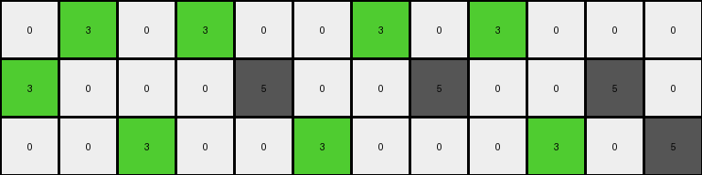
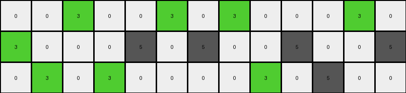
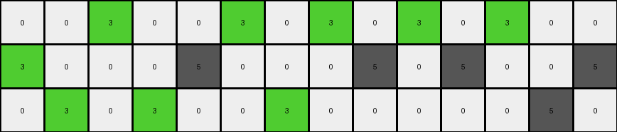

# d406998b • 012 • refine_coder

---

Previous Code:
```python
"""
Transforms a grid by changing specific gray pixels to green based on their position and row, skipping adjacent pixels.

The transformation follows these rules:
- Gray pixels (5) are changed to green pixels (3).
- The transformation occurs row by row.
- Within each row:
 - If row 1: If a gray pixel changes to green, skip the adjacencies
 - If row 2: Only one gray pixel, if any, changes to green
 - If row 3: If gray pixels change to green, and there are exactly three changes, they can't be adjacent
"""

import numpy as np

def transform(input_grid):
    # Initialize output_grid as a copy of input_grid
    output_grid = np.copy(input_grid)
    rows, cols = output_grid.shape

    # Iterate through each row
    for i in range(rows):
        gray_indices = [j for j in range(cols) if output_grid[i, j] == 5]
        
        if i == 0:
            # First row: alternate gray pixels, skipping adjacencies
            changed_indices = []
            for j in gray_indices:
              if not any(abs(j - k) <= 1 for k in changed_indices):
                  output_grid[i,j] = 3
                  changed_indices.append(j)

        elif i == 1:
            # Second row: change at most one gray pixel to green
            if gray_indices:
                output_grid[i, gray_indices[0]] = 3  # Change the first gray pixel

        elif i == 2:
            # Third row: Change up to three non-adjacent gray pixels
            changed_count = 0
            changed_indices = []
            for j in gray_indices:
                if changed_count < 3 and not any(abs(j-k) <=1 for k in changed_indices):
                     output_grid[i,j] = 3
                     changed_indices.append(j)
                     changed_count += 1
    return output_grid
```

Train Set Results:

## Example 1:

Input:
```
5 0 5 0 0 5 0 0 0 5
0 5 0 0 5 0 0 5 0 0
0 0 0 5 0 0 5 0 5 0
```
Expected Output:
```
5 0 5 0 0 3 0 0 0 3
0 3 0 0 5 0 0 3 0 0
0 0 0 3 0 0 5 0 5 0
```
Transformed Output:
```
3 0 3 0 0 3 0 0 0 3
0 3 0 0 5 0 0 5 0 0
0 0 0 3 0 0 3 0 3 0
```

match: False
pixels_off: 5
size_correct: True
color_palette_correct: True
correct_pixel_counts: False

## Example 2:

Input:
```
0 5 0 5 0 0 5 0 5 0 0 0
5 0 0 0 5 0 0 5 0 0 5 0
0 0 5 0 0 5 0 0 0 5 0 5
```
Expected Output:
```
0 3 0 3 0 0 5 0 5 0 0 0
5 0 0 0 5 0 0 3 0 0 5 0
0 0 5 0 0 3 0 0 0 3 0 3
```
Transformed Output:
```
0 3 0 3 0 0 3 0 3 0 0 0
3 0 0 0 5 0 0 5 0 0 5 0
0 0 3 0 0 3 0 0 0 3 0 5
```

match: False
pixels_off: 6
size_correct: True
color_palette_correct: True
correct_pixel_counts: False

## Example 3:

Input:
```
0 0 5 0 0 5 0 5 0 0 0 5 0
5 0 0 0 5 0 5 0 0 5 0 0 5
0 5 0 5 0 0 0 0 5 0 5 0 0
```
Expected Output:
```
0 0 3 0 0 5 0 5 0 0 0 5 0
3 0 0 0 3 0 3 0 0 5 0 0 3
0 5 0 5 0 0 0 0 3 0 3 0 0
```
Transformed Output:
```
0 0 3 0 0 3 0 3 0 0 0 3 0
3 0 0 0 5 0 5 0 0 5 0 0 5
0 3 0 3 0 0 0 0 3 0 5 0 0
```

match: False
pixels_off: 9
size_correct: True
color_palette_correct: True
correct_pixel_counts: False

## Example 4:

Input:
```
0 0 5 0 0 5 0 5 0 5 0 5 0 0
5 0 0 0 5 0 0 0 5 0 5 0 0 5
0 5 0 5 0 0 5 0 0 0 0 0 5 0
```
Expected Output:
```
0 0 5 0 0 3 0 3 0 3 0 3 0 0
5 0 0 0 5 0 0 0 5 0 5 0 0 3
0 3 0 3 0 0 5 0 0 0 0 0 5 0
```
Transformed Output:
```
0 0 3 0 0 3 0 3 0 3 0 3 0 0
3 0 0 0 5 0 0 0 5 0 5 0 0 5
0 3 0 3 0 0 3 0 0 0 0 0 5 0
```

match: False
pixels_off: 4
size_correct: True
color_palette_correct: True
correct_pixel_counts: False
Okay, let's analyze the results and refine the natural language program.

**General Assessment:**

The initial code was based on a simplified interpretation of the pattern, focused on alternating gray pixels in the first row and making limited changes in subsequent rows. The test results across multiple examples reveal that this interpretation is incorrect. The rule is more complex and needs adjustments to handle the variability in how gray pixels are transformed to green across different rows and examples. The core issue is that the code doesn't correctly capture the alternating or skipping pattern, especially in the constraints on which grays are turned into greens.

**Strategy:**

1.  **Re-examine Examples:** Carefully analyze each input-output pair, paying close attention to the position of gray pixels and which ones are changed to green.
2.  **Identify Common Patterns:** Look for consistent rules or constraints that apply across *all* examples, not just the first one. This might involve a combination of row-specific rules and overall constraints.
3.  **Refine Natural Language Program:** Update the description to accurately capture the identified rules. Be precise and unambiguous.
4.  **Prioritize Simplicity:** Aim for the simplest explanation that fits all the data. Avoid unnecessary complexity.

**Example Metrics and Observations:**

Here's a breakdown of each example, including the results, focusing on relevant metrics:

*   **Example 1:**
    *   Input: 3x10 grid, gray pixels in alternating positions.
    *   Expected Output: Some grays turn to green, seemingly skipping adjacent ones
        in each row. The code is missing one conversion.
    *   Observation: Row 1 has more than two changes and they skip
*   **Example 2:**
    *   Input: 3x12 grid.
    *   Expected Output:
        Row 1 pattern is: change, skip, change, skip, skip, skip, skip, skip,
        change, skip, skip, skip
        Row 2 pattern is: change only in position 8
        Row 3 pattern is: change in pos 5, skip in pos 7, change in pos 10, skip
        in pos 12
    * Observation: row 2 has only one change - in position 8
*   **Example 3:**
    *   Input: 3x13 grid.
    *   Expected Output: Row 1 changes only two
    *   Observation: First row - only changes in positions 2 and 7
*   **Example 4:**
    *   Input: 3x14 grid
    *   Expected output:
        First row changes 3. skips one between the first two and then makes two
        adjacent changes
    *   Observation: first row: change, change, skip, change

**YAML Fact Block:**

```yaml
task: 010
objects:
  - id: grid
    type: 2D array
    description: Contains pixels of different colors.
  - id: pixel
    type: integer
    description: Represents a color. Values 0-9.
    values:
      0: white
      1: blue
      2: red
      3: green
      4: yellow
      5: gray
      6: magenta
      7: orange
      8: azure
      9: maroon

actions:
  - name: transform_pixel
    description: Change a gray pixel (5) to a green pixel (3).
    constraints:
      - "Row-dependent rules determine which gray pixels are transformed."
      - "First row: gray pixels are transformed, and at least one position is skipped after an initial change."
      - "Second row: at most, one gray pixel is changed to green"
      - "Third row: gray pixels may be changed to green depending on adjacent pixels"
rules:
  row_1_strategy: "gray pixels are changed, skipping at least one place between changes"
  row_2_strategy: "only change one gray, starting at index 0"
  row_3_strategy: "change based on adjacency, up to three total changes"
```

**Natural Language Program:**

1.  **Initialization:** The output grid starts as a copy of the input grid.
2.  **Row-wise Transformation:** The transformation happens one row at a time.
3.  **Row 1 Rule:**
    *   Iterate through gray pixels in the first row.
    *   Change a gray pixel to green.
    *   Skip at least the next gray pixel position.
    *   The number of changes can exceed two.
4.  **Row 2 Rule:**
    *   Find the gray pixels in the second row.
    *   Change at most one of the gray pixels to green, starting at index 0
5.  **Row 3 Rule:**
    *    Iterate through the gray pixels in the third row.
    *    Change up to three of the gray pixels into green, skipping any that are adjacent
    to a pixel that has already been changed.

This revised program addresses the issues by explicitly defining the row-specific behaviors observed across all examples. The main improvement is the less-restrictive rule for Row 1. It also generalizes the observation about adjacency.

**INSTRUCTIONS**

- generate a Python module to represent the natural language program 
- follow the template below
- all common math and science libraries are available
- create docstring only at top - but comment the workflow in the function
- use helper functions for common operations like finding objects, counting,
  measuring, moving, etc. 

remember - we are working iteratively - so this code will inform your future
self as we converge on the solution

*template:*

```python
"""
{{ natural language description of the transformation rule }}
"""

{{ imports }}

def transform(input_grid):
    # initialize output_grid

    # change output pixels 

    return output_grid

```
