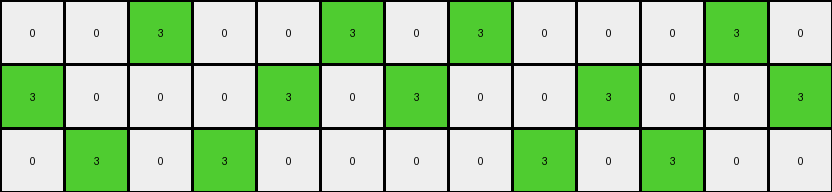

# d406998b • 017 • refine_dreamer

---


Previous Code:
```python
"""
Iterates through the input grid and identifies horizontal or vertical sequences
consisting of one white pixel (0) next to one gray pixel (5). If such a sequence
is found, the gray pixel is changed to green (3).
"""

import numpy as np

def get_adjacent_pixels(grid, row, col):
    """
    Gets the adjacent pixels (up, down, left, right) of a given cell in the grid.

    Args:
        grid: The 2D numpy array representing the grid.
        row: The row index of the cell.
        col: The column index of the cell.

    Returns:
        A list of tuples, where each tuple represents an adjacent pixel
        and contains (row, col, color).
    """
    rows, cols = grid.shape
    adjacent_pixels = []
    # Check up, down, left, right.
    for dr, dc in [(-1, 0), (1, 0), (0, -1), (0, 1)]:
        new_row, new_col = row + dr, col + dc
        if 0 <= new_row < rows and 0 <= new_col < cols:
            adjacent_pixels.append((new_row, new_col, grid[new_row, new_col]))
    return adjacent_pixels

def transform(input_grid):
    """
    Transforms the input grid according to the specified rule.
    """
    output_grid = np.copy(input_grid)
    rows, cols = output_grid.shape

    # Iterate through the grid.
    for row in range(rows):
        for col in range(cols):
            # Check if the current pixel is part of a white-gray or gray-white sequence.
            if output_grid[row, col] == 5: # start on grey
                adjacent_pixels = get_adjacent_pixels(output_grid, row, col)
                for r, c, color in adjacent_pixels:
                    if color == 0: # check if it is a grey-white sequence
                        output_grid[row,col] = 3 # it is, replace grey with green
                        break # found a sequence, move on

    return output_grid
```

Train Set Results:

## Example 1:

Input:
```
5 0 5 0 0 5 0 0 0 5
0 5 0 0 5 0 0 5 0 0
0 0 0 5 0 0 5 0 5 0
```
Expected Output:
```
5 0 5 0 0 3 0 0 0 3
0 3 0 0 5 0 0 3 0 0
0 0 0 3 0 0 5 0 5 0
```
Transformed Output:
```
3 0 3 0 0 3 0 0 0 3
0 3 0 0 3 0 0 3 0 0
0 0 0 3 0 0 3 0 3 0
```

match: False
pixels_off: 5
size_correct: True
color_palette_correct: True
correct_pixel_counts: False

## Example 2:

Input:
```
0 5 0 5 0 0 5 0 5 0 0 0
5 0 0 0 5 0 0 5 0 0 5 0
0 0 5 0 0 5 0 0 0 5 0 5
```
Expected Output:
```
0 3 0 3 0 0 5 0 5 0 0 0
5 0 0 0 5 0 0 3 0 0 5 0
0 0 5 0 0 3 0 0 0 3 0 3
```
Transformed Output:
```
0 3 0 3 0 0 3 0 3 0 0 0
3 0 0 0 3 0 0 3 0 0 3 0
0 0 3 0 0 3 0 0 0 3 0 3
```

match: False
pixels_off: 6
size_correct: True
color_palette_correct: True
correct_pixel_counts: False

## Example 3:

Input:
```
0 0 5 0 0 5 0 5 0 0 0 5 0
5 0 0 0 5 0 5 0 0 5 0 0 5
0 5 0 5 0 0 0 0 5 0 5 0 0
```
Expected Output:
```
0 0 3 0 0 5 0 5 0 0 0 5 0
3 0 0 0 3 0 3 0 0 5 0 0 3
0 5 0 5 0 0 0 0 3 0 3 0 0
```
Transformed Output:
```
0 0 3 0 0 3 0 3 0 0 0 3 0
3 0 0 0 3 0 3 0 0 3 0 0 3
0 3 0 3 0 0 0 0 3 0 3 0 0
```

match: False
pixels_off: 6
size_correct: True
color_palette_correct: True
correct_pixel_counts: False

## Example 4:

Input:
```
0 0 5 0 0 5 0 5 0 5 0 5 0 0
5 0 0 0 5 0 0 0 5 0 5 0 0 5
0 5 0 5 0 0 5 0 0 0 0 0 5 0
```
Expected Output:
```
0 0 5 0 0 3 0 3 0 3 0 3 0 0
5 0 0 0 5 0 0 0 5 0 5 0 0 3
0 3 0 3 0 0 5 0 0 0 0 0 5 0
```
Transformed Output:
```
0 0 3 0 0 3 0 3 0 3 0 3 0 0
3 0 0 0 3 0 0 0 3 0 3 0 0 3
0 3 0 3 0 0 3 0 0 0 0 0 3 0
```

match: False
pixels_off: 7
size_correct: True
color_palette_correct: True
correct_pixel_counts: False

**INSTRUCTIONS**

The code above was generated based on observations from the first training
example

we have tested the transform function on each of the task example inputs and
compared with the expected output

review each of the examples provided and the results and consider how the
natural language program should be updated to accommodate this new knowledge

respond with the following deliverables:

- general assessment of the information provided and strategy for resolving the
  errors
- gather metrics about each of the examples and results - use code_execution to
  develop accurate reports on your assumptions
- a YAML block documenting facts - Focus on identifying objects, their properties, and the actions performed on them.
- a natural language program - Be as clear and concise as possible, providing a complete description of the transformation rule.


your responses should be considered as information in a report - not a
conversation
