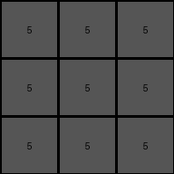

# d4469b4b • 003 • refine_dreamer

---


Previous Code:
```python
"""
Divide the 5x5 input grid into nine regions by conceptually superimposing a 3x3 grid.
If a region contains any red pixels, the corresponding output pixel is gray.
If a region contains only white pixels, the corresponding output pixel is white.
"""

import numpy as np

def get_region(input_grid, row_start, row_end, col_start, col_end):
    """Helper function to extract a region from the input grid."""
    return input_grid[row_start:row_end, col_start:col_end]

def transform(input_grid):
    """Transforms the input grid according to the described rule."""

    input_grid = np.array(input_grid)  # Ensure numpy array for easy slicing
    output_grid = np.zeros((3, 3), dtype=int)  # Initialize output grid with zeros (white)

    # Define the boundaries of the nine regions.
    regions = [
        (0, 2, 0, 2),  # Top-left
        (0, 2, 1, 4),  # Top-middle
        (0, 2, 3, 5),  # Top-right
        (1, 4, 0, 2),  # Middle-left
        (1, 4, 1, 4),  # Center
        (1, 4, 3, 5),  # Middle-right
        (3, 5, 0, 2),  # Bottom-left
        (3, 5, 1, 4),  # Bottom-middle
        (3, 5, 3, 5)   # Bottom-right
    ]
    
    k = 0
    for i in range(3):
        for j in range(3):
            row_start, row_end, col_start, col_end = regions[k]
            region = get_region(input_grid, row_start, row_end, col_start, col_end)
            if 2 in region:  # Check for any red pixels
                output_grid[i, j] = 5  # Set to gray
            k += 1

    return output_grid.tolist()
```

Train Set Results:

## Example 1:

Input:
```
2 0 0 0 0
0 2 0 0 2
2 0 0 2 0
0 0 0 2 2
0 0 2 2 0
```
Expected Output:
```
5 5 5
0 5 0
0 5 0
```
Transformed Output:
```
5 5 5
5 5 5
0 5 5
```

match: False
pixels_off: 3
size_correct: True
color_palette_correct: True
correct_pixel_counts: False

## Example 2:

Input:
```
0 0 0 0 0
0 0 1 1 1
0 1 0 1 1
0 1 0 1 0
0 0 0 0 1
```
Expected Output:
```
0 5 0
5 5 5
0 5 0
```
Transformed Output:
```
0 0 0
0 0 0
0 0 0
```

match: False
pixels_off: 5
size_correct: True
color_palette_correct: True
correct_pixel_counts: False

## Example 3:

Input:
```
3 0 0 0 0
0 0 0 3 3
0 3 3 0 0
0 3 0 3 0
3 0 3 3 0
```
Expected Output:
```
0 0 5
0 0 5
5 5 5
```
Transformed Output:
```
0 0 0
0 0 0
0 0 0
```

match: False
pixels_off: 5
size_correct: True
color_palette_correct: True
correct_pixel_counts: False

## Example 4:

Input:
```
1 0 1 0 0
1 0 0 1 1
1 1 0 1 0
0 1 0 1 0
1 0 0 0 1
```
Expected Output:
```
0 5 0
5 5 5
0 5 0
```
Transformed Output:
```
0 0 0
0 0 0
0 0 0
```

match: False
pixels_off: 5
size_correct: True
color_palette_correct: True
correct_pixel_counts: False

## Example 5:

Input:
```
2 0 2 0 2
2 0 0 0 2
2 2 0 0 0
2 0 0 2 2
2 2 2 0 2
```
Expected Output:
```
5 5 5
0 5 0
0 5 0
```
Transformed Output:
```
5 5 5
5 5 5
5 5 5
```

match: False
pixels_off: 4
size_correct: True
color_palette_correct: True
correct_pixel_counts: False

## Example 6:

Input:
```
0 2 0 2 0
0 2 2 2 0
0 2 2 0 2
2 2 2 0 0
0 0 2 0 2
```
Expected Output:
```
5 5 5
0 5 0
0 5 0
```
Transformed Output:
```
5 5 5
5 5 5
5 5 5
```

match: False
pixels_off: 4
size_correct: True
color_palette_correct: True
correct_pixel_counts: False

## Example 7:

Input:
```
0 3 0 3 0
3 3 0 0 0
0 3 0 0 0
0 0 3 0 0
3 3 3 0 0
```
Expected Output:
```
0 0 5
0 0 5
5 5 5
```
Transformed Output:
```
0 0 0
0 0 0
0 0 0
```

match: False
pixels_off: 5
size_correct: True
color_palette_correct: True
correct_pixel_counts: False

**INSTRUCTIONS**

The code above was generated based on observations from the first training
example

we have tested the transform function on each of the task example inputs and
compared with the expected output

review each of the examples provided and the results and consider how the
natural language program should be updated to accommodate this new knowledge

respond with the following deliverables:

- general assessment of the information provided and strategy for resolving the
  errors
- gather metrics about each of the examples and results - use code_execution to
  develop accurate reports on your assumptions
- a YAML block documenting facts - Focus on identifying objects, their properties, and the actions performed on them.
- a natural language program - Be as clear and concise as possible, providing a complete description of the transformation rule.


your responses should be considered as information in a report - not a
conversation
