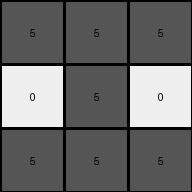
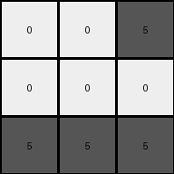

# d4469b4b • 017 • refine_dreamer

---


Previous Code:
```python
"""
1.  **Input and Output:** The input is a 5x5 grid, and the output is a 3x3 grid.

2.  **Color Mapping:** Only colors 0 (white) and 5 (gray) appear in the output.

3.  **Conditional Gray Regions:**
    * a. Check for Green Pixels: Check for the presence of green pixels in the overlapping 3x3 regions in the input.
    * If the color green IS present in the input:
        * If any green (3) pixels are present in the bottom-left 3x3 area, the bottom-left cell of the output is gray.
        * If any green (3) pixels are present in the bottom-center 3x3 area, the bottom-center cell of the output is gray.
        * If any green (3) pixels are present in the bottom-right 3x3 area, the bottom-right cell of the output is gray.
        * If any green (3) pixels are in the top-right 3x3 area, the top right output cell is grey.
        * Other pixels in the output are white.
    * If the color green is NOT present:
        * set the output to be a "cross" of grey pixels: top row, center column, and bottom row.

4. **Overlapping Regions:** The 3x3 regions in the input *overlap*. That is, we consider multiple 3x3 slices of the 5x5 input.
"""

import numpy as np

def transform(input_grid):
    # Initialize output_grid as 3x3 with all white (0)
    output_grid = np.zeros((3, 3), dtype=int)

    # Check if green exists in the input grid
    if np.any(input_grid == 3):
        # Check bottom-left 3x3 region
        if np.any(input_grid[2:5, 0:3] == 3):
            output_grid[2, 0] = 5

        # Check bottom-center 3x3 region
        if np.any(input_grid[2:5, 1:4] == 3):
            output_grid[2, 1] = 5

        # Check bottom-right 3x3 region
        if np.any(input_grid[2:5, 2:5] == 3):
            output_grid[2, 2] = 5

        # Check top-right 3x3 region
        if np.any(input_grid[0:3, 2:5] == 3):
            output_grid[0, 2] = 5

    else:
        # Create a gray cross pattern
        output_grid[0, :] = 5  # Top row
        output_grid[1, 1] = 5  # Center pixel
        output_grid[2, :] = 5  # Bottom row

    return output_grid
```

Train Set Results:

## Example 1:

Input:
```
2 0 0 0 0
0 2 0 0 2
2 0 0 2 0
0 0 0 2 2
0 0 2 2 0
```
Expected Output:
```
5 5 5
0 5 0
0 5 0
```
Transformed Output:
```
5 5 5
0 5 0
5 5 5
```

match: False
pixels_off: 2
size_correct: True
color_palette_correct: True
correct_pixel_counts: False

## Example 2:

Input:
```
0 0 0 0 0
0 0 1 1 1
0 1 0 1 1
0 1 0 1 0
0 0 0 0 1
```
Expected Output:
```
0 5 0
5 5 5
0 5 0
```
Transformed Output:
```
5 5 5
0 5 0
5 5 5
```

match: False
pixels_off: 6
size_correct: True
color_palette_correct: True
correct_pixel_counts: False

## Example 3:

Input:
```
3 0 0 0 0
0 0 0 3 3
0 3 3 0 0
0 3 0 3 0
3 0 3 3 0
```
Expected Output:
```
0 0 5
0 0 5
5 5 5
```
Transformed Output:
```
0 0 5
0 0 0
5 5 5
```

match: False
pixels_off: 1
size_correct: True
color_palette_correct: True
correct_pixel_counts: False

## Example 4:

Input:
```
1 0 1 0 0
1 0 0 1 1
1 1 0 1 0
0 1 0 1 0
1 0 0 0 1
```
Expected Output:
```
0 5 0
5 5 5
0 5 0
```
Transformed Output:
```
5 5 5
0 5 0
5 5 5
```

match: False
pixels_off: 6
size_correct: True
color_palette_correct: True
correct_pixel_counts: False

## Example 5:

Input:
```
2 0 2 0 2
2 0 0 0 2
2 2 0 0 0
2 0 0 2 2
2 2 2 0 2
```
Expected Output:
```
5 5 5
0 5 0
0 5 0
```
Transformed Output:
```
5 5 5
0 5 0
5 5 5
```

match: False
pixels_off: 2
size_correct: True
color_palette_correct: True
correct_pixel_counts: False

## Example 6:

Input:
```
0 2 0 2 0
0 2 2 2 0
0 2 2 0 2
2 2 2 0 0
0 0 2 0 2
```
Expected Output:
```
5 5 5
0 5 0
0 5 0
```
Transformed Output:
```
5 5 5
0 5 0
5 5 5
```

match: False
pixels_off: 2
size_correct: True
color_palette_correct: True
correct_pixel_counts: False

## Example 7:

Input:
```
0 3 0 3 0
3 3 0 0 0
0 3 0 0 0
0 0 3 0 0
3 3 3 0 0
```
Expected Output:
```
0 0 5
0 0 5
5 5 5
```
Transformed Output:
```
0 0 5
0 0 0
5 5 5
```

match: False
pixels_off: 1
size_correct: True
color_palette_correct: True
correct_pixel_counts: False

**INSTRUCTIONS**

The code above was generated based on observations from the first training
example

we have tested the transform function on each of the task example inputs and
compared with the expected output

review each of the examples provided and the results and consider how the
natural language program should be updated to accommodate this new knowledge

respond with the following deliverables:

- general assessment of the information provided and strategy for resolving the
  errors
- gather metrics about each of the examples and results - use code_execution to
  develop accurate reports on your assumptions
- a YAML block documenting facts - Focus on identifying objects, their properties, and the actions performed on them.
- a natural language program - Be as clear and concise as possible, providing a complete description of the transformation rule.


your responses should be considered as information in a report - not a
conversation
