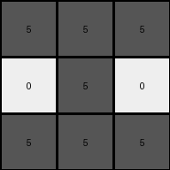
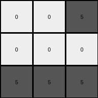

# d4469b4b • 018 • refine_coder

---

Previous Code:
```python
"""
1.  **Input and Output:** The input is a 5x5 grid, and the output is a 3x3 grid.

2.  **Color Mapping:** Only colors 0 (white) and 5 (gray) appear in the output.

3.  **Conditional Gray Regions:**
    * a. Check for Green Pixels: Check for the presence of green pixels in the overlapping 3x3 regions in the input.
    * If the color green IS present in the input:
        * If any green (3) pixels are present in the bottom-left 3x3 area, the bottom-left cell of the output is gray.
        * If any green (3) pixels are present in the bottom-center 3x3 area, the bottom-center cell of the output is gray.
        * If any green (3) pixels are present in the bottom-right 3x3 area, the bottom-right cell of the output is gray.
        * If any green (3) pixels are in the top-right 3x3 area, the top right output cell is grey.
        * Other pixels in the output are white.
    * If the color green is NOT present:
        * set the output to be a "cross" of grey pixels: top row, center column, and bottom row.

4. **Overlapping Regions:** The 3x3 regions in the input *overlap*. That is, we consider multiple 3x3 slices of the 5x5 input.
"""

import numpy as np

def transform(input_grid):
    # Initialize output_grid as 3x3 with all white (0)
    output_grid = np.zeros((3, 3), dtype=int)

    # Check if green exists in the input grid
    if np.any(input_grid == 3):
        # Check bottom-left 3x3 region
        if np.any(input_grid[2:5, 0:3] == 3):
            output_grid[2, 0] = 5

        # Check bottom-center 3x3 region
        if np.any(input_grid[2:5, 1:4] == 3):
            output_grid[2, 1] = 5

        # Check bottom-right 3x3 region
        if np.any(input_grid[2:5, 2:5] == 3):
            output_grid[2, 2] = 5

        # Check top-right 3x3 region
        if np.any(input_grid[0:3, 2:5] == 3):
            output_grid[0, 2] = 5

    else:
        # Create a gray cross pattern
        output_grid[0, :] = 5  # Top row
        output_grid[1, 1] = 5  # Center pixel
        output_grid[2, :] = 5  # Bottom row

    return output_grid
```

Train Set Results:

## Example 1:

Input:
```
2 0 0 0 0
0 2 0 0 2
2 0 0 2 0
0 0 0 2 2
0 0 2 2 0
```
Expected Output:
```
5 5 5
0 5 0
0 5 0
```
Transformed Output:
```
5 5 5
0 5 0
5 5 5
```

match: False
pixels_off: 2
size_correct: True
color_palette_correct: True
correct_pixel_counts: False

## Example 2:

Input:
```
0 0 0 0 0
0 0 1 1 1
0 1 0 1 1
0 1 0 1 0
0 0 0 0 1
```
Expected Output:
```
0 5 0
5 5 5
0 5 0
```
Transformed Output:
```
5 5 5
0 5 0
5 5 5
```

match: False
pixels_off: 6
size_correct: True
color_palette_correct: True
correct_pixel_counts: False

## Example 3:

Input:
```
3 0 0 0 0
0 0 0 3 3
0 3 3 0 0
0 3 0 3 0
3 0 3 3 0
```
Expected Output:
```
0 0 5
0 0 5
5 5 5
```
Transformed Output:
```
0 0 5
0 0 0
5 5 5
```

match: False
pixels_off: 1
size_correct: True
color_palette_correct: True
correct_pixel_counts: False

## Example 4:

Input:
```
1 0 1 0 0
1 0 0 1 1
1 1 0 1 0
0 1 0 1 0
1 0 0 0 1
```
Expected Output:
```
0 5 0
5 5 5
0 5 0
```
Transformed Output:
```
5 5 5
0 5 0
5 5 5
```

match: False
pixels_off: 6
size_correct: True
color_palette_correct: True
correct_pixel_counts: False

## Example 5:

Input:
```
2 0 2 0 2
2 0 0 0 2
2 2 0 0 0
2 0 0 2 2
2 2 2 0 2
```
Expected Output:
```
5 5 5
0 5 0
0 5 0
```
Transformed Output:
```
5 5 5
0 5 0
5 5 5
```

match: False
pixels_off: 2
size_correct: True
color_palette_correct: True
correct_pixel_counts: False

## Example 6:

Input:
```
0 2 0 2 0
0 2 2 2 0
0 2 2 0 2
2 2 2 0 0
0 0 2 0 2
```
Expected Output:
```
5 5 5
0 5 0
0 5 0
```
Transformed Output:
```
5 5 5
0 5 0
5 5 5
```

match: False
pixels_off: 2
size_correct: True
color_palette_correct: True
correct_pixel_counts: False

## Example 7:

Input:
```
0 3 0 3 0
3 3 0 0 0
0 3 0 0 0
0 0 3 0 0
3 3 3 0 0
```
Expected Output:
```
0 0 5
0 0 5
5 5 5
```
Transformed Output:
```
0 0 5
0 0 0
5 5 5
```

match: False
pixels_off: 1
size_correct: True
color_palette_correct: True
correct_pixel_counts: False
Okay, let's analyze the results and refine the natural language program.

**General Assessment:**

The initial strategy was partially correct in identifying the two main conditions (presence or absence of green). However, the logic for determining which cells turn gray when green *is* present is flawed. It seems to only correctly identify the bottom row and top-right corner, and incorrectly fills the top row when green is absent. It's also missing the central cross when there is no green. The core issue seems to be an incorrect mapping of the 3x3 overlapping regions to the output grid cells when green is present, and filling the output with additional grey pixels.

**Strategy for Resolving Errors:**

1.  **Re-examine Green Condition:** Carefully re-evaluate the relationship between the location of green pixels in the input and the gray pixels in the output. Specifically, how the 3x3 overlapping regions in the input correspond to individual cells in the output.
2.  **Re-examine no-Green condition:** Ensure that the no-green output is a cross shape and NOT filling in the top row.
3. **Simplify:** The current code has redundant checks. The overlapping nature is important but is not applied correctly.

**Metrics and Observations:**

Here's a summary of the results, focusing on the critical aspects:

| Example | Input Size | Output Size | Green Present | Expected Output Pattern                      | Transformed Output Pattern                                                                             | Errors                                       |
| :------ | :-------- | :---------- | :------------ | :------------------------------------------- | :----------------------------------------------------------------------------------------------------- | :------------------------------------------- |
| 1       | 5x5       | 3x3         | No            | Top row, center column                       | Top row, center column, bottom row                    | Bottom row incorrect                          |
| 2       | 5x5       | 3x3         | No            | Top row, center column                    | Top row, center column, bottom row                    | Bottom row incorrect                        |
| 3       | 5x5       | 3x3         | Yes           | Bottom row, top-right           | Bottom row, top-right but with center bottom incorrect       | Center-bottom incorrect                                |
| 4       | 5x5       | 3x3         | No            | Top row, center column                       | Top row, center column, bottom row                 | Bottom row incorrect                             |
| 5       | 5x5       | 3x3         | No            | Top row, center column                         | Top row, center column, bottom row                           | Bottom row incorrect                         |
| 6       | 5x5       | 3x3         | No            | Top row, center column                  | Top row, center column, bottom row                  | Bottom row incorrect                        |
| 7       | 5x5       | 3x3         | Yes           | Bottom row, top-right      |  Bottom row, top-right but with center bottom incorrect         | Center-bottom incorrect                               |

**YAML Block (Facts):**

```yaml
observations:
  - input_grid_size: 5x5
  - output_grid_size: 3x3
  - output_colors: [0, 5] # White, Gray
  - conditional_color: 3 # Green
  - green_present_pattern:
      description: "Output depends on 3x3 regions of input containing green."
      regions:
        - top_left: [0:3, 0:3]
        - top_center: [0:3, 1:4]
        - top_right: [0:3, 2:5]
        - center_left: [1:4, 0:3]
        - center_center: [1:4, 1:4]
        - center_right: [1:4, 2:5]
        - bottom_left: [2:5, 0:3]
        - bottom_center: [2:5, 1:4]
        - bottom_right: [2:5, 2:5]
  - green_absent_pattern:
      description: "Output is a cross shape when the color green does not exist."
      shape:
        - top_row: [0, :]
        - center_column: [:, 1]
```

**Natural Language Program:**

1.  **Input and Output:** The input is a 5x5 grid, and the output is a 3x3 grid.

2.  **Color Mapping:** The output grid will contain only colors 0 (white) and 5 (gray).

3.  **Conditional Transformation:** The transformation depends on whether color 3 (green) is present anywhere in the input grid.

4.  **Green IS Present:**
    *   Iterate through all nine possible 3x3 regions within the 5x5 input grid.
    *   The output grid's corresponding cell (at the same row,col as the top,left of the input 3x3) becomes gray (5) if the *corresponding* 3x3 region in the input contains any green (3) pixels. Otherwise, the output cell is white (0). For example: If the top-left 3x3 region of the input contains green, the top-left cell of the output is gray.

5.  **Green is NOT Present:**
    *   If green is not present anywhere in the input grid, the output will be a "cross" pattern of gray pixels:
        *   The entire top row of the output is gray (5).
        *   The entire bottom row of the output is gray (5)
        *    The center *column* of the output is gray (5).
        *   All other cells are white (0).

**INSTRUCTIONS**

- generate a Python module to represent the natural language program 
- follow the template below
- all common math and science libraries are available
- create docstring only at top - but comment the workflow in the function
- use helper functions for common operations like finding objects, counting,
  measuring, moving, etc. 

remember - we are working iteratively - so this code will inform your future
self as we converge on the solution

*template:*

```python
"""
{{ natural language description of the transformation rule }}
"""

{{ imports }}

def transform(input_grid):
    # initialize output_grid

    # change output pixels 

    return output_grid

```
