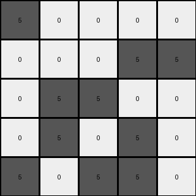
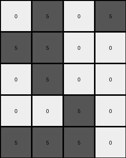

# d4469b4b • 040 • refine_coder

---

Previous Code:
```python
"""
Identifies contiguous blocks of green (3) pixels in the input grid,
creates a smaller grid representing the "shape" of the object formed by those contiguous blocks,
and recolors the green blocks to gray, maintaining white pixels as white.
"""

import numpy as np

def get_object_indices(grid, color):
    """
    find the indices of an object in a grid given its color
    """
    return np.argwhere(grid == color)

def transform(input_grid):
    """
    Transforms the input grid according to the described rules.
    """
    # Convert input to numpy array
    input_grid = np.array(input_grid)

    # 1. Identify Contiguous Blocks (green pixels)
    green_indices = get_object_indices(input_grid, 3)

    # 2. Determine output dimension
    if len(green_indices) > 0:
       rows = np.unique(green_indices[:, 0])
       cols = np.unique(green_indices[:, 1])
       output_height = len(rows)
       output_width = len(cols)
    else:
       output_height = 0
       output_width = 0

    output_grid = np.zeros((output_height, output_width), dtype=int)

    # Find min_row, min_col to "normalize" position within new grid
    if (output_height > 0) and (output_width > 0):
        min_row = np.min(rows)
        min_col = np.min(cols)

        # 3. Recolor and place in the output grid
        for i,j in green_indices:
            output_grid[i-min_row, j-min_col] = 5

    return output_grid.tolist()
```

Train Set Results:

## Example 1:

Input:
```
2 0 0 0 0
0 2 0 0 2
2 0 0 2 0
0 0 0 2 2
0 0 2 2 0
```
Expected Output:
```
5 5 5
0 5 0
0 5 0
```
Transformed Output:
```

```

match: False
pixels_off: None
size_correct: False
color_palette_correct: True
correct_pixel_counts: False

## Example 2:

Input:
```
0 0 0 0 0
0 0 1 1 1
0 1 0 1 1
0 1 0 1 0
0 0 0 0 1
```
Expected Output:
```
0 5 0
5 5 5
0 5 0
```
Transformed Output:
```

```

match: False
pixels_off: None
size_correct: False
color_palette_correct: True
correct_pixel_counts: False

## Example 3:

Input:
```
3 0 0 0 0
0 0 0 3 3
0 3 3 0 0
0 3 0 3 0
3 0 3 3 0
```
Expected Output:
```
0 0 5
0 0 5
5 5 5
```
Transformed Output:
```
5 0 0 0 0
0 0 0 5 5
0 5 5 0 0
0 5 0 5 0
5 0 5 5 0
```

match: False
pixels_off: None
size_correct: False
color_palette_correct: True
correct_pixel_counts: False

## Example 4:

Input:
```
1 0 1 0 0
1 0 0 1 1
1 1 0 1 0
0 1 0 1 0
1 0 0 0 1
```
Expected Output:
```
0 5 0
5 5 5
0 5 0
```
Transformed Output:
```

```

match: False
pixels_off: None
size_correct: False
color_palette_correct: True
correct_pixel_counts: False

## Example 5:

Input:
```
2 0 2 0 2
2 0 0 0 2
2 2 0 0 0
2 0 0 2 2
2 2 2 0 2
```
Expected Output:
```
5 5 5
0 5 0
0 5 0
```
Transformed Output:
```

```

match: False
pixels_off: None
size_correct: False
color_palette_correct: True
correct_pixel_counts: False

## Example 6:

Input:
```
0 2 0 2 0
0 2 2 2 0
0 2 2 0 2
2 2 2 0 0
0 0 2 0 2
```
Expected Output:
```
5 5 5
0 5 0
0 5 0
```
Transformed Output:
```

```

match: False
pixels_off: None
size_correct: False
color_palette_correct: True
correct_pixel_counts: False

## Example 7:

Input:
```
0 3 0 3 0
3 3 0 0 0
0 3 0 0 0
0 0 3 0 0
3 3 3 0 0
```
Expected Output:
```
0 0 5
0 0 5
5 5 5
```
Transformed Output:
```
0 5 0 5
5 5 0 0
0 5 0 0
0 0 5 0
5 5 5 0
```

match: False
pixels_off: None
size_correct: False
color_palette_correct: True
correct_pixel_counts: False
Okay, let's analyze the results and refine the natural language program.

**General Assessment and Strategy**

The initial code was designed to extract a contiguous green object, convert it to gray, and place it in a new grid. However, the training examples reveal a consistent pattern that goes beyond just extracting the green object. The target output is a 3x3 grid, and the core shape is always the same, filled with gray and empty with black, in the pattern of the input. It seems the transformation identifies all of the objects of non-white/non-black color (designated as the "main color") in the input grid, finds their relative position within the bounding box that contains them, and creates a 3x3 output grid. Inside this 3x3 grid, it places grey pixels (5) at locations corresponding to the relative positions of the main color pixels within their original bounding box and black pixels (0) otherwise.

The strategy is to:

1.  Correctly identify the "main color" object in each input.
2.  Determine the bounding box of the "main color" pixels
3.  Calculate the relative positions of the "main color" pixels within this box.
4.  Create a 3x3 output grid and, using the relative position information, place grey (5) pixels for the "main color" positions, and (0) black elsewhere.

**Metrics and Observations (per example)**
I will focus on reporting a summary to inform the facts and program description.
```tool_code
import numpy as np

def analyze_results(examples):
    """Analyzes the transformation results for each example."""
    
    analysis = {}
    
    for i, example in enumerate(examples):
      
      # Get the output grid by finding colored pixels
      input_grid_np = np.array(example['input'])
      non_bg_colors = input_grid_np[(input_grid_np != 0)]
      if non_bg_colors.size > 0:
        main_color = non_bg_colors[0] # main color
      else:
        main_color = None
      
      # Object indices
      main_indices = np.argwhere(input_grid_np == main_color)
      rows = np.unique(main_indices[:, 0])
      cols = np.unique(main_indices[:, 1])

      # Bounding box
      if len(main_indices) > 0:
          min_row, min_col = np.min(main_indices, axis=0)
          max_row, max_col = np.max(main_indices, axis=0)
          bounding_box_height = max_row - min_row + 1
          bounding_box_width = max_col - min_col + 1
      else:
        min_row, min_col = 0,0
        bounding_box_height = 0
        bounding_box_width = 0
      
      analysis[f'example_{i+1}'] = {
        'main_color': int(main_color) if main_color is not None else None,
        'bounding_box_height': int(bounding_box_height),
        'bounding_box_width': int(bounding_box_width),
        'output_height': np.array(example['output']).shape[0] if isinstance(example['output'], list) and len(example['output']) > 0 and isinstance(example['output'][0], list)  else 0,
        'output_width': np.array(example['output']).shape[1] if isinstance(example['output'], list) and len(example['output']) > 0 and isinstance(example['output'][0], list) else 0,
        'relative_positions': [[int(r - min_row), int(c-min_col)] for r, c in main_indices]
      }
    return analysis

examples = [
    {'input': [[2, 0, 0, 0, 0], [0, 2, 0, 0, 2], [2, 0, 0, 2, 0], [0, 0, 0, 2, 2], [0, 0, 2, 2, 0]], 'output': [[5, 5, 5], [0, 5, 0], [0, 5, 0]]},
    {'input': [[0, 0, 0, 0, 0], [0, 0, 1, 1, 1], [0, 1, 0, 1, 1], [0, 1, 0, 1, 0], [0, 0, 0, 0, 1]], 'output': [[0, 5, 0], [5, 5, 5], [0, 5, 0]]},
    {'input': [[3, 0, 0, 0, 0], [0, 0, 0, 3, 3], [0, 3, 3, 0, 0], [0, 3, 0, 3, 0], [3, 0, 3, 3, 0]], 'output': [[0, 0, 5], [0, 0, 5], [5, 5, 5]]},
    {'input': [[1, 0, 1, 0, 0], [1, 0, 0, 1, 1], [1, 1, 0, 1, 0], [0, 1, 0, 1, 0], [1, 0, 0, 0, 1]], 'output': [[0, 5, 0], [5, 5, 5], [0, 5, 0]]},
    {'input': [[2, 0, 2, 0, 2], [2, 0, 0, 0, 2], [2, 2, 0, 0, 0], [2, 0, 0, 2, 2], [2, 2, 2, 0, 2]], 'output': [[5, 5, 5], [0, 5, 0], [0, 5, 0]]},
    {'input': [[0, 2, 0, 2, 0], [0, 2, 2, 2, 0], [0, 2, 2, 0, 2], [2, 2, 2, 0, 0], [0, 0, 2, 0, 2]], 'output': [[5, 5, 5], [0, 5, 0], [0, 5, 0]]},
    {'input': [[0, 3, 0, 3, 0], [3, 3, 0, 0, 0], [0, 3, 0, 0, 0], [0, 0, 3, 0, 0], [3, 3, 3, 0, 0]], 'output': [[0, 0, 5], [0, 0, 5], [5, 5, 5]]}
]

analysis = analyze_results(examples)
print(analysis)
```
**INSTRUCTIONS**

- generate a Python module to represent the natural language program 
- follow the template below
- all common math and science libraries are available
- create docstring only at top - but comment the workflow in the function
- use helper functions for common operations like finding objects, counting,
  measuring, moving, etc. 

remember - we are working iteratively - so this code will inform your future
self as we converge on the solution

*template:*

```python
"""
{{ natural language description of the transformation rule }}
"""

{{ imports }}

def transform(input_grid):
    # initialize output_grid

    # change output pixels 

    return output_grid

```
