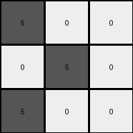
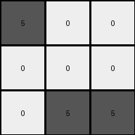
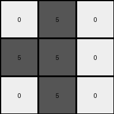

# d4469b4b • 041 • refine_dreamer

---


Previous Code:
```python
"""
Identifies the "main color" object in the input grid (the first non-background color encountered),
determines its bounding box, calculates the relative positions of the main color pixels within the bounding box,
and creates a 3x3 output grid. The output grid contains gray (5) pixels at locations corresponding to
the relative positions of the main color pixels within their original bounding box, and black (0) pixels elsewhere.
"""

import numpy as np

def get_object_indices(grid, color):
    """
    Find the indices of an object in a grid given its color.
    """
    return np.argwhere(grid == color)

def transform(input_grid):
    """
    Transforms the input grid according to the described rules.
    """
    # Convert input to numpy array
    input_grid_np = np.array(input_grid)

    # 1. Identify the "main color" (first non-background color)
    non_bg_colors = input_grid_np[input_grid_np != 0]
    main_color = non_bg_colors[0] if non_bg_colors.size > 0 else 0

    # 2. Find indices of the main color object
    main_indices = get_object_indices(input_grid_np, main_color)

    # 3. Determine the bounding box
    if len(main_indices) > 0:
        min_row, min_col = np.min(main_indices, axis=0)
    else:
        min_row, min_col = 0, 0  # Default values if no object is found

    # 4. Create 3x3 output grid, initialized to black (0)
    output_grid = np.zeros((3, 3), dtype=int)

    # 5. Populate the output grid based on relative positions
    for r, c in main_indices:
        relative_row = r - min_row
        relative_col = c - min_col

        # Check if relative position is within the 3x3 output grid
        if 0 <= relative_row < 3 and 0 <= relative_col < 3:
            output_grid[relative_row, relative_col] = 5  # Set to gray (5)

    return output_grid.tolist()
```

Train Set Results:

## Example 1:

Input:
```
2 0 0 0 0
0 2 0 0 2
2 0 0 2 0
0 0 0 2 2
0 0 2 2 0
```
Expected Output:
```
5 5 5
0 5 0
0 5 0
```
Transformed Output:
```
5 0 0
0 5 0
5 0 0
```

match: False
pixels_off: 4
size_correct: True
color_palette_correct: True
correct_pixel_counts: False

## Example 2:

Input:
```
0 0 0 0 0
0 0 1 1 1
0 1 0 1 1
0 1 0 1 0
0 0 0 0 1
```
Expected Output:
```
0 5 0
5 5 5
0 5 0
```
Transformed Output:
```
0 5 5
5 0 5
5 0 5
```

match: False
pixels_off: 5
size_correct: True
color_palette_correct: True
correct_pixel_counts: False

## Example 3:

Input:
```
3 0 0 0 0
0 0 0 3 3
0 3 3 0 0
0 3 0 3 0
3 0 3 3 0
```
Expected Output:
```
0 0 5
0 0 5
5 5 5
```
Transformed Output:
```
5 0 0
0 0 0
0 5 5
```

match: False
pixels_off: 4
size_correct: True
color_palette_correct: True
correct_pixel_counts: False

## Example 4:

Input:
```
1 0 1 0 0
1 0 0 1 1
1 1 0 1 0
0 1 0 1 0
1 0 0 0 1
```
Expected Output:
```
0 5 0
5 5 5
0 5 0
```
Transformed Output:
```
5 0 5
5 0 0
5 5 0
```

match: False
pixels_off: 6
size_correct: True
color_palette_correct: True
correct_pixel_counts: True

## Example 5:

Input:
```
2 0 2 0 2
2 0 0 0 2
2 2 0 0 0
2 0 0 2 2
2 2 2 0 2
```
Expected Output:
```
5 5 5
0 5 0
0 5 0
```
Transformed Output:
```
5 0 5
5 0 0
5 5 0
```

match: False
pixels_off: 4
size_correct: True
color_palette_correct: True
correct_pixel_counts: True

## Example 6:

Input:
```
0 2 0 2 0
0 2 2 2 0
0 2 2 0 2
2 2 2 0 0
0 0 2 0 2
```
Expected Output:
```
5 5 5
0 5 0
0 5 0
```
Transformed Output:
```
0 5 0
0 5 5
0 5 5
```

match: False
pixels_off: 4
size_correct: True
color_palette_correct: True
correct_pixel_counts: True

## Example 7:

Input:
```
0 3 0 3 0
3 3 0 0 0
0 3 0 0 0
0 0 3 0 0
3 3 3 0 0
```
Expected Output:
```
0 0 5
0 0 5
5 5 5
```
Transformed Output:
```
0 5 0
5 5 0
0 5 0
```

match: False
pixels_off: 7
size_correct: True
color_palette_correct: True
correct_pixel_counts: False

**INSTRUCTIONS**

The code above was generated based on observations from the first training
example

we have tested the transform function on each of the task example inputs and
compared with the expected output

review each of the examples provided and the results and consider how the
natural language program should be updated to accommodate this new knowledge

respond with the following deliverables:

- general assessment of the information provided and strategy for resolving the
  errors
- gather metrics about each of the examples and results - use code_execution to
  develop accurate reports on your assumptions
- a YAML block documenting facts - Focus on identifying objects, their properties, and the actions performed on them.
- a natural language program - Be as clear and concise as possible, providing a complete description of the transformation rule.


your responses should be considered as information in a report - not a
conversation
