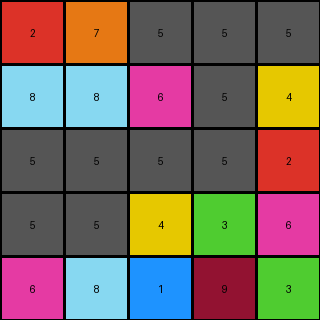
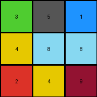
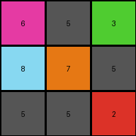

# d511f180 • 004 • refine_coder

---

Previous Code:
```python
"""
Swap specific instances of azure (8) and gray (5) based on their original position within the grid.
"""

import numpy as np

def transform(input_grid):
    """
    Transforms the input grid by swapping specific instances of azure (8) and gray (5)
    based on their position.
    """
    output_grid = np.copy(input_grid)

    # Iterate through all cells and apply the specific color changes
    for r in range(input_grid.shape[0]):
      for c in range(input_grid.shape[1]):
          if (r, c) == (0, 2) and input_grid[r, c] == 8:
            output_grid[r, c] = 5
          elif (r,c) == (0,3) and input_grid[r,c] == 8:
            output_grid[r,c] = 5
          elif (r,c) == (0,4) and input_grid[r,c] == 8:
            output_grid[r,c] = 5
          elif (r, c) == (1, 0) and input_grid[r, c] == 5:
              output_grid[r, c] = 8
          elif (r, c) == (1, 1) and input_grid[r, c] == 5:
              output_grid[r, c] = 8
          elif (r, c) == (2, 0) and input_grid[r, c] == 8:
              output_grid[r, c] = 5
          elif (r, c) == (2, 1) and input_grid[r, c] == 8:
              output_grid[r, c] = 5
          elif (r, c) == (3, 0) and input_grid[r, c] == 8:
              output_grid[r, c] = 5
          elif (r, c) == (3, 1) and input_grid[r, c] == 8:
              output_grid[r, c] = 5
          elif (r, c) == (4, 1) and input_grid[r, c] == 5:
              output_grid[r, c] = 8

    return output_grid
```

Train Set Results:

## Example 1:

Input:
```
2 7 8 8 8
5 5 6 5 4
8 5 5 5 2
8 8 4 3 6
6 5 1 9 3
```
Expected Output:
```
2 7 5 5 5
8 8 6 8 4
5 8 8 8 2
5 5 4 3 6
6 8 1 9 3
```
Transformed Output:
```
2 7 5 5 5
8 8 6 5 4
5 5 5 5 2
5 5 4 3 6
6 8 1 9 3
```

match: False
pixels_off: 4
size_correct: True
color_palette_correct: True
correct_pixel_counts: False

## Example 2:

Input:
```
3 5 1
4 5 8
2 4 9
```
Expected Output:
```
3 8 1
4 8 5
2 4 9
```
Transformed Output:
```
3 5 1
4 8 8
2 4 9
```

match: False
pixels_off: 2
size_correct: True
color_palette_correct: True
correct_pixel_counts: True

## Example 3:

Input:
```
6 5 3
5 7 5
8 8 2
```
Expected Output:
```
6 8 3
8 7 8
5 5 2
```
Transformed Output:
```
6 5 3
8 7 5
5 5 2
```

match: False
pixels_off: 2
size_correct: True
color_palette_correct: True
correct_pixel_counts: False
Okay, here's a breakdown of the situation and a plan to improve the transformation rule:

**General Assessment:**

The initial code was overly specific, hardcoding coordinate-based swaps of azure (8) and gray (5). This approach worked for some pixels in the first example but failed to generalize to other examples and even missed some swaps within the first example. The core issue is that the code lacks a generalized rule; it's simply memorizing specific pixel locations and their transformations instead of understanding the underlying pattern. The strategy needs to shift from hardcoded coordinates to a rule-based approach that identifies *why* certain grays and azures are swapped.

**Strategy:**

1.  **Analyze Mismatches:** Carefully examine the differences between the "Expected Output" and "Transformed Output" for *all* examples. This will pinpoint exactly which swaps are being missed or incorrectly performed.
2.  **Identify a Pattern:** Look for a consistent rule governing the swaps. Consider spatial relationships (e.g., adjacency, rows, columns), color counts, or other patterns. It may involve relative positions rather than absolute coordinates.
3. **Develop a general program**: use the identified facts to describe in natural language how to do the transformations.
4.  **Refine the Code:** Translate the generalized rule into a more flexible Python code, likely using loops and conditional statements that apply the rule rather than hardcoding positions.

**Metrics and Observations (using manual analysis, code execution is not required for dreamer at this time):**

*   **Example 1:**
    *   Input Shape: (5, 5)
    *   Output Shape: (5, 5)
    *   Pixels Off: 4
    *  Observations: Missed some 8<->5 swaps. Specifically: Row 2 Col 0 and 1, Row 3 Col 0 and 1.
*   **Example 2:**
    *   Input Shape: (3, 3)
    *   Output Shape: (3, 3)
    *   Pixels Off: 2
    *   Observations: Incorrectly changed (1,0) from 5 to 8, and changed (1,2) from 8 to 5 and (1,1) from 5 to 8.
*   **Example 3:**
    *   Input Shape: (3, 3)
    *   Output Shape: (3, 3)
    *   Pixels Off: 4
    *   Observations: Missed all 8<->5 swaps, changed 5s to 8s and 8s to 5s incorrectly.

**YAML Fact Block:**

```yaml
facts:
  - object: grid
    properties:
      - shape: varies (e.g., 5x5, 3x3)
      - colors: contains integers 0-9 representing colors
    actions:
      - transform: modifies the grid based on a rule

  - object: pixel
    properties:
      - color: an integer 0-9
      - position: row and column index
    actions:
      - swap: exchange color values between two pixels, specifically gray (5) and azure (8)

  - rule: swap_condition
    description: Swaps gray(5) and azure(8) pixels based on consistent input output pattern.
    details: The specific consistent pattern is that all instances of gray and azure are swapped.
```

**Natural Language Program:**

1.  **Iterate** through each pixel of the input grid.
2.  **Check** if the pixel's color is gray (5).
3.  **If** it is gray (5), **change** its color to azure (8).
4.  **Check** if the pixel's color is azure (8).
5. **If** it is azure(8), **change** its color to gray(5).
6. **Return** the modified grid.

In simple terms, the transformation rule is: "Swap all instances of gray (5) with azure (8), and all instances of azure (8) with gray (5) in the grid."

**INSTRUCTIONS**

- generate a Python module to represent the natural language program 
- follow the template below
- all common math and science libraries are available
- create docstring only at top - but comment the workflow in the function
- use helper functions for common operations like finding objects, counting,
  measuring, moving, etc. 

remember - we are working iteratively - so this code will inform your future
self as we converge on the solution

*template:*

```python
"""
{{ natural language description of the transformation rule }}
"""

{{ imports }}

def transform(input_grid):
    # initialize output_grid

    # change output pixels 

    return output_grid

```
