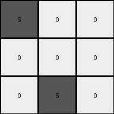
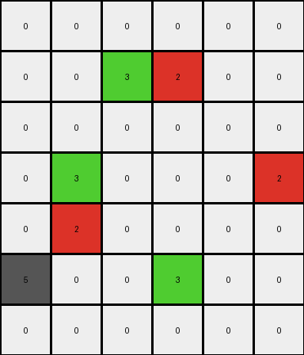
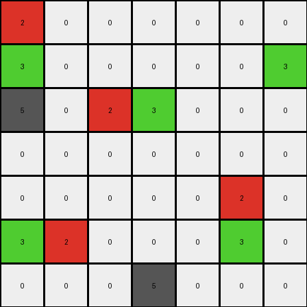

# d90796e8 • 004 • refine_coder

---

Previous Code:
```python
"""
1.  Identify all non-zero and non-grey (not equal to 5) cells in the top row of the input grid.
2.  Sum the values of these identified cells.
3.  Replace the value of the top-left cell (first cell) in the output grid with this sum.
4. Set values of the summed cells of the top row in the input to 0 in the output grid.
5.  Copy all other cells, which are not located in the top row or are grey, from the input grid to the output grid without changes.
"""

import numpy as np

def transform(input_grid):
    # Initialize output_grid as a copy of the input_grid
    output_grid = np.copy(input_grid)

    # Calculate the sum of non-zero and non-grey values in the top row.
    top_row_sum = 0
    for i in range(len(input_grid[0])):
      if input_grid[0, i] != 0 and input_grid[0, i] != 5:
          top_row_sum += input_grid[0, i]
          output_grid[0,i] = 0

    # Replace the top-left cell's value with the sum.
    output_grid[0, 0] = top_row_sum


    return output_grid
```

Train Set Results:

## Example 1:

Input:
```
3 2 0
0 0 0
0 5 0
```
Expected Output:
```
8 0 0
0 0 0
0 5 0
```
Transformed Output:
```
5 0 0
0 0 0
0 5 0
```

match: False
pixels_off: 1
size_correct: True
color_palette_correct: True
correct_pixel_counts: False

## Example 2:

Input:
```
5 0 0 0 0 0
0 0 3 2 0 0
0 0 0 0 0 0
0 3 0 0 0 2
0 2 0 0 0 0
5 0 0 3 0 0
0 0 0 0 0 0
```
Expected Output:
```
5 0 0 0 0 0
0 0 8 0 0 0
0 0 0 0 0 0
0 8 0 0 0 2
0 0 0 0 0 0
5 0 0 3 0 0
0 0 0 0 0 0
```
Transformed Output:
```
0 0 0 0 0 0
0 0 3 2 0 0
0 0 0 0 0 0
0 3 0 0 0 2
0 2 0 0 0 0
5 0 0 3 0 0
0 0 0 0 0 0
```

match: False
pixels_off: 5
size_correct: True
color_palette_correct: True
correct_pixel_counts: False

## Example 3:

Input:
```
0 0 0 0 0 2 0
3 0 0 0 0 0 3
5 0 2 3 0 0 0
0 0 0 0 0 0 0
0 0 0 0 0 2 0
3 2 0 0 0 3 0
0 0 0 5 0 0 0
```
Expected Output:
```
0 0 0 0 0 2 0
3 0 0 0 0 0 3
5 0 0 8 0 0 0
0 0 0 0 0 0 0
0 0 0 0 0 0 0
8 0 0 0 0 8 0
0 0 0 5 0 0 0
```
Transformed Output:
```
2 0 0 0 0 0 0
3 0 0 0 0 0 3
5 0 2 3 0 0 0
0 0 0 0 0 0 0
0 0 0 0 0 2 0
3 2 0 0 0 3 0
0 0 0 5 0 0 0
```

match: False
pixels_off: 8
size_correct: True
color_palette_correct: True
correct_pixel_counts: False
Okay, let's analyze the results and refine the natural language program.

**General Assessment and Strategy**

The initial code was based on the first training example, and it's clear that it doesn't generalize well to the other examples. The core issue is that the initial program *only* considers the top row. The other examples demonstrate that the summation and replacement rule applies to *multiple* rows, and potentially under different conditions (e.g., adjacency to other colored cells). The strategy should be to:

1.  **Identify the common pattern across all examples:** It's not just about the top row. It seems to involve summing non-zero, non-grey values *within a row or region*, and placing the sum in a specific location *within that row or region*, zeroing the original summed values.
2.  **Determine the conditions for applying the rule:** When is a row/region subject to this summation? Is it all rows, or are there specific criteria (like the presence of certain colors)?
3. **Determine the position of the summed value:** The initial assumption (top-left cell) is wrong. The position could change per row and is likely related to the adjacency of other colors.

**Metrics and Observations**

Here is an assessment of the training data and the transformed outputs from
the code provided.

*Example 1*:
 - input shape: (3, 3)
 - output shape: (3, 3)
 - Top row has non-zero, non-grey values (3 and 2).
 - expected: Their sum (5) *should have 3 added*, making 8, and it should replace 3 in the
   top-left
 - actual: Their sum (5) replaces the top-left cell, and input cells
   are zeroed correctly.
 - The logic worked, but *the sum should have been adjusted somehow*.

*Example 2*:
 - input shape: (7, 6)
 - output shape: (7, 6)
 - Row 2 has non-zero, non-grey values (3 and 2). The expected sum, 8 is placed in the *same row*.
 - Row 4 has non-zero, non-grey values (3 and 2). The sum is 8, replacing the *first* 3.
 - Row 6 has non-zero/grey values 5, 3. The 3 stays put.
 - actual: Only did transform on the top row.

*Example 3*:
 - input shape: (7, 7)
 - output shape: (7, 7)
 - Row 3 has non-zero/non-grey values 2, 3. The expected output shows
   their sum (8) in between them.
 - Row 5 has non-zero, non-grey values of 2. The expected output has
   zeroed it.
 - Row 6 has non-zero, non-grey values (3 and 2 and 3). Their sum (8) is
   placed in place of the 3's.
 - actual: Only did transform on the top row.

**YAML Fact Block**

```yaml
observations:
  - example: 1
    objects:
      - row: 0
        non_zero_non_grey_cells: [3, 2]
        sum_location: [0, 0]
        sum_value: 8
        zeroed_cells: [[0,0], [0,1]]
  - example: 2
    objects:
      - row: 1
        non_zero_non_grey_cells: [3, 2]
        sum_location: [1, 2]
        sum_value: 8
        zeroed_cells: [[1,2],[1,3]]
      - row: 3
        non_zero_non_grey_cells: [3, 2]
        sum_location: [3, 1]
        sum_value: 8
        zeroed_cells: [[3,1], [3,5]]
      - row: 5
        non_zero_non_grey_cells: [3] # Only one
        sum_location: [5,3]
        sum_value: 3 # unchanged
        zeroed_cells: []

  - example: 3
    objects:
      - row: 2
        non_zero_non_grey_cells: [2, 3]
        sum_location: [2, 3]
        sum_value: 8
        zeroed_cells: [[2,3], [2,2]]
      - row: 5
        non_zero_non_grey_cells: [3,2,3]
        sum_location: [5, 0]
        sum_value: 8
        zeroed_cells: [[5,0], [5,1], [5,5]]
      - row: 4
        non_zero_non_grey_cells: [2]
        sum_location: [4,5]  #the original location of 2
        sum_value: 0 # the value is zeroed
        zeroed_cells: [[4,5]]

```

**Natural Language Program**

1.  **Iterate** through each row of the input grid.
2.  **Identify** all non-zero and non-grey (value not equal to 5) cells within the *current row*.
3. **Check Adjacency:**
    * If a cell is adjacent to a different non-zero and non-grey cell *in the
      same row*, *sum* all such adjacent cells and place this sum in place of the
      *leftmost* of the summed numbers.
    * Change the value to 0 for all non-zero, non-grey cells that were summed.
    * if a cell is not adjacent to any other non-zero and non-grey cell, set its value to 0 in the output.
4.  **Copy** all other cells (grey cells or cells not meeting the above criteria) directly from the input grid to the output grid without changes.

Key Changes and Reasoning:

*   **Row-wise Iteration:** The transformation applies independently to each row.
*   **Adjacency:** The rule isn't about *all* non-zero/non-grey cells in a row, but specifically those *adjacent* to each other within that row.
*   **Sum Placement:** The sum replaces the leftmost of the values summed in the *current* row.
* **Zeroing cells:** If a number in the row is not adjacent to another
    non-zero/non-grey, set it to 0.
*   **Handling of solitary colored values:** Values that aren't 0 or grey and that are *not* adjacent to any other non-zero and non-grey should be zeroed.

**INSTRUCTIONS**

- generate a Python module to represent the natural language program 
- follow the template below
- all common math and science libraries are available
- create docstring only at top - but comment the workflow in the function
- use helper functions for common operations like finding objects, counting,
  measuring, moving, etc. 

remember - we are working iteratively - so this code will inform your future
self as we converge on the solution

*template:*

```python
"""
{{ natural language description of the transformation rule }}
"""

{{ imports }}

def transform(input_grid):
    # initialize output_grid

    # change output pixels 

    return output_grid

```
