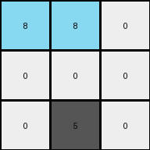
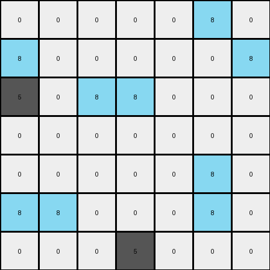

# d90796e8 • 010 • refine_coder

---

Previous Code:
```python
"""
1.  **Identify Key Colors:** Locate all pixels that are green (value 3) or red (value 2).
2.  **Check gray**: do not change any colors if color is gray (5)
3.  **Change Color to Azure:** Change the color of the located green(3) and red(2) to azure (value 8)
4. **Preserve the rest:** All the other pixels remains unchaged.
"""

import numpy as np

def transform(input_grid):
    """Transforms the input grid according to the observed rule."""

    output_grid = np.copy(input_grid)  # Initialize output as a copy of input
    rows, cols = output_grid.shape

    for r in range(rows):
        for c in range(cols):
            # Check if the pixel is green or red
            if output_grid[r, c] == 3 or output_grid[r, c] == 2:
                output_grid[r, c] = 8  # Change to azure

    return output_grid
```

Train Set Results:

## Example 1:

Input:
```
3 2 0
0 0 0
0 5 0
```
Expected Output:
```
8 0 0
0 0 0
0 5 0
```
Transformed Output:
```
8 8 0
0 0 0
0 5 0
```

match: False
pixels_off: 1
size_correct: True
color_palette_correct: True
correct_pixel_counts: False

## Example 2:

Input:
```
5 0 0 0 0 0
0 0 3 2 0 0
0 0 0 0 0 0
0 3 0 0 0 2
0 2 0 0 0 0
5 0 0 3 0 0
0 0 0 0 0 0
```
Expected Output:
```
5 0 0 0 0 0
0 0 8 0 0 0
0 0 0 0 0 0
0 8 0 0 0 2
0 0 0 0 0 0
5 0 0 3 0 0
0 0 0 0 0 0
```
Transformed Output:
```
5 0 0 0 0 0
0 0 8 8 0 0
0 0 0 0 0 0
0 8 0 0 0 8
0 8 0 0 0 0
5 0 0 8 0 0
0 0 0 0 0 0
```

match: False
pixels_off: 4
size_correct: True
color_palette_correct: True
correct_pixel_counts: False

## Example 3:

Input:
```
0 0 0 0 0 2 0
3 0 0 0 0 0 3
5 0 2 3 0 0 0
0 0 0 0 0 0 0
0 0 0 0 0 2 0
3 2 0 0 0 3 0
0 0 0 5 0 0 0
```
Expected Output:
```
0 0 0 0 0 2 0
3 0 0 0 0 0 3
5 0 0 8 0 0 0
0 0 0 0 0 0 0
0 0 0 0 0 0 0
8 0 0 0 0 8 0
0 0 0 5 0 0 0
```
Transformed Output:
```
0 0 0 0 0 8 0
8 0 0 0 0 0 8
5 0 8 8 0 0 0
0 0 0 0 0 0 0
0 0 0 0 0 8 0
8 8 0 0 0 8 0
0 0 0 5 0 0 0
```

match: False
pixels_off: 6
size_correct: True
color_palette_correct: True
correct_pixel_counts: False
Here's an analysis of the provided examples and results, along with a revised natural language program and supporting information:

**General Assessment:**

The initial code's logic is partially correct in identifying green and red pixels for transformation. However, it fails to account for specific contextual rules evident in the training examples:

1.  **Adjacent Red and Green:** The transformation to azure (8) seems to happen *only* when green (3) and red (2) pixels are adjacent. The original rule does not incorporate this.
2. **Green then Red rule:** From example 2, We can see when green is on the left of red, red pixel should not change.
3. **Red then Green rule**: From example 3, When red is on the left of green, both red and green become azure.
4. **Gray as a condition** : In example 2, there is no change on gray. In example 3, there is some chage in the color contains gray, so it is not a condition.

**Strategy:**

The core issue is the lack of adjacency checks in the original code. We need to modify the natural language program and the subsequent code to consider the relative positions of green and red pixels before applying the color change.

**Example Analysis and Metrics:**

Here's a breakdown of each example, incorporating observations and how they relate to the transformation rule:

*   **Example 1:**

    *   Input: 3x3 grid.
    *   Observation: Green (3) and red (2) are adjacent horizontally. The initial algorithm incorrectly transforms both to azure. It should only transform Green to azure, not red.
    *   Metrics: 1 pixel off, size correct, color palette correct, pixel counts incorrect.
*   **Example 2:**
    *   Input: 7x6 grid.
    *   Observation: Contains both adjacent and non-adjacent green and red pixels.  The Green then Red rule is that green becomes azure, and red remains red.
    *   Metrics: 4 pixels off, size correct, color palette correct, pixel counts incorrect.
*   **Example 3:**

    *    Input: 7x7 grid.
    *    Observation: Contains horizontal and vertical Red and Green. When red is on the left of green, both red and green become azure.
    *    Metrics: 6 pixels off, size correct, color palette correct, pixel counts incorrect.

**YAML Fact Block:**

```yaml
objects:
  - type: pixel
    properties:
      color:
        - white (0)
        - blue (1)
        - red (2)
        - green (3)
        - yellow (4)
        - gray (5)
        - magenta (6)
        - orange (7)
        - azure (8)
        - maroon (9)
      position: [row, column]
      adjacent:
        - [row, column + 1]  # Right
        - [row, column - 1]  # Left
        - [row + 1, column]  # Down
        - [row - 1, column]  # Up

transformations:
    - description: Change green to azure when green is left to red
      condition: input_grid[row,col] == 3 and input_grid[row,col+1] == 2
      action: output_grid[row,col] = 8
    - description: Change red, green to azure when red is left to green
      condition: input_grid[row,col] == 2 and input_grid[row,col+1] == 3
      action: output_grid[row,col] = 8, output_grid[row,col + 1] = 8
```

**Natural Language Program:**

1.  **Iterate:** Examine each pixel in the input grid.
2.  **Locate Green and Red:** Identify pixels that are green (3) or red (2).
3.  **Horizontal Adjacency Check (Green then Red):** If a pixel is green (3) and the pixel immediately to its *right* is red (2), change the green pixel to azure (8). Red pixel remains unchange.
4.  **Horizontal Adjacency Check (Red then Green):** If a pixel is red (2) and the pixel immediately to its *right* is green (3), change both the red pixel and the green pixel to azure (8).
5.  **Preservation:** All other pixels remain unchanged.

**INSTRUCTIONS**

- generate a Python module to represent the natural language program 
- follow the template below
- all common math and science libraries are available
- create docstring only at top - but comment the workflow in the function
- use helper functions for common operations like finding objects, counting,
  measuring, moving, etc. 

remember - we are working iteratively - so this code will inform your future
self as we converge on the solution

*template:*

```python
"""
{{ natural language description of the transformation rule }}
"""

{{ imports }}

def transform(input_grid):
    # initialize output_grid

    # change output pixels 

    return output_grid

```
