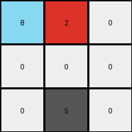
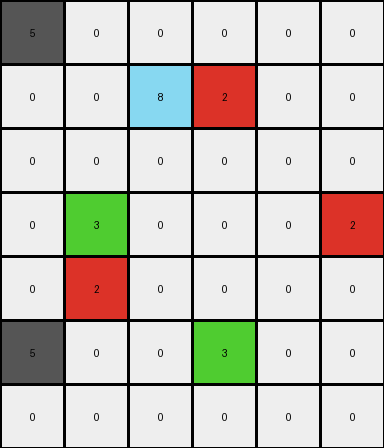
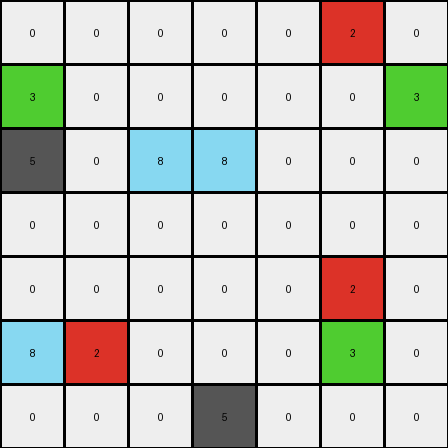

# d90796e8 • 011 • refine_dreamer

---


Previous Code:
```python
"""
1.  **Iterate:** Examine each pixel in the input grid.
2.  **Locate Green and Red:** Identify pixels that are green (3) or red (2).
3.  **Horizontal Adjacency Check (Green then Red):** If a pixel is green (3) and the pixel immediately to its *right* is red (2), change the green pixel to azure (8). Red pixel remains unchange.
4.  **Horizontal Adjacency Check (Red then Green):** If a pixel is red (2) and the pixel immediately to its *right* is green (3), change both the red pixel and the green pixel to azure (8).
5.  **Preservation:** All other pixels remain unchanged.
"""

import numpy as np

def transform(input_grid):
    """Transforms the input grid based on adjacency rules for green and red pixels."""

    output_grid = np.copy(input_grid)  # Initialize output as a copy of input
    rows, cols = output_grid.shape

    for r in range(rows):
        for c in range(cols):
            # Check for Green then Red
            if c + 1 < cols and output_grid[r, c] == 3 and output_grid[r, c + 1] == 2:
                output_grid[r, c] = 8  # Change green to azure

            # Check for Red then Green
            elif c + 1 < cols and output_grid[r, c] == 2 and output_grid[r, c + 1] == 3:
                output_grid[r, c] = 8      # Change red to azure
                output_grid[r, c + 1] = 8  # Change green to azure

    return output_grid
```

Train Set Results:

## Example 1:

Input:
```
3 2 0
0 0 0
0 5 0
```
Expected Output:
```
8 0 0
0 0 0
0 5 0
```
Transformed Output:
```
8 2 0
0 0 0
0 5 0
```

match: False
pixels_off: 1
size_correct: True
color_palette_correct: False
correct_pixel_counts: False

## Example 2:

Input:
```
5 0 0 0 0 0
0 0 3 2 0 0
0 0 0 0 0 0
0 3 0 0 0 2
0 2 0 0 0 0
5 0 0 3 0 0
0 0 0 0 0 0
```
Expected Output:
```
5 0 0 0 0 0
0 0 8 0 0 0
0 0 0 0 0 0
0 8 0 0 0 2
0 0 0 0 0 0
5 0 0 3 0 0
0 0 0 0 0 0
```
Transformed Output:
```
5 0 0 0 0 0
0 0 8 2 0 0
0 0 0 0 0 0
0 3 0 0 0 2
0 2 0 0 0 0
5 0 0 3 0 0
0 0 0 0 0 0
```

match: False
pixels_off: 3
size_correct: True
color_palette_correct: True
correct_pixel_counts: False

## Example 3:

Input:
```
0 0 0 0 0 2 0
3 0 0 0 0 0 3
5 0 2 3 0 0 0
0 0 0 0 0 0 0
0 0 0 0 0 2 0
3 2 0 0 0 3 0
0 0 0 5 0 0 0
```
Expected Output:
```
0 0 0 0 0 2 0
3 0 0 0 0 0 3
5 0 0 8 0 0 0
0 0 0 0 0 0 0
0 0 0 0 0 0 0
8 0 0 0 0 8 0
0 0 0 5 0 0 0
```
Transformed Output:
```
0 0 0 0 0 2 0
3 0 0 0 0 0 3
5 0 8 8 0 0 0
0 0 0 0 0 0 0
0 0 0 0 0 2 0
8 2 0 0 0 3 0
0 0 0 5 0 0 0
```

match: False
pixels_off: 4
size_correct: True
color_palette_correct: True
correct_pixel_counts: False

**INSTRUCTIONS**

The code above was generated based on observations from the first training
example

we have tested the transform function on each of the task example inputs and
compared with the expected output

review each of the examples provided and the results and consider how the
natural language program should be updated to accommodate this new knowledge

respond with the following deliverables:

- general assessment of the information provided and strategy for resolving the
  errors
- gather metrics about each of the examples and results - use code_execution to
  develop accurate reports on your assumptions
- a YAML block documenting facts - Focus on identifying objects, their properties, and the actions performed on them.
- a natural language program - Be as clear and concise as possible, providing a complete description of the transformation rule.


your responses should be considered as information in a report - not a
conversation
