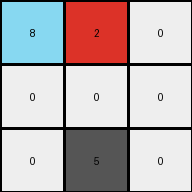
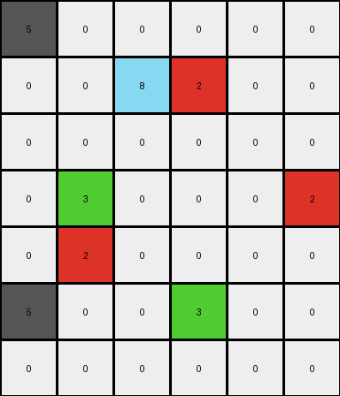
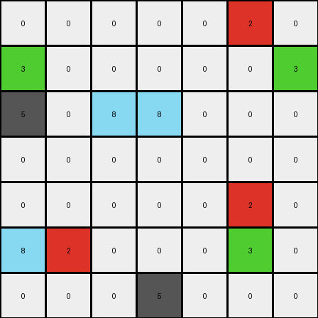

# d90796e8 • 012 • refine_coder

---

Previous Code:
```python
"""
1.  **Iterate:** Examine each pixel in the input grid.
2.  **Locate Green and Red:** Identify pixels that are green (3) or red (2).
3.  **Horizontal Adjacency Check (Green then Red):** If a pixel is green (3) and the pixel immediately to its *right* is red (2), change the green pixel to azure (8). Red pixel remains unchange.
4.  **Horizontal Adjacency Check (Red then Green):** If a pixel is red (2) and the pixel immediately to its *right* is green (3), change both the red pixel and the green pixel to azure (8).
5.  **Preservation:** All other pixels remain unchanged.
"""

import numpy as np

def transform(input_grid):
    """Transforms the input grid based on adjacency rules for green and red pixels."""

    output_grid = np.copy(input_grid)  # Initialize output as a copy of input
    rows, cols = output_grid.shape

    for r in range(rows):
        for c in range(cols):
            # Check for Green then Red
            if c + 1 < cols and output_grid[r, c] == 3 and output_grid[r, c + 1] == 2:
                output_grid[r, c] = 8  # Change green to azure

            # Check for Red then Green
            elif c + 1 < cols and output_grid[r, c] == 2 and output_grid[r, c + 1] == 3:
                output_grid[r, c] = 8      # Change red to azure
                output_grid[r, c + 1] = 8  # Change green to azure

    return output_grid
```

Train Set Results:

## Example 1:

Input:
```
3 2 0
0 0 0
0 5 0
```
Expected Output:
```
8 0 0
0 0 0
0 5 0
```
Transformed Output:
```
8 2 0
0 0 0
0 5 0
```

match: False
pixels_off: 1
size_correct: True
color_palette_correct: False
correct_pixel_counts: False

## Example 2:

Input:
```
5 0 0 0 0 0
0 0 3 2 0 0
0 0 0 0 0 0
0 3 0 0 0 2
0 2 0 0 0 0
5 0 0 3 0 0
0 0 0 0 0 0
```
Expected Output:
```
5 0 0 0 0 0
0 0 8 0 0 0
0 0 0 0 0 0
0 8 0 0 0 2
0 0 0 0 0 0
5 0 0 3 0 0
0 0 0 0 0 0
```
Transformed Output:
```
5 0 0 0 0 0
0 0 8 2 0 0
0 0 0 0 0 0
0 3 0 0 0 2
0 2 0 0 0 0
5 0 0 3 0 0
0 0 0 0 0 0
```

match: False
pixels_off: 3
size_correct: True
color_palette_correct: True
correct_pixel_counts: False

## Example 3:

Input:
```
0 0 0 0 0 2 0
3 0 0 0 0 0 3
5 0 2 3 0 0 0
0 0 0 0 0 0 0
0 0 0 0 0 2 0
3 2 0 0 0 3 0
0 0 0 5 0 0 0
```
Expected Output:
```
0 0 0 0 0 2 0
3 0 0 0 0 0 3
5 0 0 8 0 0 0
0 0 0 0 0 0 0
0 0 0 0 0 0 0
8 0 0 0 0 8 0
0 0 0 5 0 0 0
```
Transformed Output:
```
0 0 0 0 0 2 0
3 0 0 0 0 0 3
5 0 8 8 0 0 0
0 0 0 0 0 0 0
0 0 0 0 0 2 0
8 2 0 0 0 3 0
0 0 0 5 0 0 0
```

match: False
pixels_off: 4
size_correct: True
color_palette_correct: True
correct_pixel_counts: False
Okay, let's analyze the results and refine the natural language program.

**General Assessment:**

The initial code was based on a limited understanding derived from the first training example. It correctly identified the "Green then Red" adjacency rule but implemented it incompletely, and it also partially and incorrectly implemented the "Red then Green" rule. The core issue is that the code modifies the grid *in place* during iteration. When it changes a green pixel to azure in the "Green then Red" case, it doesn't subsequently check if that *newly created* azure pixel is next to a *previously existing* red pixel. Similarly, when a red pixel changes to azure due to the "red then green" adjacency, the next pixel is skipped and not evaluated. The results show mismatches in multiple examples, especially where sequences of "Green then Red" or "Red then Green" occur. The updated strategy will focus on preventing updates from interfering with future pixel checks within the same iteration.

**Metrics and Observations:**

Here's a breakdown of each example, incorporating observations from the results.

*   **Example 1:**
    *   Input: `3 2 0; 0 0 0; 0 5 0`
    *   Expected: `8 0 0; 0 0 0; 0 5 0`
    *   Actual: `8 2 0; 0 0 0; 0 5 0`
    *   Issue: The '2' (red) pixel next to the changed green pixel remains. It should not. It changes if followed by green.
*   **Example 2:**
    *   Input: `5 0 0 0 0 0; 0 0 3 2 0 0; 0 0 0 0 0 0; 0 3 0 0 0 2; 0 2 0 0 0 0; 5 0 0 3 0 0; 0 0 0 0 0 0`
    *   Expected: `5 0 0 0 0 0; 0 0 8 0 0 0; 0 0 0 0 0 0; 0 8 0 0 0 2; 0 0 0 0 0 0; 5 0 0 3 0 0; 0 0 0 0 0 0`
    *   Actual: `5 0 0 0 0 0; 0 0 8 2 0 0; 0 0 0 0 0 0; 0 3 0 0 0 2; 0 2 0 0 0 0; 5 0 0 3 0 0; 0 0 0 0 0 0`
    *   Issues:
        1.  Row 2: The '2' (red) pixel remains; should be azure as it *was* adjacent to '3' (green)
        2.  Row 4: The '3' should become '8'.
        3. Row 5: The 2 should not change as there is not a green to the right.
*   **Example 3:**
    *   Input: `0 0 0 0 0 2 0; 3 0 0 0 0 0 3; 5 0 2 3 0 0 0; 0 0 0 0 0 0 0; 0 0 0 0 0 2 0; 3 2 0 0 0 3 0; 0 0 0 5 0 0 0`
    *   Expected: `0 0 0 0 0 2 0; 3 0 0 0 0 0 3; 5 0 0 8 0 0 0; 0 0 0 0 0 0 0; 0 0 0 0 0 0 0; 8 0 0 0 0 8 0; 0 0 0 5 0 0 0`
    *   Actual: `0 0 0 0 0 2 0; 3 0 0 0 0 0 3; 5 0 8 8 0 0 0; 0 0 0 0 0 0 0; 0 0 0 0 0 2 0; 8 2 0 0 0 3 0; 0 0 0 5 0 0 0`
    *   Issues:
      1.  Row 3: only first azure.
      2. Row 5: The red 2 does not change
      3. Row 6: The red 2 should not change. The Green at col 5 should change.

**YAML Facts:**

```yaml
objects:
  - color: green
    value: 3
    shape: pixel
    action: change_to_azure_if_followed_by_red
  - color: red
    value: 2
    shape: pixel
    action: change_to_azure_if_followed_by_green
  - color: azure
    value: 8
    shape: pixel
    context: result_of_adjacency

rules:
  - condition: green pixel immediately followed by a red pixel horizontally
    action: change the green pixel to azure
  - condition: red pixel immediately followed by a green pixel horizontally
    action: change both the red and green pixels to azure
```

**Natural Language Program:**

1.  **Iterate:** Examine each pixel in the input grid.
2.  **Locate Green and Red:** Identify pixels that are green (3) or red (2).
3.  **Horizontal Adjacency Check (Green then Red):** If a pixel is green (3) and the pixel immediately to its *right* is red (2), change *only* the green pixel to azure (8).
4.  **Horizontal Adjacency Check (Red then Green):** If a pixel is red (2) and the pixel immediately to its *right* is green (3), change *both* the red pixel and the green pixel to azure (8).
5.  **Preservation:** All other pixels remain unchanged. Do not evaluate cells after they have changed.

Key changes from the prior program are bolded - and are intended to clarify the
logic for application of the rule during the iteration. The "do not evaluate
cells after they have changed" will be essential to get correct in the code.

**INSTRUCTIONS**

- generate a Python module to represent the natural language program 
- follow the template below
- all common math and science libraries are available
- create docstring only at top - but comment the workflow in the function
- use helper functions for common operations like finding objects, counting,
  measuring, moving, etc. 

remember - we are working iteratively - so this code will inform your future
self as we converge on the solution

*template:*

```python
"""
{{ natural language description of the transformation rule }}
"""

{{ imports }}

def transform(input_grid):
    # initialize output_grid

    # change output pixels 

    return output_grid

```
