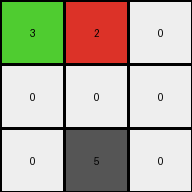
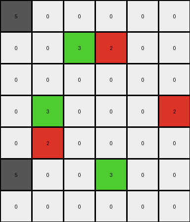
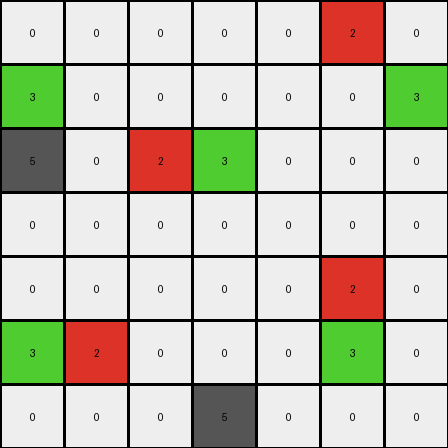

# d90796e8 • 015 • refine_dreamer

---


Previous Code:
```python
"""
1.  **Identify** all red (2), green (3), and gray (5) pixels in the input grid.
2.  **Preserve** gray (5) pixels; they remain unchanged in the output.
2.  **Preserve** one of the red(2) pixels; they remain unchanged in the output.
3.  **Locate** instances where a red (2) pixel and a green (3) are in specific positions, the red being to the SW and NE of a green.
4.  **Replace** these green and red by the colour azure (8).
5. **Preserve** the location of green pixels.
6.  All other cells remain white (0).
"""

import numpy as np

def find_pixels_by_color(grid, color):
    """Finds the coordinates of all pixels of a specific color."""
    return np.argwhere(grid == color).tolist()

def transform(input_grid):
    # initialize output_grid
    output_grid = np.copy(input_grid)
    input_grid_rows, input_grid_cols = input_grid.shape
    output_grid_rows, output_grid_cols = output_grid.shape
    
    # Find the locations of all relevant colors.
    red_pixels = find_pixels_by_color(input_grid, 2)
    green_pixels = find_pixels_by_color(input_grid, 3)
    gray_pixels = find_pixels_by_color(input_grid, 5)

    # Preserve gray pixels.
    #for row, col in gray_pixels:
    #    output_grid[row, col] = 5

    # Preserve green pixels
    #for row, col in green_pixels:
    #    output_grid[row, col] = 3
        
    # Preserve one red pixel.
    #if len(red_pixels)>1:
    #   output_grid[red_pixels[0][0], red_pixels[0][1]] = 2

    # Check for the red-green relationship and replace with azure.
    for r_row, r_col in red_pixels:
        for g_row, g_col in green_pixels:
            if (r_row == g_row + 1 and r_col == g_col - 1) or \
               (r_row == g_row - 1 and r_col == g_col + 1) :
                output_grid[r_row, r_col] = 8
                output_grid[g_row, g_col] = 8

    return output_grid
```

Train Set Results:

## Example 1:

Input:
```
3 2 0
0 0 0
0 5 0
```
Expected Output:
```
8 0 0
0 0 0
0 5 0
```
Transformed Output:
```
3 2 0
0 0 0
0 5 0
```

match: False
pixels_off: 2
size_correct: True
color_palette_correct: False
correct_pixel_counts: False

## Example 2:

Input:
```
5 0 0 0 0 0
0 0 3 2 0 0
0 0 0 0 0 0
0 3 0 0 0 2
0 2 0 0 0 0
5 0 0 3 0 0
0 0 0 0 0 0
```
Expected Output:
```
5 0 0 0 0 0
0 0 8 0 0 0
0 0 0 0 0 0
0 8 0 0 0 2
0 0 0 0 0 0
5 0 0 3 0 0
0 0 0 0 0 0
```
Transformed Output:
```
5 0 0 0 0 0
0 0 3 2 0 0
0 0 0 0 0 0
0 3 0 0 0 2
0 2 0 0 0 0
5 0 0 3 0 0
0 0 0 0 0 0
```

match: False
pixels_off: 4
size_correct: True
color_palette_correct: True
correct_pixel_counts: False

## Example 3:

Input:
```
0 0 0 0 0 2 0
3 0 0 0 0 0 3
5 0 2 3 0 0 0
0 0 0 0 0 0 0
0 0 0 0 0 2 0
3 2 0 0 0 3 0
0 0 0 5 0 0 0
```
Expected Output:
```
0 0 0 0 0 2 0
3 0 0 0 0 0 3
5 0 0 8 0 0 0
0 0 0 0 0 0 0
0 0 0 0 0 0 0
8 0 0 0 0 8 0
0 0 0 5 0 0 0
```
Transformed Output:
```
0 0 0 0 0 2 0
3 0 0 0 0 0 3
5 0 2 3 0 0 0
0 0 0 0 0 0 0
0 0 0 0 0 2 0
3 2 0 0 0 3 0
0 0 0 5 0 0 0
```

match: False
pixels_off: 6
size_correct: True
color_palette_correct: True
correct_pixel_counts: False

**INSTRUCTIONS**

The code above was generated based on observations from the first training
example

we have tested the transform function on each of the task example inputs and
compared with the expected output

review each of the examples provided and the results and consider how the
natural language program should be updated to accommodate this new knowledge

respond with the following deliverables:

- general assessment of the information provided and strategy for resolving the
  errors
- gather metrics about each of the examples and results - use code_execution to
  develop accurate reports on your assumptions
- a YAML block documenting facts - Focus on identifying objects, their properties, and the actions performed on them.
- a natural language program - Be as clear and concise as possible, providing a complete description of the transformation rule.


your responses should be considered as information in a report - not a
conversation
