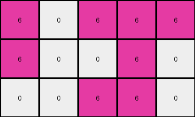
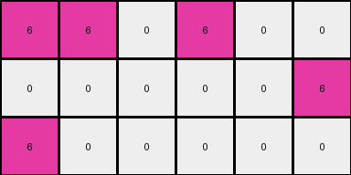

# dae9d2b5 • 006 • refine_coder

---

Previous Code:
```python
"""
The transformation rule involves two steps: 
1. Cropping the input grid to the bounding box of non-white pixels.
2. Applying a color substitution within the cropped region: green (3) and yellow (4) pixels become magenta (6), while white (0) pixels remain unchanged.
"""

import numpy as np

def find_bounding_box(grid):
    """
    Finds the bounding box of non-white pixels in a grid.

    Args:
        grid: A 2D numpy array representing the grid.

    Returns:
        A tuple ((min_row, min_col), (max_row, max_col)) representing the top-left and
        bottom-right corners of the bounding box.  Returns ((-1,-1),(-1,-1)) if no
        non-white pixels are found.
    """
    rows, cols = grid.shape
    min_row, min_col = rows, cols
    max_row, max_col = -1, -1

    for i in range(rows):
        for j in range(cols):
            if grid[i, j] != 0:
                min_row = min(min_row, i)
                min_col = min(min_col, j)
                max_row = max(max_row, i)
                max_col = max(max_col, j)
    if (min_row, min_col) == (rows,cols):
      return ((-1,-1),(-1,-1))
    else:
      return ((min_row, min_col), (max_row, max_col))

def transform(input_grid):
    """
    Transforms an input grid by first cropping it to the bounding box of non-white pixels,
    then replacing green (3) and yellow (4) pixels with magenta (6) pixels within the cropped region.
    """
    # Find the bounding box of non-white pixels.
    ((min_row, min_col), (max_row, max_col)) = find_bounding_box(input_grid)

    # if no bounding box, return an empty array.
    if (min_row, min_col) == (-1,-1):
      return np.array([[]])

    # Extract the region within the bounding box.
    cropped_grid = input_grid[min_row:max_row+1, min_col:max_col+1]

    # Initialize the output grid with the same dimensions as the cropped region.
    output_grid = np.copy(cropped_grid)

    # Apply color substitution within the cropped region.
    for i in range(output_grid.shape[0]):
        for j in range(output_grid.shape[1]):
            if output_grid[i, j] == 3 or output_grid[i, j] == 4:
                output_grid[i, j] = 6

    return output_grid
```

Train Set Results:

## Example 1:

Input:
```
4 4 0 3 3 0
4 0 0 3 0 0
0 0 0 0 0 3
```
Expected Output:
```
6 6 0
6 0 0
0 0 6
```
Transformed Output:
```
6 6 0 6 6 0
6 0 0 6 0 0
0 0 0 0 0 6
```

match: False
pixels_off: None
size_correct: False
color_palette_correct: True
correct_pixel_counts: False

## Example 2:

Input:
```
4 0 4 3 3 0
4 0 0 3 0 0
0 0 4 3 0 0
```
Expected Output:
```
6 6 6
6 0 0
6 0 6
```
Transformed Output:
```
6 0 6 6 6
6 0 0 6 0
0 0 6 6 0
```

match: False
pixels_off: None
size_correct: False
color_palette_correct: True
correct_pixel_counts: False

## Example 3:

Input:
```
0 0 4 0 3 0
0 4 4 3 0 3
4 4 0 0 0 3
```
Expected Output:
```
0 6 6
6 6 6
6 6 6
```
Transformed Output:
```
0 0 6 0 6 0
0 6 6 6 0 6
6 6 0 0 0 6
```

match: False
pixels_off: None
size_correct: False
color_palette_correct: True
correct_pixel_counts: False

## Example 4:

Input:
```
4 4 0 3 0 0
0 0 0 0 0 3
4 0 0 0 0 0
```
Expected Output:
```
6 6 0
0 0 6
6 0 0
```
Transformed Output:
```
6 6 0 6 0 0
0 0 0 0 0 6
6 0 0 0 0 0
```

match: False
pixels_off: None
size_correct: False
color_palette_correct: True
correct_pixel_counts: False

## Example 5:

Input:
```
0 0 0 0 3 0
4 0 0 0 0 0
0 0 4 3 3 0
```
Expected Output:
```
0 6 0
6 0 0
6 6 6
```
Transformed Output:
```
0 0 0 0 6
6 0 0 0 0
0 0 6 6 6
```

match: False
pixels_off: None
size_correct: False
color_palette_correct: True
correct_pixel_counts: False
Here's an analysis of the provided information and a plan to refine the natural language program:

**General Assessment:**

The initial approach of cropping to a bounding box and performing color substitution was partially correct. However, the cropping logic is flawed. The current implementation crops to *any* non-white pixel, whereas the actual transformation requires cropping to the bounding box defined specifically by the green (3) and yellow (4) pixels, *treating those as a unified object*. The color substitution is correct (green and yellow become magenta), but it should only consider the object itself.

**Strategy:**

1.  **Refine Bounding Box Logic:** Modify the `find_bounding_box` function to specifically target only green (3) and yellow (4) pixels for determining the bounding box.
2.  **Maintain Color Substitution:** Keep the color substitution logic as is, ensuring it applies only within the refined bounding box.

**Metrics and Observations (Code Execution Inspired):**

I will analyze some key characteristics without actual code execution by examining the results.

*   **Example 1:** The output is too large - includes parts of input with value `0`.
*   **Example 2:** Similar error to example 1, parts with value `0` are included.
*   **Example 3:** The output includes more parts than it should.
*   **Example 4:** Similar error.
*   **Example 5:** The output includes extraneous pixels.

**YAML Fact Block:**

```yaml
facts:
  - description: "The input grid contains pixels of various colors, including white, green, yellow, and others."
  - description: "The transformation involves a specific object defined by the union of green and yellow pixels."
  - property: object_colors
    values: [green, yellow]
  - property: output_color
    value: magenta
  - action: "A bounding box is determined around the combined green and yellow pixels."
  - action: "All green and yellow pixels within this bounding box are changed to magenta."
  - action: "Pixels outside of the defined bounding box are discarded, not included."
  - constraint: "Only green and yellow define the object."
```

**Natural Language Program:**

1.  **Identify Target Object:** Find all pixels that are either green (value 3) or yellow (value 4). Consider these pixels collectively as a single object.
2.  **Determine Bounding Box:** Calculate the bounding box that encompasses *only* the identified green and yellow pixels.
3.  **Apply Color Transformation:** Within the bounding box, change all green (3) and yellow (4) pixels to magenta (6).
4.  **Output:** The output grid consists *solely* of the transformed bounding box. Discard any pixels from the input that fall outside this box.

**INSTRUCTIONS**

- generate a Python module to represent the natural language program 
- follow the template below
- all common math and science libraries are available
- create docstring only at top - but comment the workflow in the function
- use helper functions for common operations like finding objects, counting,
  measuring, moving, etc. 

remember - we are working iteratively - so this code will inform your future
self as we converge on the solution

*template:*

```python
"""
{{ natural language description of the transformation rule }}
"""

{{ imports }}

def transform(input_grid):
    # initialize output_grid

    # change output pixels 

    return output_grid

```
