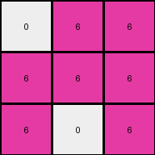
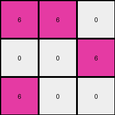

# dae9d2b5 • 009 • refine_dreamer

---

Previous Code:
```python
"""
The input grid (3x6) is transformed into an output grid (3x3). Non-white pixels (yellow/4 and green/3) in the input are replaced by magenta (6) in the output. White (0) pixels remain unchanged. The transformation is performed by reducing the input grid column-wise: two input columns condense into one output column. If either of the two columns contains a non-white pixel, the output is magenta.
"""

import numpy as np

def transform(input_grid):
    # Initialize output grid with dimensions 3x3, filled with white (0)
    output_grid = np.zeros((3, 3), dtype=int)

    # Iterate through columns of the output grid
    for out_col in range(3):
        # Corresponding columns in the input grid
        in_col1 = out_col * 2
        in_col2 = out_col * 2 + 1

        # Iterate through rows
        for row in range(3):
            # Check if either corresponding input pixel is non-white
            if (input_grid[row, in_col1] != 0) or (input_grid[row, in_col2] != 0):
                output_grid[row, out_col] = 6  # Set output pixel to magenta (6)
            # else output is white.

    return output_grid
```

Train Set Results:

## Example 1:

Input:
```
4 4 0 3 3 0
4 0 0 3 0 0
0 0 0 0 0 3
```
Expected Output:
```
6 6 0
6 0 0
0 0 6
```
Transformed Output:
```
6 6 6
6 6 0
0 0 6
```

match: False
pixels_off: 2
size_correct: True
color_palette_correct: True
correct_pixel_counts: False

## Example 2:

Input:
```
4 0 4 3 3 0
4 0 0 3 0 0
0 0 4 3 0 0
```
Expected Output:
```
6 6 6
6 0 0
6 0 6
```
Transformed Output:
```
6 6 6
6 6 0
0 6 0
```

match: False
pixels_off: 4
size_correct: True
color_palette_correct: True
correct_pixel_counts: True

## Example 3:

Input:
```
0 0 4 0 3 0
0 4 4 3 0 3
4 4 0 0 0 3
```
Expected Output:
```
0 6 6
6 6 6
6 6 6
```
Transformed Output:
```
0 6 6
6 6 6
6 0 6
```

match: False
pixels_off: 1
size_correct: True
color_palette_correct: True
correct_pixel_counts: False

## Example 4:

Input:
```
4 4 0 3 0 0
0 0 0 0 0 3
4 0 0 0 0 0
```
Expected Output:
```
6 6 0
0 0 6
6 0 0
```
Transformed Output:
```
6 6 0
0 0 6
6 0 0
```

match: True
pixels_off: 0
size_correct: True
color_palette_correct: True
correct_pixel_counts: True

## Example 5:

Input:
```
0 0 0 0 3 0
4 0 0 0 0 0
0 0 4 3 3 0
```
Expected Output:
```
0 6 0
6 0 0
6 6 6
```
Transformed Output:
```
0 0 6
6 0 0
0 6 6
```

match: False
pixels_off: 3
size_correct: True
color_palette_correct: True
correct_pixel_counts: False
**INSTRUCTIONS**

The code above was generated based on observations from the first training
example

we have tested the transform function on each of the task example inputs and
compared with the expected output

review each of the examples provided and the results and consider how the
natural language program should be updated to accommodate this new knowledge

respond with the following deliverables:

- general assessment of the information provided and strategy for resolving the
  errors
- gather metrics about each of the examples and results - use code_execution to
  develop accurate reports on your assumptions
- a YAML block documenting facts - Focus on identifying objects, their properties, and the actions performed on them.
- a natural language program - Be as clear and concise as possible, providing a complete description of the transformation rule.


your responses should be considered as information in a report - not a
conversation
