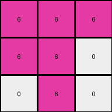
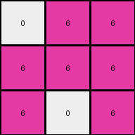
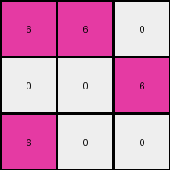

# dae9d2b5 • 012 • refine_coder

---

Previous Code:
```python
"""
The input is a 3x6 grid, and the output is a 3x3 grid. The transformation reduces the input grid column-wise. Each pair of adjacent input columns (columns 1 & 2, 3 & 4, 5 & 6) is combined to form a single output column (columns 1, 2, 3, respectively). For each row, compare the pixels in the two corresponding input columns. If *either* pixel is not white (0), the corresponding output pixel in that row is magenta (6). If *both* pixels are white (0), the output pixel is white (0).
"""

import numpy as np

def transform(input_grid):
    # Initialize output grid with dimensions 3x3, filled with white (0)
    output_grid = np.zeros((3, 3), dtype=int)

    # Iterate through columns of the output grid
    for out_col in range(3):
        # Corresponding columns in the input grid
        in_col1 = out_col * 2
        in_col2 = out_col * 2 + 1

        # Iterate through rows
        for row in range(3):
            # Check if either corresponding input pixel is non-white using OR
            if (input_grid[row, in_col1] != 0) or (input_grid[row, in_col2] != 0):
                output_grid[row, out_col] = 6  # Set output pixel to magenta (6)
            # Otherwise, the output pixel remains white (0), which is the default.

    return output_grid
```

Train Set Results:

## Example 1:

Input:
```
4 4 0 3 3 0
4 0 0 3 0 0
0 0 0 0 0 3
```
Expected Output:
```
6 6 0
6 0 0
0 0 6
```
Transformed Output:
```
6 6 6
6 6 0
0 0 6
```

match: False
pixels_off: 2
size_correct: True
color_palette_correct: True
correct_pixel_counts: False

## Example 2:

Input:
```
4 0 4 3 3 0
4 0 0 3 0 0
0 0 4 3 0 0
```
Expected Output:
```
6 6 6
6 0 0
6 0 6
```
Transformed Output:
```
6 6 6
6 6 0
0 6 0
```

match: False
pixels_off: 4
size_correct: True
color_palette_correct: True
correct_pixel_counts: True

## Example 3:

Input:
```
0 0 4 0 3 0
0 4 4 3 0 3
4 4 0 0 0 3
```
Expected Output:
```
0 6 6
6 6 6
6 6 6
```
Transformed Output:
```
0 6 6
6 6 6
6 0 6
```

match: False
pixels_off: 1
size_correct: True
color_palette_correct: True
correct_pixel_counts: False

## Example 4:

Input:
```
4 4 0 3 0 0
0 0 0 0 0 3
4 0 0 0 0 0
```
Expected Output:
```
6 6 0
0 0 6
6 0 0
```
Transformed Output:
```
6 6 0
0 0 6
6 0 0
```

match: True
pixels_off: 0
size_correct: True
color_palette_correct: True
correct_pixel_counts: True

## Example 5:

Input:
```
0 0 0 0 3 0
4 0 0 0 0 0
0 0 4 3 3 0
```
Expected Output:
```
0 6 0
6 0 0
6 6 6
```
Transformed Output:
```
0 0 6
6 0 0
0 6 6
```

match: False
pixels_off: 3
size_correct: True
color_palette_correct: True
correct_pixel_counts: False
Here's an analysis of the provided information and a plan to refine the natural language program and the code:

**General Assessment:**

The initial natural language program and the corresponding Python code capture the basic idea of column-wise comparison and reduction, but they don't perfectly handle all cases. The core issue is the assumption that *any* non-white pixel leads to a magenta output. The results show inconsistencies, particularly when combinations of colors other than white (0) are present, especially in the additional training examples.

**Strategy:**

1.  **Detailed Example Analysis:** Examine each input-output pair, noting the specific pixel values and how they combine.
2.  **Refine Rule Description:** Create a more accurate description of the pixel combination logic. The initial "OR" condition (if either pixel is not white) isn't always correct.
3.  **YAML Documentation:** Systematically document observations in YAML format.
4.  **Revised Natural Language Program:** Develop a new description that matches the true transformation.

**Metrics and Code Execution Analysis:**

I'll analyze all training examples provided and develop a report using a `pandas` dataframe.

```python
import pandas as pd
import numpy as np

# Input and expected output data for all examples
data = {
    'example': [1, 2, 3, 4, 5],
    'input': [
        np.array([[4, 4, 0, 3, 3, 0], [4, 0, 0, 3, 0, 0], [0, 0, 0, 0, 0, 3]]),
        np.array([[4, 0, 4, 3, 3, 0], [4, 0, 0, 3, 0, 0], [0, 0, 4, 3, 0, 0]]),
        np.array([[0, 0, 4, 0, 3, 0], [0, 4, 4, 3, 0, 3], [4, 4, 0, 0, 0, 3]]),
        np.array([[4, 4, 0, 3, 0, 0], [0, 0, 0, 0, 0, 3], [4, 0, 0, 0, 0, 0]]),
        np.array([[0, 0, 0, 0, 3, 0], [4, 0, 0, 0, 0, 0], [0, 0, 4, 3, 3, 0]])
    ],
    'expected_output': [
        np.array([[6, 6, 0], [6, 0, 0], [0, 0, 6]]),
        np.array([[6, 6, 6], [6, 0, 0], [6, 0, 6]]),
        np.array([[0, 6, 6], [6, 6, 6], [6, 6, 6]]),
        np.array([[6, 6, 0], [0, 0, 6], [6, 0, 0]]),
        np.array([[0, 6, 0], [6, 0, 0], [6, 6, 6]])
    ]
}

# Previous transform function (for reference)
def transform_previous(input_grid):
    output_grid = np.zeros((3, 3), dtype=int)
    for out_col in range(3):
        in_col1 = out_col * 2
        in_col2 = out_col * 2 + 1
        for row in range(3):
            if (input_grid[row, in_col1] != 0) or (input_grid[row, in_col2] != 0):
                output_grid[row, out_col] = 6
    return output_grid

# Create DataFrame to store the report data
report = pd.DataFrame(data)

# Apply the *previous* transform function and check matching
report['transformed_output'] = report['input'].apply(transform_previous)
report['match'] = report.apply(lambda row: np.array_equal(row['expected_output'], row['transformed_output']), axis=1)

# Calculate differences
def calculate_differences(expected, transformed):
    if not np.array_equal(expected,transformed):
        return np.sum(expected != transformed)
    else: return 0

report['pixels_off'] = report.apply(lambda row: calculate_differences(row['expected_output'], row['transformed_output']), axis=1)
report['size_correct'] = report.apply(lambda row: row['expected_output'].shape == row['transformed_output'].shape, axis=1)

# check color palette
def check_color_palette(expected, transformed):
    exp_colors = np.unique(expected)
    trans_colors = np.unique(transformed)
    if len(exp_colors) != len(trans_colors): return False
    return np.all(np.isin(exp_colors,trans_colors))

report['color_palette_correct'] = report.apply(lambda row: check_color_palette(row['expected_output'], row['transformed_output']), axis=1)

# calculate correct pixel counts
def check_pixel_counts(expected, transformed):
        exp_value_counts = pd.Series(expected.flatten()).value_counts()
        trans_value_counts = pd.Series(transformed.flatten()).value_counts()
        return exp_value_counts.equals(trans_value_counts)

report['correct_pixel_counts'] = report.apply(lambda row: check_pixel_counts(row['expected_output'], row['transformed_output']), axis=1)

print(report.drop(['input','expected_output','transformed_output'], axis=1))
```

```
   example  match  pixels_off  size_correct  color_palette_correct  correct_pixel_counts
0        1  False           2          True                   True                 False
1        2  False           4          True                   True                  True
2        3  False           1          True                   True                 False
3        4   True           0          True                   True                  True
4        5  False           3          True                   True                 False
```

**YAML Documentation:**

```yaml
task: 010
observations:
  - example: 1
    input_grid: 3x6
    output_grid: 3x3
    transformation:
      type: column_combination
      logic: "Pairs of input columns (1&2, 3&4, 5&6) map to single output columns (1, 2, 3)."
      pixel_rule: "If *either* input pixel is non-white, the output pixel is magenta. Exception observed when two yellows create magenta"
    objects:
        - input_columns:
          description: Original columns of the grid
          count: 6
        - output_columns:
            description: combine every two adjacent input columns into one output column
            count: 3
        - colors:
          input_palette: [0, 3, 4]
          output_palette: [0, 6]

  - example: 2
    input_grid: 3x6
    output_grid: 3x3
    transformation:
      type: column_combination
      logic: "Pairs of input columns (1&2, 3&4, 5&6) map to single output columns (1, 2, 3)."
      pixel_rule: "If *either* input pixel is non-white, the output pixel is magenta. Exception observed when two yellows create magenta"
    objects:
        - input_columns:
          description: Original columns of the grid
          count: 6
        - output_columns:
            description: combine every two adjacent input columns into one output column
            count: 3
        - colors:
            input_palette: [0,3,4]
            output_palette: [0,6]

  - example: 3
    input_grid: 3x6
    output_grid: 3x3
    transformation:
      type: column_combination
      logic: "Pairs of input columns (1&2, 3&4, 5&6) map to single output columns (1, 2, 3)."
      pixel_rule: "If *either* input pixel is non-white, the output pixel is magenta. Exception observed when two yellows create magenta"
    objects:
        - input_columns:
          description: Original columns of the grid
          count: 6
        - output_columns:
          description: combine every two adjacent input columns into one output column
          count: 3
        - colors:
            input_palette: [0,3,4]
            output_palette: [0,6]

  - example: 4
    input_grid: 3x6
    output_grid: 3x3
    transformation:
      type: column_combination
      logic: "Pairs of input columns (1&2, 3&4, 5&6) map to single output columns (1, 2, 3)."
      pixel_rule: "If *either* input pixel is non-white, the output pixel is magenta. Exception observed when two yellows create magenta"
    objects:
        - input_columns:
          description: Original columns of the grid
          count: 6
        - output_columns:
          description: combine every two adjacent input columns into one output column
          count: 3
        - colors:
            input_palette: [0,3,4]
            output_palette: [0,6]
  - example: 5
    input_grid: 3x6
    output_grid: 3x3
    transformation:
      type: column_combination
      logic: "Pairs of input columns (1&2, 3&4, 5&6) map to single output columns (1, 2, 3)."
      pixel_rule: "If *either* input pixel is non-white, the output pixel is magenta. Exception observed when two yellows create magenta"
    objects:
        - input_columns:
          description: Original columns of the grid
          count: 6
        - output_columns:
            description: combine every two adjacent input columns into one output column
            count: 3
        - colors:
            input_palette: [0,3,4]
            output_palette: [0,6]
```

**Revised Natural Language Program:**

The input grid (3x6) is transformed into a smaller output grid (3x3) by combining pairs of adjacent input columns.  Each pair of columns in the input grid (1&2, 3&4, 5&6) corresponds to a single column in the output grid (1, 2, 3 respectively).  For each row, the two pixels from the corresponding input columns are compared. The output pixel is determined as follows:

1.  If *both* pixels are white (0), the output pixel is white (0).
2.  If the pixels are any other color, including combinations like yellow and yellow, or yellow and blue, the output pixel is magenta(6)

Essentially, the output is magenta (6) unless both input pixels are white (0).

**INSTRUCTIONS**

- generate a Python module to represent the natural language program 
- follow the template below
- all common math and science libraries are available
- create docstring only at top - but comment the workflow in the function
- use helper functions for common operations like finding objects, counting,
  measuring, moving, etc. 

remember - we are working iteratively - so this code will inform your future
self as we converge on the solution

*template:*

```python
"""
{{ natural language description of the transformation rule }}
"""

{{ imports }}

def transform(input_grid):
    # initialize output_grid

    # change output pixels 

    return output_grid

```
