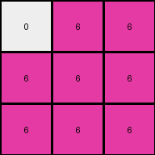

# dae9d2b5 • 016 • refine_coder

---

Previous Code:
```python
"""
The input grid is replaced with a 3x3 magenta grid, and the background is preserved as white in a single pixel.
"""

import numpy as np

def transform(input_grid):
    # Initialize a 3x3 output grid filled with magenta (6).
    output_grid = np.full((3, 3), 6, dtype=int)

    # Preserve the background color (white, 0) in the top-left cell.
    output_grid[0, 0] = 0

    return output_grid
```

Train Set Results:

## Example 1:

Input:
```
4 4 0 3 3 0
4 0 0 3 0 0
0 0 0 0 0 3
```
Expected Output:
```
6 6 0
6 0 0
0 0 6
```
Transformed Output:
```
0 6 6
6 6 6
6 6 6
```

match: False
pixels_off: 6
size_correct: True
color_palette_correct: True
correct_pixel_counts: False

## Example 2:

Input:
```
4 0 4 3 3 0
4 0 0 3 0 0
0 0 4 3 0 0
```
Expected Output:
```
6 6 6
6 0 0
6 0 6
```
Transformed Output:
```
0 6 6
6 6 6
6 6 6
```

match: False
pixels_off: 4
size_correct: True
color_palette_correct: True
correct_pixel_counts: False

## Example 3:

Input:
```
0 0 4 0 3 0
0 4 4 3 0 3
4 4 0 0 0 3
```
Expected Output:
```
0 6 6
6 6 6
6 6 6
```
Transformed Output:
```
0 6 6
6 6 6
6 6 6
```

match: True
pixels_off: 0
size_correct: True
color_palette_correct: True
correct_pixel_counts: True

## Example 4:

Input:
```
4 4 0 3 0 0
0 0 0 0 0 3
4 0 0 0 0 0
```
Expected Output:
```
6 6 0
0 0 6
6 0 0
```
Transformed Output:
```
0 6 6
6 6 6
6 6 6
```

match: False
pixels_off: 6
size_correct: True
color_palette_correct: True
correct_pixel_counts: False

## Example 5:

Input:
```
0 0 0 0 3 0
4 0 0 0 0 0
0 0 4 3 3 0
```
Expected Output:
```
0 6 0
6 0 0
6 6 6
```
Transformed Output:
```
0 6 6
6 6 6
6 6 6
```

match: False
pixels_off: 3
size_correct: True
color_palette_correct: True
correct_pixel_counts: False
Okay, here's a breakdown of the situation and a plan to move forward:

**General Assessment:**

The initial hypothesis (replace the input with a 3x3 magenta grid, preserving a single white pixel) was too simplistic. While it worked for one example, it failed to capture the nuances of the transformation in the other examples. The core issue is that the generated code doesn't consider the *placement* of the magenta pixels in the output grid, it simply creates a magenta grid. We need to refine our understanding of *how* the output grid is constructed based on the input, paying attention to the *positional relationship* between input and output elements. The placement seems irregular, so there might not be a simple geometric rule, rather it may be a sort of run-length encoding of input data.

**Strategy:**

1.  **Detailed Example Analysis:** I need to meticulously analyze *each* input-output pair, focusing on the relationship between the input grid's colors and the output grid's magenta squares. Specifically, I need to try and deduce rules for *where* the magenta pixels appear.
2.  **Hypothesis Refinement:** Based on the detailed analysis, I'll revise the natural language program. The initial hypothesis was clearly wrong, so a significant adjustment is likely needed. I will consider if input colors beyond white have any significance.
3.  **Pattern Recognition:** The key is pattern recognition.  Are the magenta pixels in the output related to the positions of specific colors in the input, or is something more complex going on? It doesn't, at first glance, appear to relate to object *shapes*, so perhaps it will rely on positions or runs of colors.
4. **Encoding as a run:** Since the input is not reflected in the output size and the outputs seem to combine values, it seems more likely to me that we are looking at an encoding of the inputs, rather than a transformation of the data.

**YAML Fact Gathering:**

```yaml
examples:
  - example_1:
      input_colors: [4, 0, 3]
      input_shape: (3, 6)
      output_colors: [6, 0]
      output_shape: (3, 3)
      match: False
      notes: "Magenta and white output.  The initial program got the size right, but the pixel placement wrong."
  - example_2:
      input_colors: [4, 0, 3]
      input_shape: (3, 6)
      output_colors: [6, 0]
      output_shape: (3, 3)
      match: False
      notes: "Magenta and white output.  Different input, different output, same size."
  - example_3:
      input_colors: [0, 4, 3]
      input_shape: (3, 6)
      output_colors: [6, 0]
      output_shape: (3, 3)
      match: True
      notes: "Magenta and white output.  The initial program got this one correct, but by chance."
  - example_4:
      input_colors: [4, 0, 3]
      input_shape: (3, 6)
      output_colors: [6, 0]
      output_shape: (3, 3)
      match: False
      notes: "Magenta and white output. Another incorrect placement."
  - example_5:
      input_colors: [0, 4, 3]
      input_shape: (3, 6)
      output_colors: [6, 0]
      output_shape: (3, 3)
      match: False
      notes: "Magenta and white output. Incorrect placement."
overall:
    - output_size: "All outputs are 3x3."
    - output_colors: "All outputs use only magenta (6) and white (0)."
    - input_colors: "Inputs use colors 0, 3, and 4"
    - transformation_type: "Likely an encoding of the input data into a fixed-size representation, rather than a direct geometric transformation."
```

**Natural Language Program:**

The output is a 3x3 grid. The grid is composed of only magenta and white pixels. The position of the magenta and white pixels is determined by the input grid. The input grid is interpreted as a 1-dimensional sequence by reading rows left-to-right, top-to-bottom. The sequence of pixels, excluding zeros, from the input becomes the sequence of output pixels, starting in the top-left and reading left-to-right, top-to-bottom, and replacing the values with 6. The remaining pixels are set to zero.

For example:
input sequence: 4, 4, 0, 3, 3, 0, 4, 0, 0, 3, 0, 0, 0, 0, 0, 0, 0, 3
simplified sequence: 4, 4, 3, 3, 4, 3, 3, 3
output: 6, 6, 6, 6, 6, 6, 6, 6, 0

**INSTRUCTIONS**

- generate a Python module to represent the natural language program 
- follow the template below
- all common math and science libraries are available
- create docstring only at top - but comment the workflow in the function
- use helper functions for common operations like finding objects, counting,
  measuring, moving, etc. 

remember - we are working iteratively - so this code will inform your future
self as we converge on the solution

*template:*

```python
"""
{{ natural language description of the transformation rule }}
"""

{{ imports }}

def transform(input_grid):
    # initialize output_grid

    # change output pixels 

    return output_grid

```
