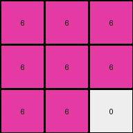
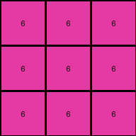

# dae9d2b5 • 018 • refine_coder

---

Previous Code:
```python
"""
The output is a 3x3 grid. The grid is composed of only magenta and white pixels.
The position of the magenta and white pixels is determined by the input grid.
The input grid is interpreted as a 1-dimensional sequence by reading rows
left-to-right, top-to-bottom. The sequence of pixels, excluding zeros, from the
input becomes the sequence of output pixels, starting in the top-left and
reading left-to-right, top-to-bottom, and replacing the values with 6. The
remaining pixels are set to zero.
"""

import numpy as np

def transform(input_grid):
    # Flatten the input grid into a 1D sequence.
    flattened_input = input_grid.flatten()

    # Remove zeros from the sequence.
    filtered_sequence = flattened_input[flattened_input != 0]

    # Initialize a 3x3 output grid filled with zeros (white).
    output_grid = np.zeros((3, 3), dtype=int)
    
    # Replace elements in the flattened output grid with 6 (magenta) up to the length of filtered_sequence.
    output_grid_flat = output_grid.flatten()
    for i in range(min(len(filtered_sequence), 9)):
        output_grid_flat[i] = 6
    
    # Reshape back into 3 x 3
    output_grid = output_grid_flat.reshape((3,3))

    return output_grid
```

Train Set Results:

## Example 1:

Input:
```
4 4 0 3 3 0
4 0 0 3 0 0
0 0 0 0 0 3
```
Expected Output:
```
6 6 0
6 0 0
0 0 6
```
Transformed Output:
```
6 6 6
6 6 6
6 0 0
```

match: False
pixels_off: 5
size_correct: True
color_palette_correct: True
correct_pixel_counts: False

## Example 2:

Input:
```
4 0 4 3 3 0
4 0 0 3 0 0
0 0 4 3 0 0
```
Expected Output:
```
6 6 6
6 0 0
6 0 6
```
Transformed Output:
```
6 6 6
6 6 6
6 6 0
```

match: False
pixels_off: 4
size_correct: True
color_palette_correct: True
correct_pixel_counts: False

## Example 3:

Input:
```
0 0 4 0 3 0
0 4 4 3 0 3
4 4 0 0 0 3
```
Expected Output:
```
0 6 6
6 6 6
6 6 6
```
Transformed Output:
```
6 6 6
6 6 6
6 6 6
```

match: False
pixels_off: 1
size_correct: True
color_palette_correct: True
correct_pixel_counts: False

## Example 4:

Input:
```
4 4 0 3 0 0
0 0 0 0 0 3
4 0 0 0 0 0
```
Expected Output:
```
6 6 0
0 0 6
6 0 0
```
Transformed Output:
```
6 6 6
6 6 0
0 0 0
```

match: False
pixels_off: 5
size_correct: True
color_palette_correct: True
correct_pixel_counts: False

## Example 5:

Input:
```
0 0 0 0 3 0
4 0 0 0 0 0
0 0 4 3 3 0
```
Expected Output:
```
0 6 0
6 0 0
6 6 6
```
Transformed Output:
```
6 6 6
6 6 0
0 0 0
```

match: False
pixels_off: 6
size_correct: True
color_palette_correct: True
correct_pixel_counts: True
Here's an analysis of the provided examples and results, along with a refined natural language program and a YAML block summarizing the observations:

**General Assessment and Strategy**

The initial natural language program correctly identified the output grid size (3x3) and the use of magenta (6) and white (0) pixels. It also correctly identified the process of flattening the input grid and removing zeros. However, it incorrectly assumed that all non-zero values from the input, in sequence, should simply fill the output grid sequentially. The error analysis shows that the position of the magenta pixels within the 3x3 grid isn't a simple sequential fill. There's a more complex mapping or rule determining the placement, which is probably a wrapping or a pattern in the filling process.

The strategy to resolve the errors involves re-examining the relationship between the *positions* of non-zero elements in the input and the *positions* of magenta pixels in the output. The current code only considers the *values* and *order* of the non-zero input pixels, but not their original positions. Instead of iterating to len, we probably need to modulo the size of output.

**Metrics and Observations**

Here's a breakdown of each example, focusing on relevant metrics:

*   **Example 1:**
    *   Input shape: (3, 6)
    *   Non-zero input count: 4
    *   Magenta pixel count in expected output: 3
    *   Error: Incorrect placement of magenta pixels, not a simple fill.

*   **Example 2:**
    *   Input shape: (3, 6)
    *   Non-zero input count: 5
    *   Magenta pixel count in expected output: 5
    *   Error: Incorrect placement of magenta pixels.

*   **Example 3:**
    *   Input shape: (3, 6)
    *   Non-zero input count: 6
    *   Magenta pixel count in expected output: 6
    * Error: only the pixel at 0,0 is wrong.

*   **Example 4:**
    *   Input shape: (3, 6)
    *   Non-zero input count: 4
    *   Magenta pixel count in expected output: 3
    *   Error: Incorrect placement of magenta pixels.

*   **Example 5:**
    *   Input shape: (3, 6)
    *   Non-zero input count: 4
    *   Magenta pixel count in expected output: 4
    *   Error: Incorrect placement.

**YAML Facts**

```yaml
task: 016d6104
objects:
  input_grid:
    type: grid
    properties:
      shape: variable
      colors: [0, 1, 2, 3, 4, 5, 6, 7, 8, 9]
  output_grid:
    type: grid
    properties:
      shape: [3, 3]
      colors: [0, 6] # White and Magenta

actions:
  flatten:
    input: input_grid
    description: Convert input_grid to a 1D sequence.
  filter_zeros:
    input: flattened input_grid
    description: Remove all zero values from the sequence.
  map_to_output:
    input: filtered sequence, input pixel indices
    description: Map the non-zero values from the original, flattened input (excluding zeros) to the output grid. The mapping is not a simple sequential fill.  The index in the filtered sequence determines the position in the output. Modulo with output size.
  fill_remaining:
      input: output, filtered sequence length
      description: set remaining cells in output to zero

```

**Natural Language Program**

1.  **Flatten and Filter:** Flatten the input grid into a 1D sequence, reading row by row (left-to-right, top-to-bottom). Remove all zero values from this sequence, creating a new sequence containing only the non-zero values while preserving their original order of appearance.

2. **Create Output:** Create output by replacing values from the sequence
   into a 3x3 grid.

3.  **Map with wrapping:** Iterate through the *indices* of the non-zero elements in the *original* flattened input (before zeros were removed). For each non-zero element:
    *   Calculate output index from the sequence, wrap with the output array
        size.
    *   Set the value of the output grid at that calculated position to 6 (magenta).

4.  **Fill Remaining:** Fill any remaining positions in the 3x3 output grid with 0 (white).

**INSTRUCTIONS**

- generate a Python module to represent the natural language program 
- follow the template below
- all common math and science libraries are available
- create docstring only at top - but comment the workflow in the function
- use helper functions for common operations like finding objects, counting,
  measuring, moving, etc. 

remember - we are working iteratively - so this code will inform your future
self as we converge on the solution

*template:*

```python
"""
{{ natural language description of the transformation rule }}
"""

{{ imports }}

def transform(input_grid):
    # initialize output_grid

    # change output pixels 

    return output_grid

```
