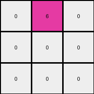
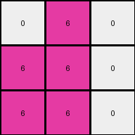

# dae9d2b5 • 027 • refine_dreamer

---

Previous Code:
```python
"""
1. **Identify Non-White Regions:** Locate all pixels in the input grid that are not white (0). In this case find and group all occurrences of colors green (3) and yellow (4).
2. **Downscale and Recenter**: Reduce the grid size down to half the input in x and half the input in y discarding the outer border of 0's.
3. **Consolidate and Recolor:** all non-white colors that are present after downscaling are transformed to 6.
4. **Output:** The result is the 3x3 output grid.
"""

import numpy as np

def transform(input_grid):
    # Convert input grid to a NumPy array
    input_array = np.array(input_grid)
    
    # 1. Identify Non-White Regions (implicitly handled in the next steps)

    # 2. Downscale and Recenter
    rows, cols = input_array.shape
    
    # Find the bounding box of non-zero elements to recenter
    non_zero_rows = np.any(input_array != 0, axis=1)
    non_zero_cols = np.any(input_array != 0, axis=0)
    min_row, max_row = np.where(non_zero_rows)[0][[0, -1]]
    min_col, max_col = np.where(non_zero_cols)[0][[0, -1]]

    # Crop the array
    cropped_array = input_array[min_row:max_row+1, min_col:max_col+1]
      
    output_array = np.zeros((3,3), dtype=int)

    
    resized_array_x = cropped_array.shape[0]
    resized_array_y = cropped_array.shape[1]
        
    
    start_x = max(0, (resized_array_x + 1)// 2 -1)
    start_y = max(0,(resized_array_y + 1) // 2 -1)

   
    for i in range(3):
        for j in range(3):
           
            ii = min(start_x + i , cropped_array.shape[0] -1 )
            jj = min(start_y + j , cropped_array.shape[1] -1)

            if 0 <= ii < cropped_array.shape[0] and 0 <= jj < cropped_array.shape[1]:
                
                if cropped_array[ii,jj] != 0:
                    output_array[i,j] = 6
                

    # 3. Consolidate and Recolor (change any non-zero value to 6)
    #output_array[output_array != 0] = 6

    # 4. Output
    return output_array.tolist()
```

Train Set Results:

## Example 1:

Input:
```
4 4 0 3 3 0
4 0 0 3 0 0
0 0 0 0 0 3
```
Expected Output:
```
6 6 0
6 0 0
0 0 6
```
Transformed Output:
```
0 6 0
0 0 0
0 0 0
```

match: False
pixels_off: 3
size_correct: True
color_palette_correct: True
correct_pixel_counts: False

## Example 2:

Input:
```
4 0 4 3 3 0
4 0 0 3 0 0
0 0 4 3 0 0
```
Expected Output:
```
6 6 6
6 0 0
6 0 6
```
Transformed Output:
```
0 6 0
6 6 0
6 6 0
```

match: False
pixels_off: 5
size_correct: True
color_palette_correct: True
correct_pixel_counts: False

## Example 3:

Input:
```
0 0 4 0 3 0
0 4 4 3 0 3
4 4 0 0 0 3
```
Expected Output:
```
0 6 6
6 6 6
6 6 6
```
Transformed Output:
```
6 6 0
0 0 0
0 0 0
```

match: False
pixels_off: 8
size_correct: True
color_palette_correct: True
correct_pixel_counts: False

## Example 4:

Input:
```
4 4 0 3 0 0
0 0 0 0 0 3
4 0 0 0 0 0
```
Expected Output:
```
6 6 0
0 0 6
6 0 0
```
Transformed Output:
```
0 0 0
0 0 0
0 0 0
```

match: False
pixels_off: 4
size_correct: True
color_palette_correct: True
correct_pixel_counts: False

## Example 5:

Input:
```
0 0 0 0 3 0
4 0 0 0 0 0
0 0 4 3 3 0
```
Expected Output:
```
0 6 0
6 0 0
6 6 6
```
Transformed Output:
```
0 0 0
6 6 6
6 6 6
```

match: False
pixels_off: 3
size_correct: True
color_palette_correct: True
correct_pixel_counts: False
**INSTRUCTIONS**

The code above was generated based on observations from the first training
example

we have tested the transform function on each of the task example inputs and
compared with the expected output

review each of the examples provided and the results and consider how the
natural language program should be updated to accommodate this new knowledge

respond with the following deliverables:

- general assessment of the information provided and strategy for resolving the
  errors
- gather metrics about each of the examples and results - use code_execution to
  develop accurate reports on your assumptions
- a YAML block documenting facts - Focus on identifying objects, their properties, and the actions performed on them.
- a natural language program - Be as clear and concise as possible, providing a complete description of the transformation rule.


your responses should be considered as information in a report - not a
conversation
