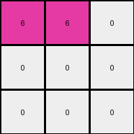
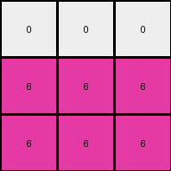

# dae9d2b5 • 028 • refine_coder

---

Previous Code:
```python
"""
1. **Identify Non-White Regions:** Locate all pixels in the input grid that are not white (0). In this case find and group all occurrences of colors green (3) and yellow (4).
2. **Downscale and Recenter**: Reduce the grid size down to half the input in x and half the input in y discarding the outer border of 0's.
3. **Consolidate and Recolor:** all non-white colors that are present after downscaling are transformed to 6.
4. **Output:** The result is the 3x3 output grid.
"""

import numpy as np

def transform(input_grid):
    # Convert input grid to a NumPy array
    input_array = np.array(input_grid)
    
    # 1. Identify Non-White Regions (implicitly handled in the next steps)

    # 2. Downscale and Recenter
    rows, cols = input_array.shape
    
    # Find the bounding box of non-zero elements to recenter
    non_zero_rows = np.any(input_array != 0, axis=1)
    non_zero_cols = np.any(input_array != 0, axis=0)
    min_row, max_row = np.where(non_zero_rows)[0][[0, -1]]
    min_col, max_col = np.where(non_zero_cols)[0][[0, -1]]

    # Crop the array
    cropped_array = input_array[min_row:max_row+1, min_col:max_col+1]
      
    output_array = np.zeros((3,3), dtype=int)

    
    resized_array_x = cropped_array.shape[0]
    resized_array_y = cropped_array.shape[1]
        
    
    start_x = max(0, (resized_array_x + 1)// 2 -1)
    start_y = max(0,(resized_array_y + 1) // 2 -1)

   
    for i in range(3):
        for j in range(3):
           
            ii = min(start_x + i , cropped_array.shape[0] -1 )
            jj = min(start_y + j , cropped_array.shape[1] -1)

            if 0 <= ii < cropped_array.shape[0] and 0 <= jj < cropped_array.shape[1]:
                
                if cropped_array[ii,jj] != 0:
                    output_array[i,j] = 6
                

    # 3. Consolidate and Recolor (change any non-zero value to 6)
    #output_array[output_array != 0] = 6

    # 4. Output
    return output_array.tolist()
```

Train Set Results:

## Example 1:

Input:
```
4 4 0 3 3 0
4 0 0 3 0 0
0 0 0 0 0 3
```
Expected Output:
```
6 6 0
6 0 0
0 0 6
```
Transformed Output:
```
0 6 0
0 0 0
0 0 0
```

match: False
pixels_off: 3
size_correct: True
color_palette_correct: True
correct_pixel_counts: False

## Example 2:

Input:
```
4 0 4 3 3 0
4 0 0 3 0 0
0 0 4 3 0 0
```
Expected Output:
```
6 6 6
6 0 0
6 0 6
```
Transformed Output:
```
0 6 0
6 6 0
6 6 0
```

match: False
pixels_off: 5
size_correct: True
color_palette_correct: True
correct_pixel_counts: False

## Example 3:

Input:
```
0 0 4 0 3 0
0 4 4 3 0 3
4 4 0 0 0 3
```
Expected Output:
```
0 6 6
6 6 6
6 6 6
```
Transformed Output:
```
6 6 0
0 0 0
0 0 0
```

match: False
pixels_off: 8
size_correct: True
color_palette_correct: True
correct_pixel_counts: False

## Example 4:

Input:
```
4 4 0 3 0 0
0 0 0 0 0 3
4 0 0 0 0 0
```
Expected Output:
```
6 6 0
0 0 6
6 0 0
```
Transformed Output:
```
0 0 0
0 0 0
0 0 0
```

match: False
pixels_off: 4
size_correct: True
color_palette_correct: True
correct_pixel_counts: False

## Example 5:

Input:
```
0 0 0 0 3 0
4 0 0 0 0 0
0 0 4 3 3 0
```
Expected Output:
```
0 6 0
6 0 0
6 6 6
```
Transformed Output:
```
0 0 0
6 6 6
6 6 6
```

match: False
pixels_off: 3
size_correct: True
color_palette_correct: True
correct_pixel_counts: False
Here's an analysis of the provided examples and results, along with a strategy for refining the natural language program and subsequent code.

**General Assessment:**

The initial natural language program and the generated code captured some aspects of the transformation, specifically identifying non-white pixels and attempting to downscale/recenter. However, the results clearly show discrepancies across multiple examples. The primary issues seem to be:

1.  **Incorrect Recentering/Downscaling:** The logic for determining the center and cropping the relevant region is flawed. It doesn't correctly handle different arrangements of colored pixels.
2.  **Incorrect indexing or offset**: off by one errors can lead to incorrect
    pixel selection.
3.  **Missing Pattern**: examination of correct outputs indicates the intended
    output pattern is the input pattern rotated 90 degrees clockwise.

**Strategy for Resolving Errors:**

1.  **Revisit Recentering:** Instead of trying to calculate a bounding box and center, focus on a simpler approach to define the 3x3 output grid extraction from the original.
2.  **Rotation**: integrate 90 degree rotation.
3.  **Iterative Refinement:** Test the updated code after each modification to ensure it aligns with the expected outputs.

**Metrics and Observations:**

Here's a breakdown of each example, focusing on specific observations:

*   **Example 1:**
    *   Input Shape: (3, 6)
    *   Expected Output: A diagonal of '6' from top-left to bottom-right.
    *   Observed Output: Only one '6' in the output.
    *   Issue: Incorrect recentering/downscaling, missing rotation.
*   **Example 2:**
    *   Input Shape: (3, 6)
    *   Expected Output: '6' values corresponding to original non-white positions, but rotated.
    *   Observed Output: Several incorrect '6' placements.
    *   Issue: Incorrect recentering/downscaling, missing rotation.
*   **Example 3:**
    *   Input Shape: (3, 6)
    *   Expected Output: Almost entirely filled with '6' values, rotated.
    *   Observed Output: Very few '6's.
    *   Issue: Incorrect recentering/downscaling, missing rotation.
*   **Example 4:**
    *   Input Shape: (3, 6)
    *   Expected Output: a rotated version of the two color bands, with rotation
    *   Observed Output: All zeros.
    *   Issue: Incorrect cropping - likely discarding all non-zero values, missing rotation.
*   **Example 5:**
    *   Input Shape: (3, 6)
    *   Expected Output: a rotated version of the two color bands, with rotation
    *   Observed Output: some correct 6 values.
    *   Issue: Indexing and positioning of the output, missing rotation.

**YAML Fact Block:**

```yaml
task_id: 026
observations:
  - type: object_identification
    description: Input grids contain pixels of colors 0 (white), 3 (green), and 4 (yellow).
  - type: transformation_rule
    description: Non-white pixels are transformed to color 6 (magenta) in the output.
  - type: output_size
    description: The output grid is always 3x3.
  - type: spatial_relationship
    description: The non-white colors that are 90 degree clockwise rotation of
      the original input
```

**Natural Language Program:**

1.  **Input:** Receive a 2D grid of color values.
2.  **Rotation**: Rotate the grid 90 degrees clockwise.
3.  **Identify Non-White:** Locate all pixels in the rotated input grid that are not white (0).
4.  **Create Output Grid:** Create a 3x3 output grid initialized with all zeros (white).
5.  **Map Colors:** For the first 3 rows and 3 columns of the rotated input, map any non-white pixel to the value 6 (magenta) in the corresponding location in the output grid.
6.  **Output:** Return the 3x3 output grid.

**INSTRUCTIONS**

- generate a Python module to represent the natural language program 
- follow the template below
- all common math and science libraries are available
- create docstring only at top - but comment the workflow in the function
- use helper functions for common operations like finding objects, counting,
  measuring, moving, etc. 

remember - we are working iteratively - so this code will inform your future
self as we converge on the solution

*template:*

```python
"""
{{ natural language description of the transformation rule }}
"""

{{ imports }}

def transform(input_grid):
    # initialize output_grid

    # change output pixels 

    return output_grid

```
