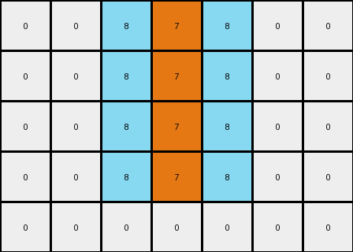
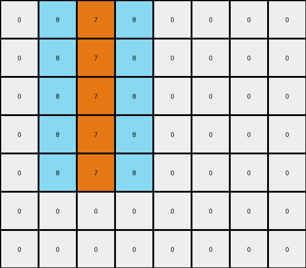

# db3e9e38 • 010 • refine_coder

---

Previous Code:
```python
"""
Transforms an input grid by expanding a vertical orange line into a checkerboard pattern of orange and azure, leaving the area below the line unchanged.
"""

import numpy as np

def find_orange_line(grid):
    """Finds the vertical orange line in the grid."""
    rows, cols = grid.shape
    for j in range(cols):
        for i in range(rows):
            if grid[i, j] == 7:
                # Found start of potential line
                start_row = i
                end_row = i
                while end_row + 1 < rows and grid[end_row + 1, j] == 7:
                    end_row += 1
                return start_row, end_row, j
    return None, None, None

def transform(input_grid):
    """Transforms the input grid according to the described rule."""
    output_grid = np.copy(input_grid)
    start_row, end_row, col = find_orange_line(input_grid)

    if start_row is None:  # No orange line found
        return output_grid

    rows, cols = input_grid.shape

    # Checkerboard expansion
    for i in range(start_row, end_row + 1):
           if i - 1 >= 0 :
              if output_grid[i-1,col] == 0:
                output_grid[i-1, col] = 8
           if i + 1 < rows and i + 1 <= end_row:
              if output_grid[i + 1, col] == 0:
                output_grid[i+1, col] = 8
           if col - 1 >= 0 :
              if output_grid[i,col-1] == 0:
                output_grid[i, col-1] = 8
           if col + 1 < cols :
              if output_grid[i,col+1] == 0:
                output_grid[i, col+1] = 8
    return output_grid
```

Train Set Results:

## Example 1:

Input:
```
0 0 0 7 0 0 0
0 0 0 7 0 0 0
0 0 0 7 0 0 0
0 0 0 7 0 0 0
0 0 0 0 0 0 0
```
Expected Output:
```
8 7 8 7 8 7 8
0 7 8 7 8 7 0
0 0 8 7 8 0 0
0 0 0 7 0 0 0
0 0 0 0 0 0 0
```
Transformed Output:
```
0 0 8 7 8 0 0
0 0 8 7 8 0 0
0 0 8 7 8 0 0
0 0 8 7 8 0 0
0 0 0 0 0 0 0
```

match: False
pixels_off: 8
size_correct: True
color_palette_correct: True
correct_pixel_counts: False

## Example 2:

Input:
```
0 0 7 0 0 0 0 0
0 0 7 0 0 0 0 0
0 0 7 0 0 0 0 0
0 0 7 0 0 0 0 0
0 0 7 0 0 0 0 0
0 0 0 0 0 0 0 0
0 0 0 0 0 0 0 0
```
Expected Output:
```
7 8 7 8 7 8 7 0
7 8 7 8 7 8 0 0
7 8 7 8 7 0 0 0
0 8 7 8 0 0 0 0
0 0 7 0 0 0 0 0
0 0 0 0 0 0 0 0
0 0 0 0 0 0 0 0
```
Transformed Output:
```
0 8 7 8 0 0 0 0
0 8 7 8 0 0 0 0
0 8 7 8 0 0 0 0
0 8 7 8 0 0 0 0
0 8 7 8 0 0 0 0
0 0 0 0 0 0 0 0
0 0 0 0 0 0 0 0
```

match: False
pixels_off: 11
size_correct: True
color_palette_correct: True
correct_pixel_counts: False
Here's an analysis of the provided information and a plan to refine the natural language program and code:

**General Assessment:**

The initial code focuses on identifying a vertical orange line and expanding it.  However, the expansion logic is flawed. It only replaces adjacent white (0) pixels with azure (8). The expected outputs show a checkerboard-like pattern extending *beyond* immediate neighbors, and importantly, the expansion extends *left and right*, not just up and down.  The expansion also stops when it hits a non-white pixel.  The area *below* the vertical orange line isn't affected.

**Strategy:**

1.  **Refine Object Identification:** Clearly define the "orange line" as an object, and understand its properties (starting row, ending row, column).
2.  **Correct Expansion Logic:** Implement a checkerboard expansion that propagates both horizontally and vertically from the orange line. This checkerboard should *alternate* orange and azure, and not expand into non-white cells or past the detected length of the orange line itself.
3. **Confirm invariance below the detected length of the orange line.** Ensure that the region below the orange line isn't modified.
4.  **Iterative Testing:** Test the updated code against *all* training examples after each modification.

**Example Metrics and Analysis:**

Here's a breakdown of each example, incorporating the observed results and expected behavior.

*Example 1*

*   **Input:** A 4x7 grid with a vertical orange line of length 4 at column 3. The rest are white pixels.
*   **Expected Output:** A checkerboard pattern (orange/azure) replacing the white pixels *above* the bottom of the orange line. The rest of the input grid is unchanged.
*   **Transformed Output:** Only the immediate white neighbors of the orange line are changed to azure.
*   **Errors:** Incorrect expansion logic; checkerboard pattern is incomplete.
*   **Metrics:**
    *   `pixels_off`: 8
    *   `size_correct`: True
    *   `color_palette_correct`: True
    *   `correct_pixel_counts`: False

*Example 2*

*   **Input:**  A 7x8 grid, with a vertical orange line (length 5) at column 2.
*   **Expected Output:** A checkerboard pattern (orange/azure) fills the area defined by the top and bottom of the vertical orange line. The line stops at row 4. Pixels below the orange line are unchanged.
*   **Transformed Output:** Similar to Example 1, only immediate white neighbors are changed to azure.
*   **Errors:** Incorrect expansion; checkerboard pattern is incomplete.
*    **Metrics:**
    *   `pixels_off`: 11
    *   `size_correct`: True
    *   `color_palette_correct`: True
    *   `correct_pixel_counts`: False
**YAML Facts:**

```yaml
objects:
  - name: orange_line
    type: vertical_line
    color: orange
    properties:
      start_row: int  # Row index where the line begins
      end_row: int    # Row index where the line ends
      column: int     # Column index where the line is located

  - name: checkerboard_area
    type: region
    properties:
      top_row: int      # define the upper bound of the effect
      bottom_row: int   # define the lower bound of the effect.  The bottom of the orange line
      left_column: int
      right_column: int
    pattern:
      - color: orange
      - color: azure

actions:
  - name: find_orange_line
    description: Locates the vertical orange line within the grid.
    input: grid
    output: [start_row, end_row, column]

  - name: expand_to_checkerboard
    description: Creates a checkerboard pattern of orange and azure, bounded by the orange line, and any other non-white pixels.
    input:
      grid: array
      orange_line_start_row: int
      orange_line_end_row: int
      orange_line_column: int

    output: modified_grid
```

**Natural Language Program:**

1.  **Find the Orange Line:** Locate the vertical orange line in the input grid. Note its starting row, ending row, and column.
2.  **Define the top of the checkerboard region** The top of the effect will begin by filling a row of pixels with orange, beginning at the `orange_line_column` and extending left until a non-white pixel is detected. And then right until a non-white pixel is detected.
3.  **Checkerboard Expansion:**
    *   Starting from the `orange_line_column` and `top_row`, and working *left and right* to fill the row, replace white pixels above the `orange_line_end_row` with a checkerboard pattern.
    *   The checkerboard pattern alternates between orange and azure.
    *   Do *not* replace or change any non-white pixels.  Stop the checkerboard expansion at any non-white pixel.
    *   Do *not* alter any pixels below the `orange_line_end_row`.
4.  **Return:** Return the modified grid.

**INSTRUCTIONS**

- generate a Python module to represent the natural language program 
- follow the template below
- all common math and science libraries are available
- create docstring only at top - but comment the workflow in the function
- use helper functions for common operations like finding objects, counting,
  measuring, moving, etc. 

remember - we are working iteratively - so this code will inform your future
self as we converge on the solution

*template:*

```python
"""
{{ natural language description of the transformation rule }}
"""

{{ imports }}

def transform(input_grid):
    # initialize output_grid

    # change output pixels 

    return output_grid

```
